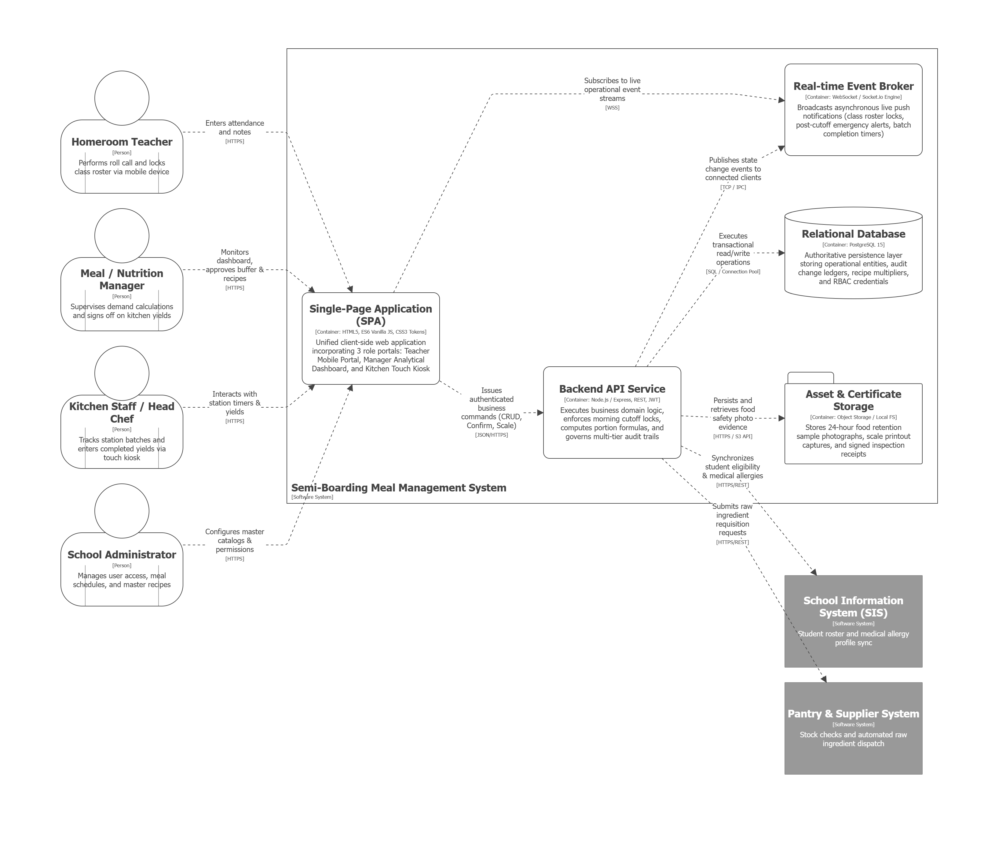
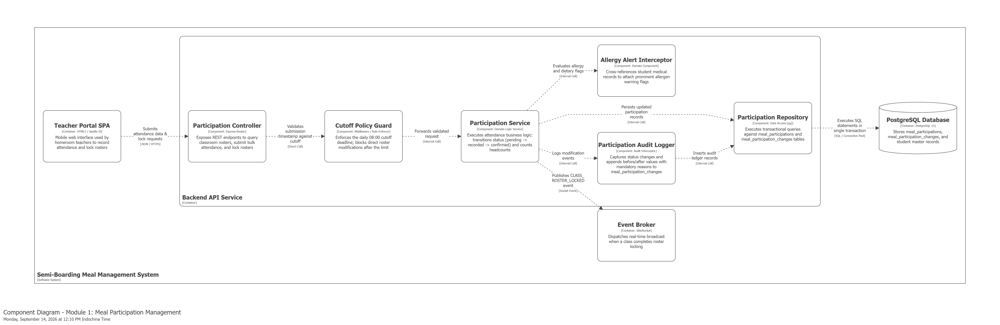
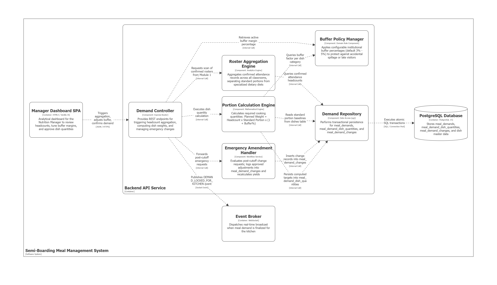
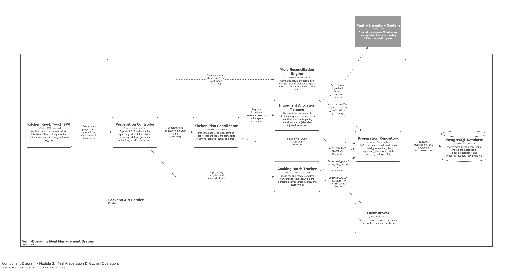
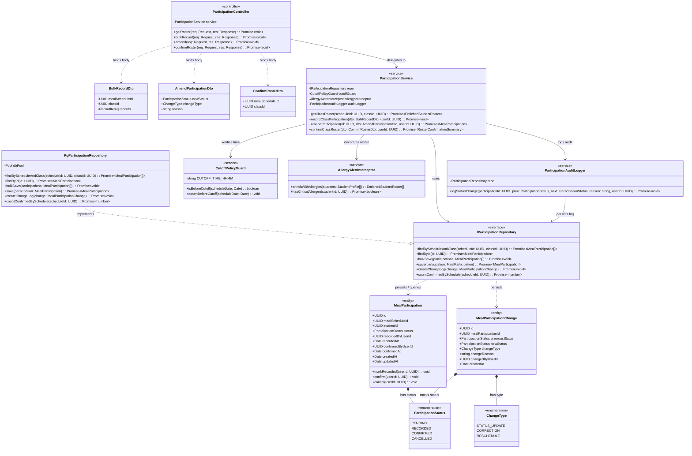
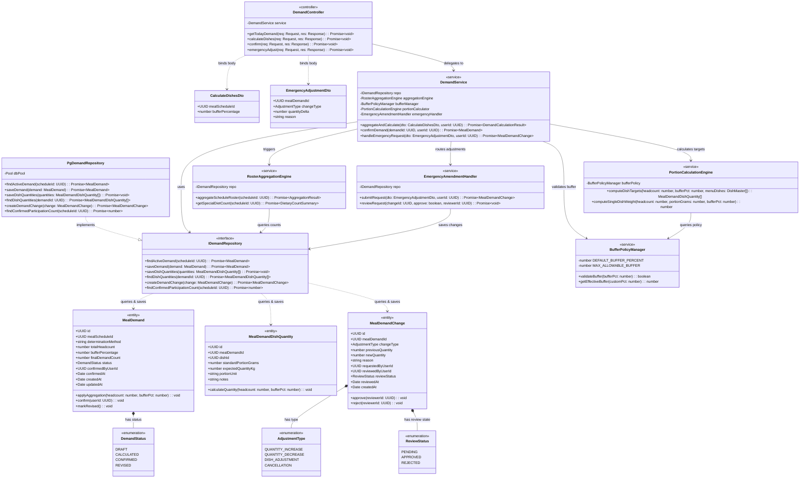
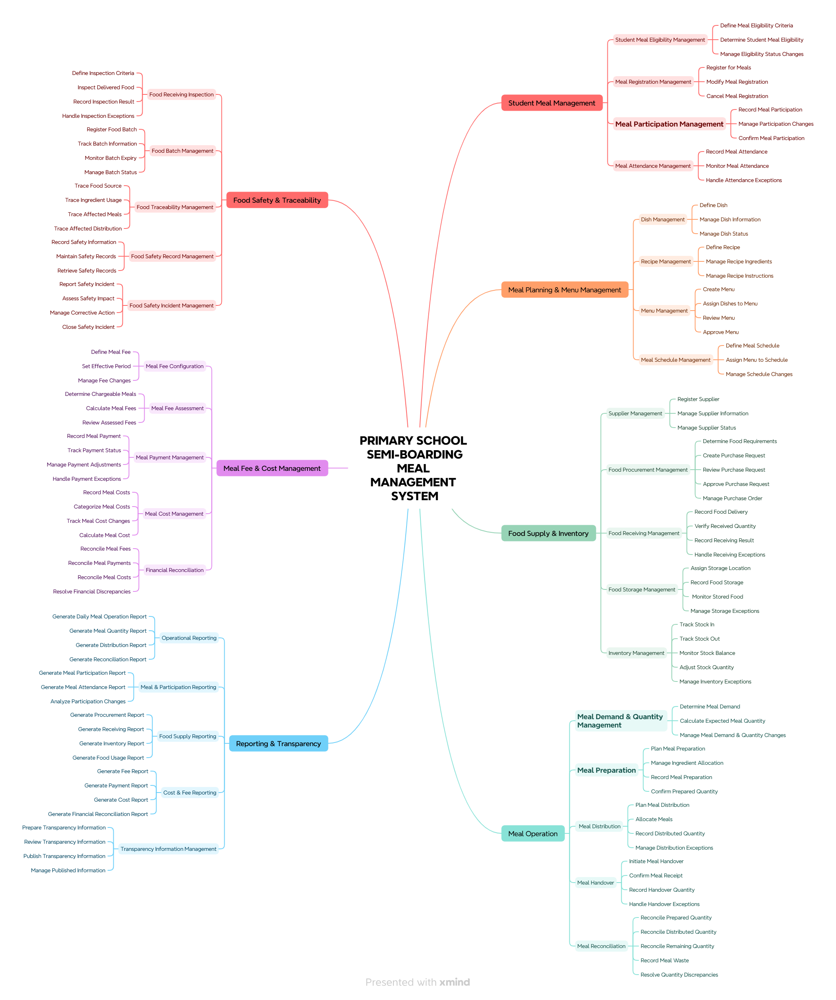
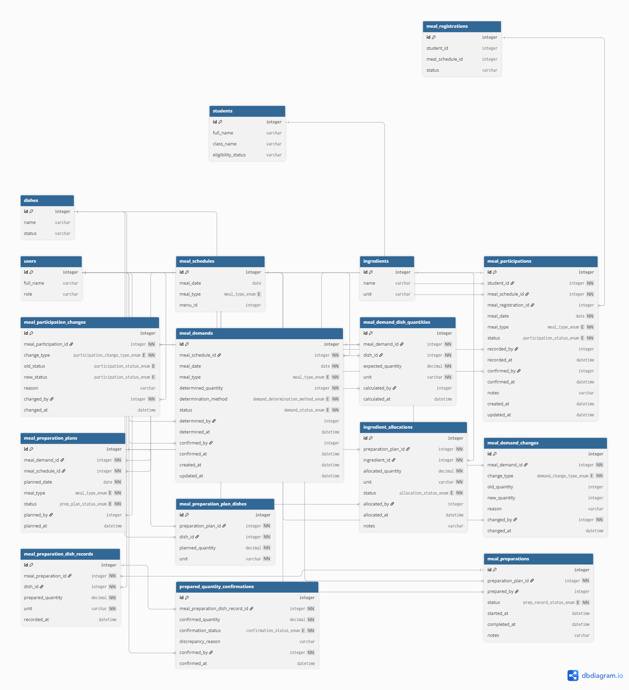

# Primary School Semi-Boarding Meal Management System

> A comprehensive web-based operations platform designed to manage the full meal lifecycle for primary school semi-boarding programs — from student attendance and dynamic demand forecasting through kitchen preparation, food safety compliance, and cost transparency.

---

## Problem Statement

Primary schools operating semi-boarding programs face recurring operational friction across the meal supply and preparation value chain:

- **Attendance Discrepancy:** Manual paper rosters lead to persistent meal over/under-production daily.
- **Food Over/Under-Production:** Absence of dynamic scaling from confirmed student headcounts to raw ingredient purchase and preparation quantities.
- **Emergency Disruption:** Late arrivals, sudden absences, and dietary changes occurring after the morning cutoff lack an auditable, real-time approval workflow.
- **Traceability Gaps:** Raw ingredient batches, pantry inventory, and distributed meal trays are disconnected, making food safety investigations slow and unreliable.
- **Cost Opacity:** Expense reconciliation and per-meal cost calculations are performed across disconnected spreadsheets, detached from actual kitchen yields.

---

## Project Methodology

This repository adheres to a **strict top-down decomposition methodology**, guaranteeing that every engineering artifact is directly traceable to its upstream operational requirement:

```
Top-Down Mind Map (System Scope & Strategic Intent)
       ↓
Core vs. Supporting Domain Classification
       ↓
Selected Core Operational Features
       ↓
Actor Roles & Use Cases
       ↓
Information Architecture & Screen Inventory
       ↓
Task Flows & Wireframes
       ↓
Relational Database Architecture (DDL & ERD)
       ↓
Interactive Working Prototype
```

---

## Repository Structure

```
primary-school-meal-management/
│
├── README.md                          ← Main project documentation (Project Map)
│
├── arc42/                             ← arc42 Software Architecture Documentation Suite
│   ├── README.md                      ← arc42 master navigation index & section tracker
│   ├── 01-introduction-and-goals.md   ← Section 1: System requirements & Q42 quality goals
│   ├── 02-architecture-constraints.md ← Section 2: Technical, operational & legal constraints
│   ├── 03-context-and-scope.md        ← Section 3: Business & technical context, external interfaces
│   ├── 04-solution-strategy.md        ← Section 4: Modular monolith, DDD, technology rationale
│   ├── 05-building-block-view.md      ← Section 5: Level-1 Containers & Level-2 Components
│   ├── 06-runtime-view.md             ← Section 6: Dynamic sequence scenarios (Cutoff, Triage, HACCP)
│   ├── 07-deployment-view.md          ← Section 7: Campus infrastructure, Docker & device profiles
│   ├── 08-crosscutting-concepts.md    ← Section 8: Domain model, RBAC, cutoff guards, audit logs
│   ├── 09-architecture-decisions.md   ← Section 9: ADRs (Monolith, Cutoff Guard, Vanilla UI, WSS)
│   ├── 10-quality-requirements.md     ← Section 10: Measurable quality scenarios (QS-01 to QS-08)
│   ├── 11-risks-and-technical-debt.md ← Section 11: Risk register & technical debt backlog
│   └── 12-glossary.md                 ← Section 12: Domain dictionary & acronyms
│
├── c4/                                ← C4 Software Architecture Documentation
│   ├── README.md                      ← C4 documentation map & index
│   ├── c4-context.md                  ← Level 1: System Context Diagram
│   ├── c4-containers.md               ← Level 2: Container Diagram
│   ├── c4-components-*.md             ← Level 3: Component Diagrams (M1, M2, M3)
│   └── c4-code-*.md                   ← Level 4: Code Diagrams (M1, M2, M3 UML Class Diagrams)
│
├── docs/                              ← Comprehensive top-down engineering documentation
│   ├── README.md                      ← Documentation index and methodology guide
│   ├── traceability.md                ← End-to-end traceability chain mapping
│   │
│   ├── 01-top-down/                   ← System decomposition & business domain analysis
│   │   ├── README.md
│   │   ├── PRIMARY_SCHOOL_SEMI-BOARDING_MEAL_MANAGEMENT_SYSTEM.png ← Full system mind map
│   │   ├── business-domains.md
│   │   └── core-supporting-classification.md
│   │
│   ├── 02-core-features/              ← Deep dive into the 3 active MVP core modules
│   │   ├── README.md
│   │   └── core-feature-breakdown.md
│   │
│   ├── 03-roles-usecases/             ← Actors, permissions, and UML use case models
│   │   ├── README.md
│   │   ├── roles.md
│   │   ├── role-feature-mapping.md
│   │   ├── usecase-overview.md        ← UC-00 System Overview (Mermaid)
│   │   ├── usecase-admin.md           ← UC-ADM School Administrator
│   │   ├── usecase-manager.md         ← UC-MGR Meal/Nutrition Manager
│   │   ├── usecase-kitchen.md         ← UC-KIT Kitchen Staff
│   │   ├── usecase-teacher.md         ← UC-TCH Homeroom Teacher
│   │   └── usecase-storekeeper.md     ← UC-STO Storekeeper
│   │
│   ├── 04-information-architecture/   ← Navigation models, task flows, and screen catalog
│   │   ├── README.md
│   │   ├── sitemap.md
│   │   ├── screen-hierarchy.md
│   │   ├── task-flows.md
│   │   └── screen-inventory.md
│   │
│   ├── 05-ui-ux/                      ← Design system tokens, wireframes, and mockups
│   │   ├── README.md
│   │   ├── wireframes/
│   │   ├── mockups/
│   │   └── design-system.md
│   │
│   └── 06-database/                   ← Database design, schema, and data dictionary
│       ├── README.md
│       ├── PRIMARY_SCHOOL_SEMI-BOARDING_MEAL_MANAGEMENT_SYSTEM.png ← Relational ERD
│       ├── database-erd.md
│       ├── schema.dbml
│       └── data-dictionary.md
│
├── database/                          ← SQL scripts and database documentation
│   ├── PRIMARY SCHOOL SEMI-BOARDING MEAL MANAGEMENT SYSTEM.sql
│   └── DBDOCS.md
│
├── frontend/                          ← Interactive frontend prototype application
│   ├── README.md                      ← Prototype technical architecture and user guide
│   ├── index.html                     ← Unified interactive application (M1, M2, M3)
│   ├── css/                           ← Modular Vanilla CSS design tokens & layouts
│   └── js/                            ← Role-separated vanilla ES6 JavaScript modules
│
├── screenshots/                       ← High-resolution UI captures categorized by role
│   ├── README.md                      ← Complete visual catalog with screen annotations
│   ├── gv/                            ← Homeroom Teacher screens (SCR-TCH-*)
│   ├── qlb/                           ← Meal/Nutrition Manager screens (SCR-MGR-*)
│   └── knb/                           ← Kitchen Staff Kiosk screens (SCR-KIT-*)
│
└── prototype/                         ← Legacy prototype documentation
    └── README.md
```

---

## Artifact Index

| Phase | Artifact | Description | Status |
|:---:|---|---|:---:|
| **—** | [Documentation Hub](docs/README.md) | Central navigation hub for all 6 top-down engineering phases | ✅ Complete |
| **C4** | [C4 Model Architecture](c4/README.md) | Full 4-Level Architecture: Level 1 Context, Level 2 Containers, Level 3 Components (M1, M2, M3), Level 4 Code (M1, M2, M3) | ✅ Complete |
| **arc42** | [arc42 Architecture Suite](arc42/README.md) | Comprehensive 12-section architecture documentation adhering to Dr. Starke & Dr. Hruschka's standard (ESSENTIAL level) | ✅ Complete |
| **01** | [Top-Down Decomposition](docs/01-top-down/README.md) | Business domain classification & system mind map | ✅ Complete |
| **02** | [Core Feature Breakdown](docs/02-core-features/README.md) | In-depth breakdown of the 3 active MVP core modules | ✅ Complete |
| **03** | [Roles & Use Cases](docs/03-roles-usecases/README.md) | Actor definition, permission matrix, and UML use cases | ✅ Complete |
| **04** | [Information Architecture](docs/04-information-architecture/README.md) | Screen inventory, sitemap, and operational task flows | ✅ Complete |
| **05** | [UI/UX Wireframes & Mockups](docs/05-ui-ux/README.md) | Design system, UI component library, and wireframes | 🔄 In Progress |
| **06** | [Database Architecture](docs/06-database/README.md) | Relational ERD, DBML schema, and data dictionary | ✅ Complete |
| **—** | [Traceability Chain](docs/traceability.md) | End-to-end forward and backward requirements tracing | ✅ Complete |
| **—** | [Interactive Prototype](frontend/README.md) | Prototype architecture guide and live web app ([Launch App](frontend/index.html)) | ✅ Reference |
| **—** | [UI Visual Catalog](screenshots/README.md) | Complete catalog of 11 system screenshots mapped to screen IDs | ✅ Reference |

---

## Traceability

Every artifact in this repository is strictly derived from the tier directly above it. See [docs/traceability.md](docs/traceability.md) for the complete end-to-end mapping:

$$\text{Core Domain} \longrightarrow \text{Core Capability} \longrightarrow \text{Core Feature} \longrightarrow \text{Actor} \longrightarrow \text{Use Case} \longrightarrow \text{Task Flow} \longrightarrow \text{Screen} \longrightarrow \text{DB Entity}$$

---

## C4 Software Architecture Model

This project models its software architecture using the complete 4-level **C4 Model** (Context, Containers, Components, Code), providing high-fidelity visual diagrams and structural specifications:

### Level 1 — System Context Diagram
Defines the boundary of the Semi-Boarding Meal Management System, human actors, and external system integrations (SIS, Pantry/Supplier, Parent Notification Gateway):


*For detailed actor specifications and external integration profiles, refer to [c4/c4-context.md](c4/c4-context.md).*

---

### Level 2 — Container Diagram
Illustrates the high-level technical building blocks: Unified SPA (3 role portals), Node.js/Express Backend API, WebSocket Real-time Broker, and PostgreSQL 15 Relational Database:



*For runtime technical responsibilities and networking details, refer to [c4/c4-containers.md](c4/c4-containers.md).*

---

### Level 3 — Component Diagrams

#### 1. Module 1: Meal Participation Management Components
Internal components governing classroom student roll call, dietary/allergen alerts, and morning cutoff lock enforcement:



*For endpoint specifications and rule guard documentation, refer to [c4/c4-components-participation.md](c4/c4-components-participation.md).*

#### 2. Module 2: Meal Demand & Quantity Management Components
Internal components managing headcount aggregation, portion formula calculations, buffer policy, and emergency adjustments:



*For formula details and policy configurations, refer to [c4/c4-components-demand.md](c4/c4-components-demand.md).*

#### 3. Module 3: Meal Preparation & Kitchen Operations Components
Internal components orchestrating kitchen shift plans, raw ingredient allocations, station batch timers, and finished yield reconciliation:



*For kitchen station workflows and verification logic, refer to [c4/c4-components-preparation.md](c4/c4-components-preparation.md).*

---

### Level 4 — Code Diagrams (UML Class Diagrams)

#### 1. Module 1: Meal Participation Class Diagram
- **Key Domain Entities:** `MealParticipation`, `MealParticipationChange`, `ParticipationStatus`, `ChangeType`.
- **Core Services & Contracts:** `ParticipationService`, `CutoffPolicyGuard`, `AllergyAlertInterceptor`, `IParticipationRepository`.
- **Detailed Specification:** [c4/c4-code-participation.md](c4/c4-code-participation.md)



---

#### 2. Module 2: Meal Demand & Quantity Class Diagram
- **Key Domain Entities:** `MealDemand`, `MealDemandDishQuantity`, `MealDemandChange`, `DemandStatus`, `AdjustmentType`.
- **Core Services & Contracts:** `DemandService`, `RosterAggregationEngine`, `PortionCalculationEngine`, `BufferPolicyManager`, `IDemandRepository`.
- **Detailed Specification:** [c4/c4-code-demand.md](c4/c4-code-demand.md)



---

#### 3. Module 3: Meal Preparation & Kitchen Class Diagram
- **Key Domain Entities:** `MealPreparationPlan`, `MealPreparationPlanDish`, `IngredientAllocation`, `MealPreparation`, `PreparedQuantityConfirmation`.
- **Core Services & Contracts:** `PreparationService`, `KitchenPlanCoordinator`, `IngredientAllocationManager`, `CookingBatchTracker`, `YieldReconciliationEngine`, `IPreparationRepository`.
- **Detailed Specification:** [c4/c4-code-preparation.md](c4/c4-code-preparation.md)

```mermaid
classDiagram
  direction TB

  class PlanStatus {
    <<enumeration>>
    PLANNED
    IN_PROGRESS
    COMPLETED
    CANCELLED
  }

  class AllocationStatus {
    <<enumeration>>
    ALLOCATED
    ADJUSTED
    RETURNED
  }

  class ConfirmationStatus {
    <<enumeration>>
    MATCHED
    DISCREPANCY
  }

  class MealPreparationPlan {
    <<entity>>
    +UUID id
    +UUID mealDemandId
    +string shiftName
    +PlanStatus status
    +Date scheduledStartTime
    +Date scheduledEndTime
    +Date createdAt
    +startShift(): void
    +completeShift(): void
  }

  class MealPreparationPlanDish {
    <<entity>>
    +UUID id
    +UUID preparationPlanId
    +UUID dishId
    +number targetQuantityKg
    +string assignedStation
  }

  class IngredientAllocation {
    <<entity>>
    +UUID id
    +UUID preparationPlanId
    +UUID ingredientId
    +number allocatedQuantity
    +string unit
    +AllocationStatus status
    +markAdjusted(delta: number): void
    +markReturned(returnedQty: number): void
  }

  class MealPreparation {
    <<entity>>
    +UUID id
    +UUID preparationPlanId
    +string stationName
    +number batchNumber
    +Date cookingStartTime
    +Date cookingEndTime
    +number coreTemperatureCelsius
    +UUID chefUserId
    +completeBatch(coreTempC: number): void
  }

  class MealPreparationDishRecord {
    <<entity>>
    +UUID id
    +UUID mealPreparationId
    +UUID dishId
    +number actualPreparedQuantityKg
  }

  class PreparedQuantityConfirmation {
    <<entity>>
    +UUID id
    +UUID mealPreparationPlanId
    +UUID dishId
    +number plannedQuantityKg
    +number confirmedQuantityKg
    +ConfirmationStatus status
    +string discrepancyReason
    +UUID confirmedByUserId
    +Date confirmedAt
    +evaluateVariance(tolerancePct: number): ConfirmationStatus
  }

  class YieldSignoffDto {
    +UUID planId
    +UUID dishId
    +number measuredWeightKg
    +string discrepancyReason
  }

  class IPreparationRepository {
    <<interface>>
    +findActivePlanByDemand(demandId: UUID): Promise~MealPreparationPlan~
    +savePlan(plan: MealPreparationPlan): Promise~MealPreparationPlan~
    +savePlanDishes(dishes: MealPreparationPlanDish[]): Promise~void~
    +saveAllocations(allocations: IngredientAllocation[]): Promise~void~
    +createCookingBatch(batch: MealPreparation): Promise~MealPreparation~
    +saveDishRecord(record: MealPreparationDishRecord): Promise~void~
    +saveConfirmation(confirmation: PreparedQuantityConfirmation): Promise~PreparedQuantityConfirmation~
  }

  class PgPreparationRepository {
    -Pool dbPool
    +findActivePlanByDemand(demandId: UUID): Promise~MealPreparationPlan~
    +savePlan(plan: MealPreparationPlan): Promise~MealPreparationPlan~
    +savePlanDishes(dishes: MealPreparationPlanDish[]): Promise~void~
    +saveAllocations(allocations: IngredientAllocation[]): Promise~void~
    +createCookingBatch(batch: MealPreparation): Promise~MealPreparation~
    +saveDishRecord(record: MealPreparationDishRecord): Promise~void~
    +saveConfirmation(confirmation: PreparedQuantityConfirmation): Promise~PreparedQuantityConfirmation~
  }

  class KitchenPlanCoordinator {
    <<service>>
    -IPreparationRepository repo
    +generateShiftPlan(demandId: UUID, targets: DishTargetSummary[]): Promise~MealPreparationPlan~
    +assignStations(planDishes: MealPreparationPlanDish[]): void
  }

  class IngredientAllocationManager {
    <<service>>
    -IPreparationRepository repo
    +calculateRequisition(targets: DishTargetSummary[]): IngredientAllocation[]
    +dispatchPantryOrder(allocations: IngredientAllocation[]): Promise~boolean~
  }

  class CookingBatchTracker {
    <<service>>
    -IPreparationRepository repo
    +startBatch(planId: UUID, station: string, chefId: UUID): Promise~MealPreparation~
    +completeBatch(prepId: UUID, tempC: number, measuredKg: number): Promise~MealPreparation~
  }

  class YieldReconciliationEngine {
    <<service>>
    -number TOLERANCE_PERCENTAGE
    +reconcileYield(targetKg: number, actualKg: number, reason: string, reviewerId: UUID): PreparedQuantityConfirmation
    +isWithinTolerance(targetKg: number, actualKg: number): boolean
  }

  class PreparationService {
    <<service>>
    -IPreparationRepository repo
    -KitchenPlanCoordinator coordinator
    -IngredientAllocationManager allocationMgr
    -CookingBatchTracker batchTracker
    -YieldReconciliationEngine yieldEngine
    +getTodayKitchenPlan(demandId: UUID): Promise~FullKitchenPlan~
    +startCookingBatch(planId: UUID, station: string, chefId: UUID): Promise~MealPreparation~
    +recordYieldSignoff(dto: YieldSignoffDto, userId: UUID): Promise~PreparedQuantityConfirmation~
  }

  class PreparationController {
    <<controller>>
    -PreparationService service
    +getShiftPlan(req: Request, res: Response): Promise~void~
    +startBatch(req: Request, res: Response): Promise~void~
    +completeBatch(req: Request, res: Response): Promise~void~
    +signoffYield(req: Request, res: Response): Promise~void~
  }

  %% Relationships
  PgPreparationRepository ..|> IPreparationRepository : implements
  PreparationController --> PreparationService : delegates to
  PreparationService --> IPreparationRepository : uses
  PreparationService --> KitchenPlanCoordinator : coordinates plans
  PreparationService --> IngredientAllocationManager : allocates ingredients
  PreparationService --> CookingBatchTracker : monitors batches
  PreparationService --> YieldReconciliationEngine : evaluates yields
  IPreparationRepository ..> MealPreparationPlan : persists
  IPreparationRepository ..> IngredientAllocation : persists
  IPreparationRepository ..> MealPreparation : persists
  IPreparationRepository ..> PreparedQuantityConfirmation : persists
  MealPreparationPlan *-- PlanStatus : has status
  IngredientAllocation *-- AllocationStatus : has status
  PreparedQuantityConfirmation *-- ConfirmationStatus : has status
  PreparationController ..> YieldSignoffDto : binds body
```



---

## arc42 Software Architecture Documentation Suite

This repository implements the standardized [arc42](https://arc42.org) architecture documentation template (by Dr. Gernot Starke and Dr. Peter Hruschka) at the **ESSENTIAL** detail level. The documentation suite is organized in a modular structure under [`arc42/`](arc42/), cross-referencing upstream business requirements and C4 architecture models:

### Documentation Navigation & Section Map

| Section | Title | Primary Architectural Focus | Status |
|:---:|:---|:---|:---:|
| **01** | [Introduction and Goals](arc42/01-introduction-and-goals.md) | Business problem, active MVP features (M1, M2, M3), 4 measurable Q42 quality goals, and 7-role stakeholder sign-off matrix. | ✅ Complete |
| **02** | [Architecture Constraints](arc42/02-architecture-constraints.md) | Technical constraints (Vanilla Web/Node/PostgreSQL), operational limits (08:00 cutoff), legal standards (Decision 1246/QĐ-BYT). | ✅ Complete |
| **03** | [Context and Scope](arc42/03-context-and-scope.md) | Business and technical context, external interfaces (`IF-01` SIS, `IF-02` Inventory, `IF-03` Parent Gateway, `IF-04` Accounting). | ✅ Complete |
| **04** | [Solution Strategy](arc42/04-solution-strategy.md) | Modular Monolith paradigm, DDD decomposition, technology choices, and architectural approaches mapped to Section 1.2 quality goals. | ✅ Complete |
| **05** | [Building Block View](arc42/05-building-block-view.md) | Static structure: Level-1 Containers (SPA, API, WSS, PostgreSQL, Media) and Level-2 Components for M1, M2, and M3. | ✅ Complete |
| **06** | [Runtime View](arc42/06-runtime-view.md) | 4 core dynamic sequence scenarios: Morning roll-call lock, emergency cutoff triage, portion scaling, and HACCP temperature/yield checks. | ✅ Complete |
| **07** | [Deployment View](arc42/07-deployment-view.md) | Infrastructure topology: School campus LAN, client hardware profiles (Tablets, Desktop, Kitchen Kiosks), Docker containers, and TLS proxy. | ✅ Complete |
| **08** | [Crosscutting Concepts](arc42/08-crosscutting-concepts.md) | Unified Domain Model, RBAC security scopes, temporal cutoff policy, HACCP temperature barrier, immutable audit logging, and error envelopes. | ✅ Complete |
| **09** | [Architecture Decisions](arc42/09-architecture-decisions.md) | 4 formal Nygard ADRs: ADR-001 (Modular Monolith), ADR-002 (Cutoff Guard & Triage), ADR-003 (Vanilla Web Stack), ADR-004 (WebSocket Pub/Sub). | ✅ Complete |
| **10** | [Quality Requirements](arc42/10-quality-requirements.md) | 8 concrete, measurable quality scenarios (`QS-01` through `QS-08`) testing `#reliable`, `#efficient`, `#safe`, and `#usable` thresholds. | ✅ Complete |
| **11** | [Risks and Technical Debt](arc42/11-risks-and-technical-debt.md) | Prioritized risk register (Probability × Impact), mitigation strategies (`RISK-01` to `RISK-04`), and technical debt backlog (`DEBT-01` to `DEBT-03`). | ✅ Complete |
| **12** | [Glossary](arc42/12-glossary.md) | Canonical ubiquitous domain dictionary (Semi-Boarding, Cutoff, Buffers, HACCP, Kiểm thực 3 bước, Rations) and acronym expansions. | ✅ Complete |

### Key Architectural Anchors

- **Q42 Quality Model:** 4 hard quality goals anchor all architectural decisions: `#reliable` (08:00 AM cutoff lockdown with 100% auditable amendments), `#efficient` (50+ concurrent teacher check-ins at $p95 < 300\text{ms}$ and $< 1.0\text{s}$ rollup), `#safe` (100% persistent allergen alerts and mandatory $\ge 75^\circ\text{C}$ cooking temperature check), and `#usable` (< 90s roll-call, $\le 2\text{ taps}$ kiosk actions).
- **Architecture Decisions (ADRs):** Decisions are formally recorded in Nygard ADR format in [arc42/09-architecture-decisions.md](arc42/09-architecture-decisions.md), covering the modular monolith, temporal guard interceptor, vanilla UI stack, and WebSocket event distribution.
- **Bi-directional Traceability with C4:** arc42 building blocks (Section 5) and deployment nodes (Section 7) map directly 1-to-1 with the C4 diagrams in [`c4/`](c4/).

---

## System Architecture & Data Models

### 1. Top-Down System Decomposition Mind Map

The mind map illustrates the comprehensive structural breakdown from institutional strategic goals to functional domains, distinguishing between core operational modules and supporting capabilities:



*For detailed business domain analysis and scope justification, refer to [docs/01-top-down/README.md](docs/01-top-down/README.md).*

---

### 2. Relational Database Architecture (Schema & ERD)

A robust 3NF relational schema that seamlessly interconnects the 3 active operational modules: from classroom student attendance (`meal_participations`), aggregated demand calculation (`meal_demands`, `meal_demand_dish_quantities`) to kitchen preparation execution (`meal_preparation_plans`) and physical yield verification (`meal_preparations`, `prepared_quantity_confirmations`):



*For complete entity specifications, data dictionaries, and SQL scripts, refer to [docs/06-database/README.md](docs/06-database/README.md).*

---

## User Interface & Role Workflows (UI Showcase)

The platform delivers purpose-built user experiences tailored to the three primary operational actors in the semi-boarding meal supply chain, with real-time state synchronization across all interfaces:

### 1. Homeroom Teacher — Classroom Supervisor (GV / TCH)
*Classroom operations: Manages daily student rosters, records meal participation, flags medical dietary restrictions/allergies, and locks headcounts before the morning cutoff deadline.*


> **SCR-TCH-01 — Class Roster Participation & Cutoff Countdown:**
> - **Real-Time Attendance:** Fast one-tap status toggling per student (*Attended*, *Excused Absence*, *Unexcused Absence*, *Guest Meal*).
> - **Allergy Safety Indicators:** High-visibility warning badges for students with registered dietary restrictions (e.g., peanut or seafood allergies) to ensure dietary isolation.
> - **Cutoff Enforcement:** Live countdown timer to the daily lock deadline (`08:30:00`) to guarantee kitchen prep timelines, paired with an emergency adjustment request trigger (`SCR-TCH-04`).

---

### 2. Meal / Nutrition Manager — Operations Supervisor (QLB / MGR)
*Operations office: Aggregates real-time attendance across all school grades, computes precise raw ingredient demand, configures safety buffer percentages (`Buffer %`), and reviews late emergency change requests.*


> **SCR-MGR-01 — Demand Determination & Buffer Optimization:**
> - **Live Data Aggregation:** Real-time synchronization of submission progress across all classrooms with a dynamic visual completion indicator.
> - **Flexible Forecasting Models:** Selectable calculation engines (*Participation-Based Actuals*, *Registered Baseline Roster*, *7-Day Historical Moving Average*).
> - **Safety Buffer Adjustment:** Configurable portion buffer (`Buffer %`) to prevent shortages during tray distribution and absorb emergency headcounts.


> **SCR-MGR-02 — Dish Portion Calculation & Manual Overrides:**
> - **Automated Batch Scaling:** Automatically calculates required preparation quantities based on standard portion metrics: $\text{Planned Quantity} = \text{Standard Portion} \times \text{Final Demand} \times (1 + \text{Buffer})$.
> - **Audited Manual Overrides:** Allows managers to adjust dish quantities to account for seasonal ingredient yields or weather variations, enforcing mandatory justification notes.

---

### 3. Kitchen Staff / Head Chef — Kitchen Operations Kiosk (KNB / KIT)
*Kitchen floor operations: High-contrast touch kiosk interface designed for industrial tablet or wall-mounted displays. Guides chefs through shift targets, ingredient storage verification, cooking timers, and post-cook yield reconciliation.*


> **SCR-KIT-01 — Kitchen Shift Operational Kiosk:**
> - **Kiosk-Optimized Ergonomics:** Card-based high-contrast UI with large tap targets tailored for kitchen wall mounts and industrial tablets.
> - **Target Dish Visibility:** Displays real-time preparation quotas across all scheduled meal courses (staple carbs, primary proteins, vegetable broths, sides, desserts).
> - **One-Touch Workflow Transitions:** Immediate navigation across the four key kitchen phases: Ingredient Receiving (`SCR-KIT-02`), Station Cooking (`SCR-KIT-03`), and Yield Verification (`SCR-KIT-04`).


> **SCR-KIT-03 — Industrial Cooking Stations & Active Batch Timers:**
> - **Station-Segregated Execution:** Dedicated tracking by cooking appliance (24-tray industrial steam cabinets, pressure braising pans, 100L soup kettles).
> - **Real-Time Timers:** Active countdown monitors ensuring food safety thermal standards and precise doneness criteria.
> - **Seamless Handoff:** Direct transition from batch completion to scale weighing and yield variance logging.

---

## Quick Start (Prototype)

Run the unified interactive web prototype simulating all 3 core operational roles:

```bash
python -m http.server 8080 --directory frontend
```

Open in your browser: **`http://localhost:8080/index.html`**

The prototype features a dynamic viewport controller (toggling between Mobile 390px and Desktop / Kiosk Tablet modes) and role switching:
1. **Teacher Portal:** Record Class 1A attendance & lock roster (`SCR-TCH-01`, `SCR-TCH-03`).
2. **Manager Portal:** Aggregate school demand & scale dish portions (`SCR-MGR-01`, `SCR-MGR-02`).
3. **Kitchen Kiosk:** Review shift targets, run batch cooking timers & verify yield tolerances (`SCR-KIT-01` → `SCR-KIT-04`).
