# Primary School Semi-Boarding Meal Management System

> **A production-grade, top-down engineered operations platform for primary school semi-boarding meal management.**
> Governs student attendance, dynamic headcount demand, dietary & allergen safety, catering purchase orders, 3-step food safety compliance, and financial fee reconciliation under an External Catering Vendor Operating Model.

[](c4/README.md)
[](arc42/README.md)
[](docs/07-api-documentation/README.md)
[](docs/06-database/README.md)
[](backend/README.md)
[](frontend/README.md)

---

## Table of Contents

- [Problem Statement](#problem-statement)
- [Core Operating Model &amp; Golden Timelines](#core-operating-model--golden-timelines)
- [Top-Down Decomposition Methodology](#top-down-decomposition-methodology)
  - [System Scope &amp; Decomposition Mind Map](#system-scope--decomposition-mind-map)
- [C4 Software Architecture Suite](#c4-software-architecture-suite)
  - [Level 1: System Context Diagram](#level-1--system-context-diagram)
  - [Level 2: Container Diagram](#level-2--container-diagram)
  - [Level 3: Component Architecture (All 8 Business Domains)](#level-3--component-architecture-all-8-business-domains)
- [arc42 Architecture Documentation Suite](#arc42-architecture-documentation-suite)
- [Relational Database Architecture (3NF Schema &amp; ERD)](#relational-database-architecture-3nf-schema--erd)
- [RESTful API Specification &amp; OpenAPI 3.0.3](#restful-api-specification--openapi-303)
  - [Swagger UI Visual Showcase](#swagger-ui-visual-showcase)
- [Information Architecture &amp; Portals](#information-architecture--portals)
- [User Interface Showcase (Operational Portals)](#user-interface-showcase-operational-portals)
- [Repository Structure](#repository-structure)
- [Quick Start Guide](#quick-start-guide)
  - [Prerequisites](#prerequisites)
  - [1. Backend Setup (NestJS + Prisma)](#1-backend-setup-nestjs--prisma)
  - [2. Frontend Setup (React 19 + Vite)](#2-frontend-setup-react-19--vite)
- [Traceability Matrix](#traceability-matrix)

---

## Problem Statement

Primary schools managing semi-boarding programs face critical operational hurdles across the food supply and attendance chain:

- **Attendance Discrepancies:** Paper rosters lead to daily meal over-ordering or under-ordering.
- **Safety Buffer Inefficiencies:** Lacking dynamic scaling from classroom headcounts to vendor purchase orders causes unnecessary budget waste.
- **Strict Cutoff Violations:** Absence of enforced cutoff times creates chaotic last-minute kitchen changes without audit trails.
- **Food Safety Compliance Gaps:** Ministry of Health regulations (Decision 1246/QĐ-BYT) require strict core temperature ($\ge 65^\circ\text{C}$), sensory verification, and 24-hour retention samples at the delivery dock.
- **Fee Opacity:** Reconciling monthly student attendance credits and catering supplier invoices across paper logs is error-prone and contentious.

---

## Core Operating Model & Golden Timelines

```
Operating Model: External Catering Vendor Operating Model
Scope Bounding:  Dedicated Lunch-Only Scope (Mon–Fri)
Security Model:  Fixed 4-Role RBAC (ADM, MGR, ACC, PAR) via Bearer JWT
```

The system coordinates school staff, parents, and external vendors around strict daily operational milestones:

```
[08:30 AM] Attendance Cutoff Lock (AttendanceCutoffGuard freezes classroom roster)
     │
     ▼
[08:45 AM] Demand Aggregation (+0–10% Buffer) & Vendor PO Dispatch
     │
     ▼
[10:30 AM] Delivery Dock Arrival & 3-Step Inspection (Core Temp ≥ 65°C, Decision 1246/QĐ-BYT)
     │
     ▼
[11:00 AM] Classroom Meal Trolley Distribution & Allergen Cross-Check
     │
     ▼
[13:00 PM] 3-Way Reconciliation (Ordered vs. Delivered vs. Consumed) & Accrued Payables
     │
     ▼
[Monthly]  Automated Billing Batch (Absence Credits) & VietQR Payment Collection
```

> [!IMPORTANT]
> **Strict Cutoff Enforcement:** At `08:30:00 AM`, the `AttendanceCutoffGuard` automatically rejects direct roster mutations with `409 Conflict (CUTOFF_EXCEEDED)`. Late exceptions must pass through an authorized amendment workflow with mandatory justification notes.

---

## Top-Down Decomposition Methodology

This project adheres to a **strict top-down decomposition methodology**, ensuring that every engineering deliverable (C4 model, arc42 architecture, database entity, REST endpoint, and UI component) maps directly to upstream operational requirements:

```
Top-Down Mind Map (System Scope & Strategic Intent)
       ↓
Core vs. Supporting Domain Classification (8 Business Domains)
       ↓
Selected Core Operational Features (24 MVP Features)
       ↓
Actor Roles & Use Cases (Fixed 4-Role RBAC: ADM, MGR, ACC, PAR)
       ↓
Information Architecture & Screen Inventory (17 Active Screens)
       ↓
Operational Task Flows & Visual Mockups
       ↓
Relational Database Architecture (PostgreSQL 15 3NF Schema & DBML)
       ↓
RESTful API Specification (OpenAPI 3.0.3 Contract)
       ↓
C4 Architecture & arc42 Architecture Suites
       ↓
Production Implementation (NestJS 10 + React 19 / Vite Prototype)
```

### System Scope & Decomposition Mind Map

The mind map illustrates the comprehensive structural breakdown from institutional strategic goals to functional domains, distinguishing between core operational modules and supporting capabilities:


*For detailed business domain analysis and scope justification, refer to [docs/01-top-down/README.md](docs/01-top-down/README.md) and [docs/01-top-down/MVP.md](docs/01-top-down/MVP.md).*

---

## C4 Software Architecture Suite

The system software architecture is modeled using the complete **C4 Model** (Context, Containers, Components) across all **8 Business Domains**, adhering to standard C4 PlantUML / Mermaid specifications:

### Level 1 — System Context Diagram

Defines the boundary of the Semi-Boarding Meal Management System, the 4 fixed human actors, and the 4 external system integrations:

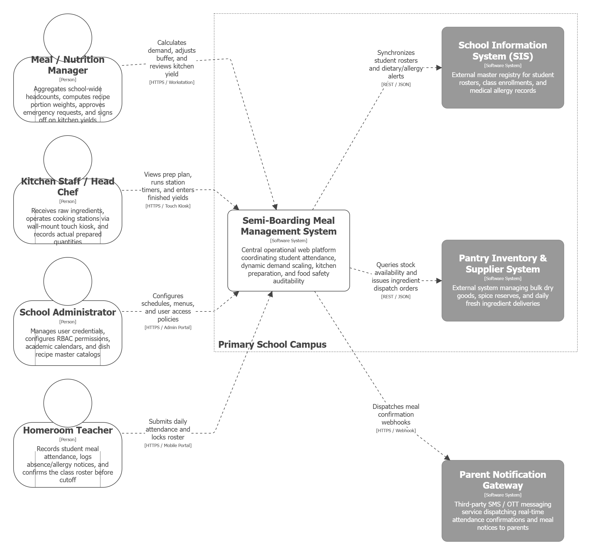

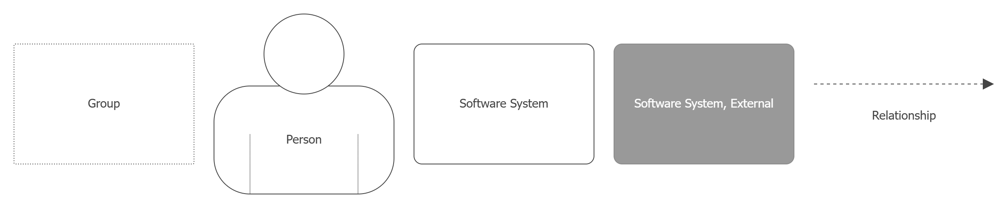

*For complete actor specifications and external integration protocols (SIS, Banking/VietQR, Parent Gateway, Catering Vendor), see [c4/c4-context.md](c4/c4-context.md).*

---

### Level 2 — Container Diagram

Illustrates the high-level deployable units: Unified Web Single-Page Application (4 role portals), Node.js / NestJS Backend REST API, WebSocket Real-time Broker, PostgreSQL 15 Relational Database, and S3-Compatible Media Storage:

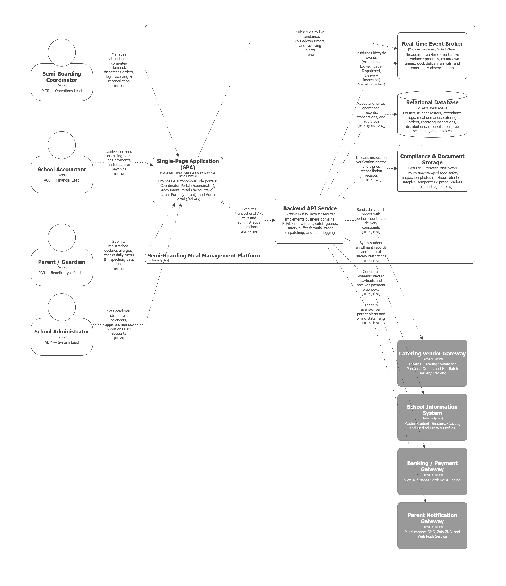


*For container runtime responsibilities, security boundaries, and networking protocols, see [c4/c4-containers.md](c4/c4-containers.md).*

---

### Level 3 — Component Architecture (All 8 Business Domains)

Each of the system's 8 business domains is architected with clear boundaries, separation of concerns, and defined controller-service-repository patterns:

#### Domain 1: Student Meal Management (Participation & Attendance)

Governs eligibility determination, semester boarding enrollment, classroom morning roll call, and 08:30 AM cutoff freeze:

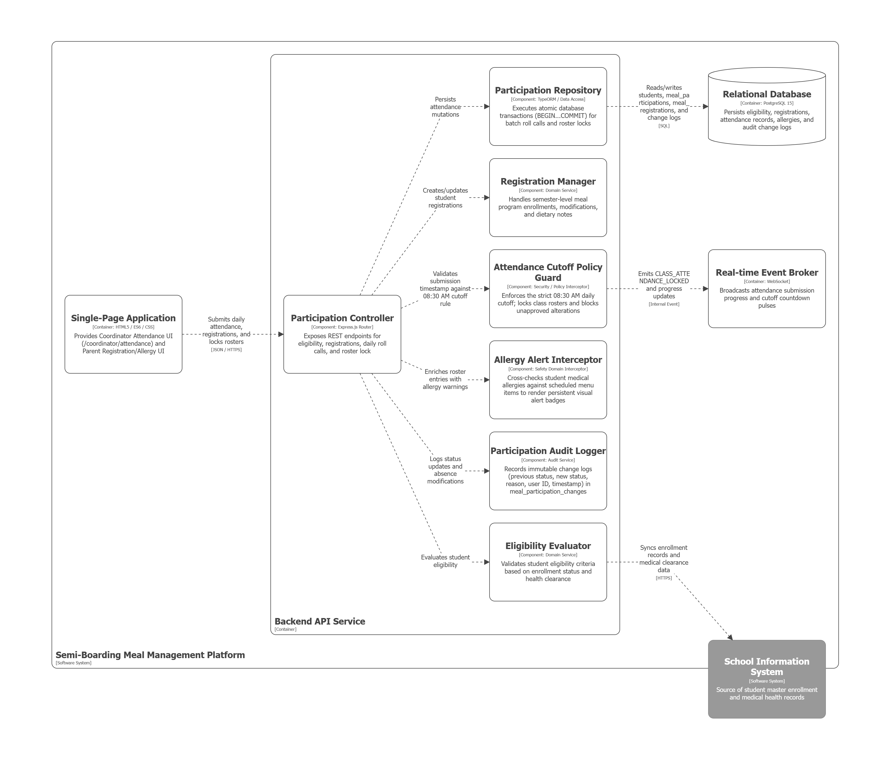

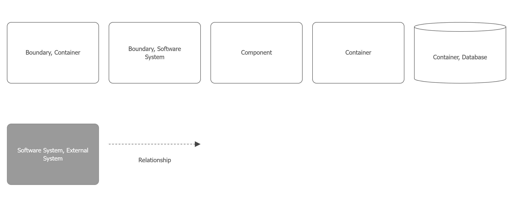

*Detailed specification: [c4/c4-components-participation.md](c4/c4-components-participation.md)*

---

#### Domain 2: Meal Planning & Menu Management

Manages the standardized nutritional dish catalog, weekly lunch menu composition, and 1-level administrative approval:

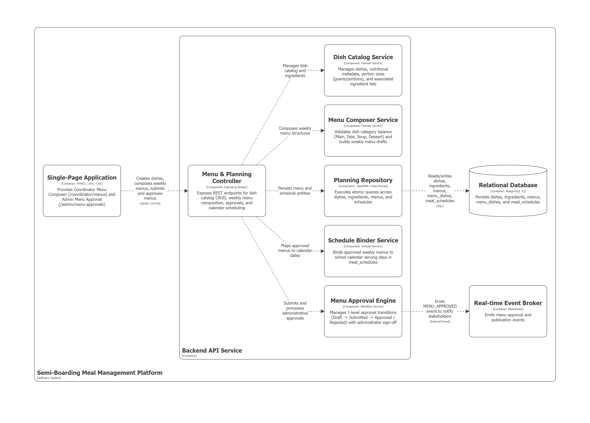

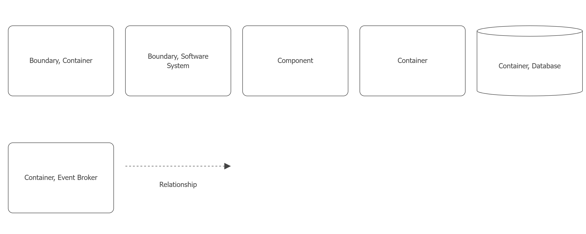

*Detailed specification: [c4/c4-components-planning.md](c4/c4-components-planning.md)*

---

#### Domain 3A: Meal Operation — Demand & Purchase Order Dispatch

Executes classroom roll-call aggregation, dynamic buffer application ($0\%\text{--}10\%$), portion calculations, and electronic PO dispatch to the caterer before 08:45 AM:

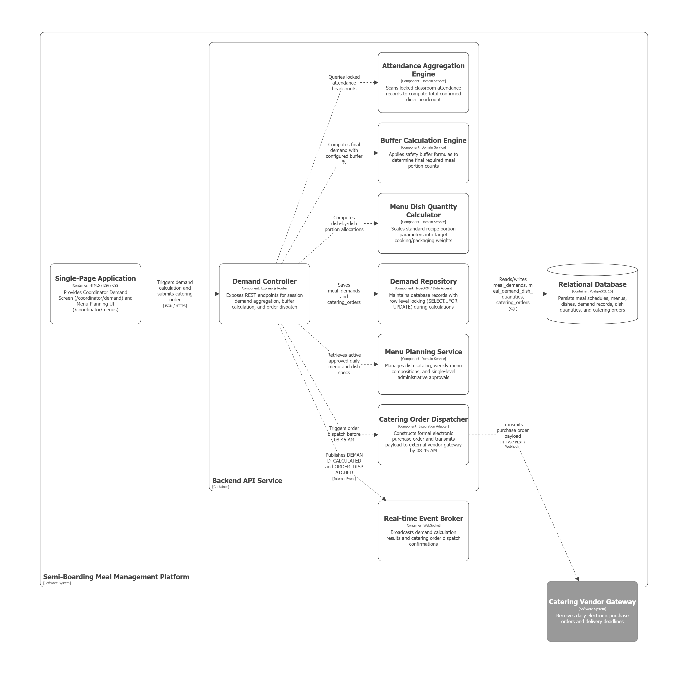


*Detailed specification: [c4/c4-components-demand.md](c4/c4-components-demand.md)*

---

#### Domain 3B: Meal Operation — Receiving, Distribution & Reconciliation

Governs 10:30 AM delivery dock receiving, 3-step food safety inspection (Decision 1246/QĐ-BYT, core temp $\ge 65^\circ\text{C}$), 11:00 AM classroom trolley distribution, and 13:00 PM 3-way quantity reconciliation:

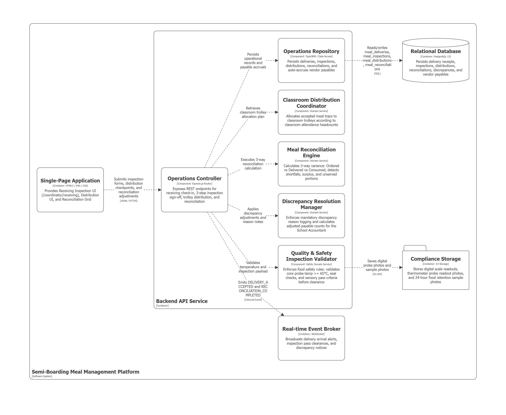


*Detailed specification: [c4/c4-components-preparation.md](c4/c4-components-preparation.md)*

---

#### Domain 4: Meal Fee & Cost Management

Configures meal fee schedules, generates monthly student billing batches with automatic absence credits, generates dynamic VietQR codes, and reconciles caterer payables:

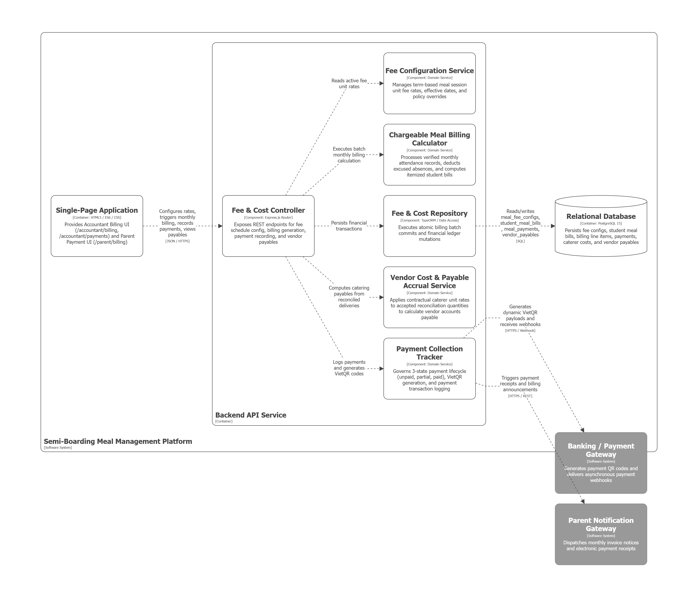


*Detailed specification: [c4/c4-components-fee-cost.md](c4/c4-components-fee-cost.md)*

---

#### Domain 5: Reporting & Transparency

Produces daily operational execution summaries, financial debt aging reports, and the public/parent daily transparency feed:

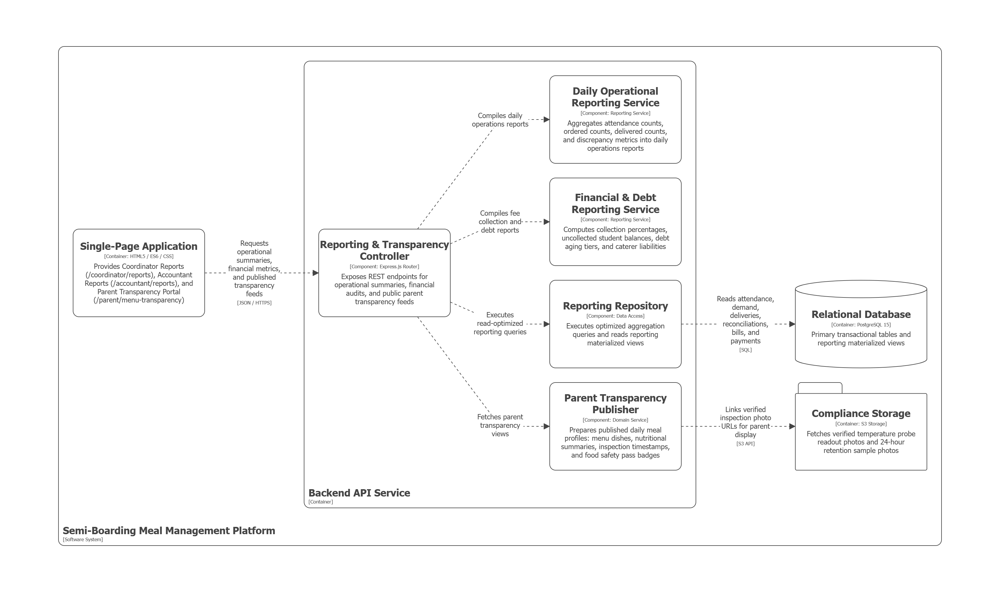

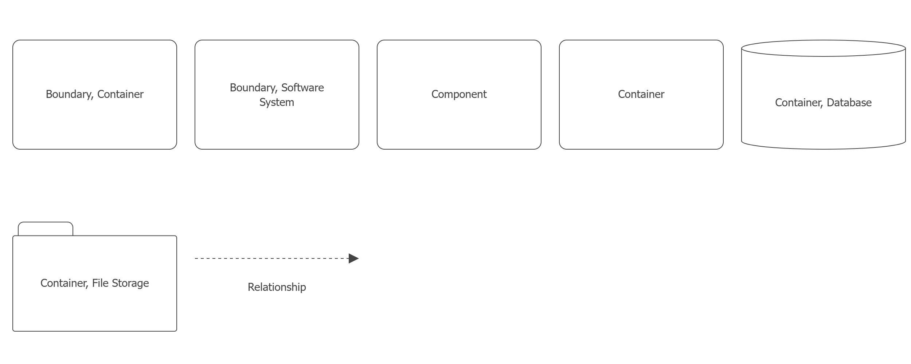

*Detailed specification: [c4/c4-components-reporting.md](c4/c4-components-reporting.md)*

---

#### Domain 6: User & Access Management

Manages user authentication, cryptographically signed JWT issuance, and the fixed 4-role RBAC security perimeter:

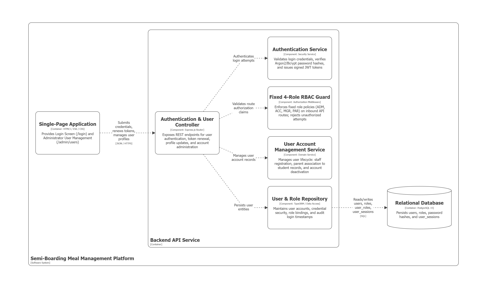

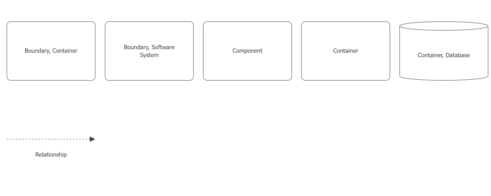

*Detailed specification: [c4/c4-components-users-rbac.md](c4/c4-components-users-rbac.md)*

---

#### Domain 7: Nutrition & Health Management

Captures medical food allergy declarations and performs non-blocking cross-referencing against daily lunch menus:

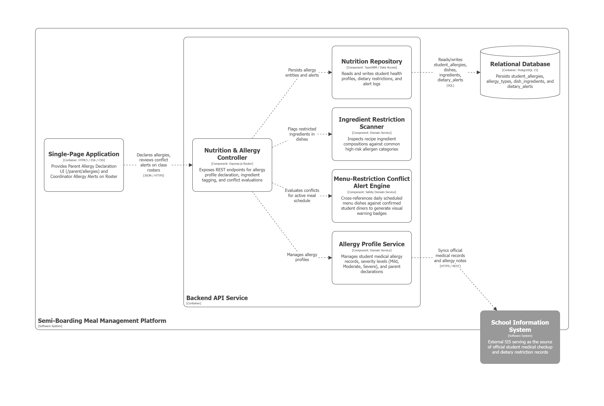


*Detailed specification: [c4/c4-components-nutrition.md](c4/c4-components-nutrition.md)*

---

#### Domain 8: Master Data & Academic Configuration

Maintains school academic years, semesters, grade levels, classes, student master profiles, lunch serving days, and holiday calendars:

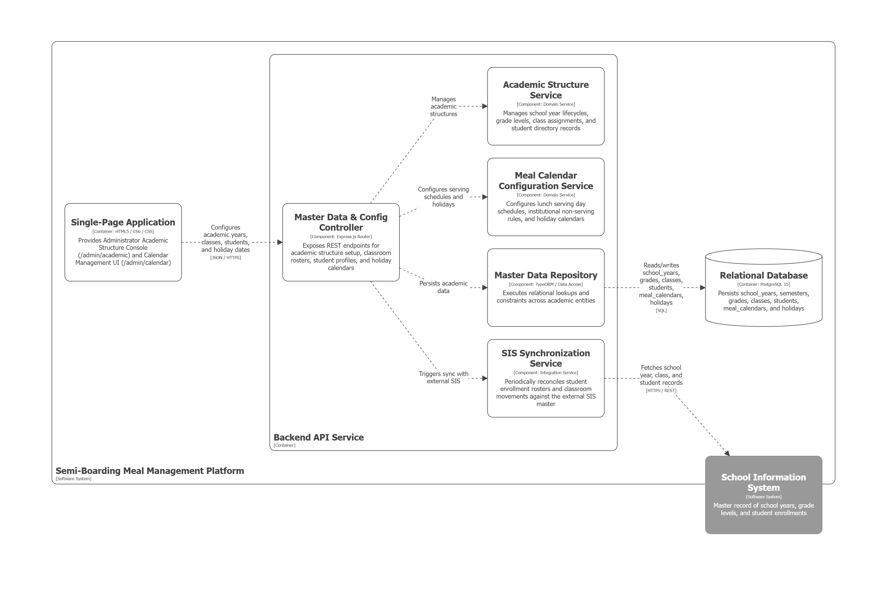


*Detailed specification: [c4/c4-components-master-data.md](c4/c4-components-master-data.md)*

---

## arc42 Architecture Documentation Suite

The complete architecture is documented according to the internationally recognized [arc42](https://arc42.org) standard (by Dr. Gernot Starke & Dr. Peter Hruschka) at the **ESSENTIAL** detail level under [`arc42/`](arc42/):

|   Section   | Title                                                           | Architectural Scope                                                                       |   Status   |
| :----------: | :-------------------------------------------------------------- | :---------------------------------------------------------------------------------------- | :---------: |
| **01** | [Introduction and Goals](arc42/01-introduction-and-goals.md)     | Business problem, MVP features, 4 measurable Q42 quality goals, stakeholder matrix        | ✅ Complete |
| **02** | [Architecture Constraints](arc42/02-architecture-constraints.md) | Technical constraints, operational cutoff rules, legal standards (Decision 1246/QĐ-BYT)  | ✅ Complete |
| **03** | [Context and Scope](arc42/03-context-and-scope.md)               | Business and technical context, external interfaces (`IF-01` to `IF-04`)              | ✅ Complete |
| **04** | [Solution Strategy](arc42/04-solution-strategy.md)               | Modular Monolith paradigm, DDD decomposition, technology trade-offs                       | ✅ Complete |
| **05** | [Building Block View](arc42/05-building-block-view.md)           | Static structure: Level-1 Containers and Level-2 Components across all 8 domains          | ✅ Complete |
| **06** | [Runtime View](arc42/06-runtime-view.md)                         | Dynamic scenarios: 08:30 cutoff lock, emergency triage, 3-step inspection, reconciliation | ✅ Complete |
| **07** | [Deployment View](arc42/07-deployment-view.md)                   | Campus LAN topology, hardware profiles (Tablets, Kiosks), Docker & TLS proxy              | ✅ Complete |
| **08** | [Crosscutting Concepts](arc42/08-crosscutting-concepts.md)       | Unified Domain Model, RBAC security, temporal guards, audit logging, error envelopes      | ✅ Complete |
| **09** | [Architecture Decisions](arc42/09-architecture-decisions.md)     | Nygard ADRs: Modular Monolith, Temporal Guards, Vanilla/React UI, WebSocket Pub/Sub       | ✅ Complete |
| **10** | [Quality Requirements](arc42/10-quality-requirements.md)         | 8 measurable quality scenarios (`QS-01` to `QS-08`) testing Q42 quality goals         | ✅ Complete |
| **11** | [Risks and Technical Debt](arc42/11-risks-and-technical-debt.md) | Prioritized risk register, mitigation strategies, and technical debt backlog              | ✅ Complete |
| **12** | [Glossary](arc42/12-glossary.md)                                 | Ubiquitous domain language, Vietnamese legal definitions, acronym expansions              | ✅ Complete |

---

## Relational Database Architecture (3NF Schema & ERD)

The persistence tier is designed as a normalized **Third Normal Form (3NF)** relational database running on **PostgreSQL 15**. It cleanly interconnects all operational domains: student registrations, meal schedules, classroom attendance, dynamic demands, catering purchase orders, dock receiving inspections, classroom distribution, 3-way reconciliation, billing batches, and VietQR payments.


> [!NOTE]
> - **Canonical DBML Schema:** [`docs/06-database/schema.dbml`](docs/06-database/schema.dbml)
> - **Production DDL Script:** [`database/PRIMARY SCHOOL SEMI-BOARDING MEAL MANAGEMENT SYSTEM.sql`](<database/PRIMARY SCHOOL SEMI-BOARDING MEAL MANAGEMENT SYSTEM.sql>)
> - **Schema & Architecture Guide:** [`docs/06-database/README.md`](docs/06-database/README.md)

---

## RESTful API Specification & OpenAPI 3.0.3

The platform exposes a standardized, production-ready RESTful API conforming to the **OpenAPI 3.0.3** standard.

- **Human-Readable API Manual:** [`docs/07-api-documentation/api-specification.md`](docs/07-api-documentation/api-specification.md)
- **Machine-Readable Contract:** [`docs/07-api-documentation/openapi.yaml`](docs/07-api-documentation/openapi.yaml)
- **Base URL:** `https://api.schoolmeals.edu.vn/api/v1`

### Swagger UI Visual Showcase

The interactive OpenAPI specification covers all 8 business domains with request/response schemas, error codes, and temporal guards:

#### 1. Authentication, Profile & Master Data Configuration (Domains 6 & 8)

*Covers JWT login, current user profile, system user directory, academic terms, grade/class structure, and serving calendar:*

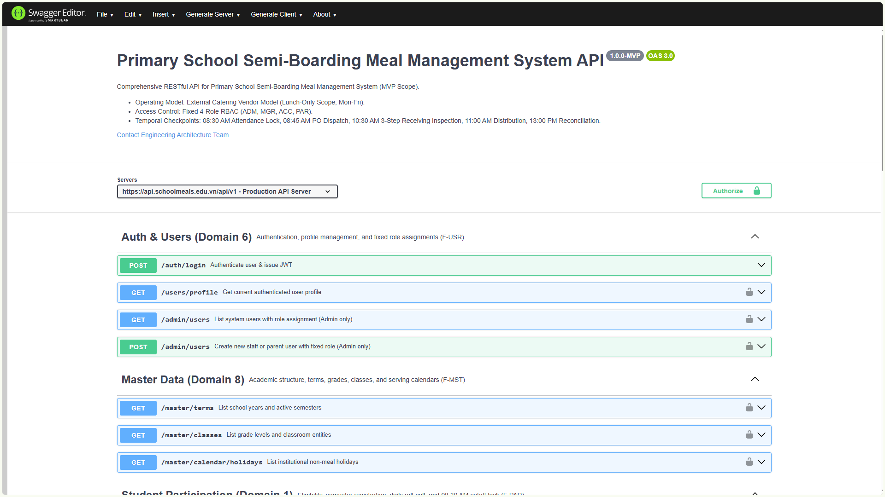

---

#### 2. Student Participation, Menus & Demand Aggregation (Domains 1, 2 & 3)

*Covers student boarding eligibility, semester registration, classroom morning roll call, 08:30 AM cutoff lock, emergency amendments, dish master catalog, weekly menu composition, and morning demand aggregation:*

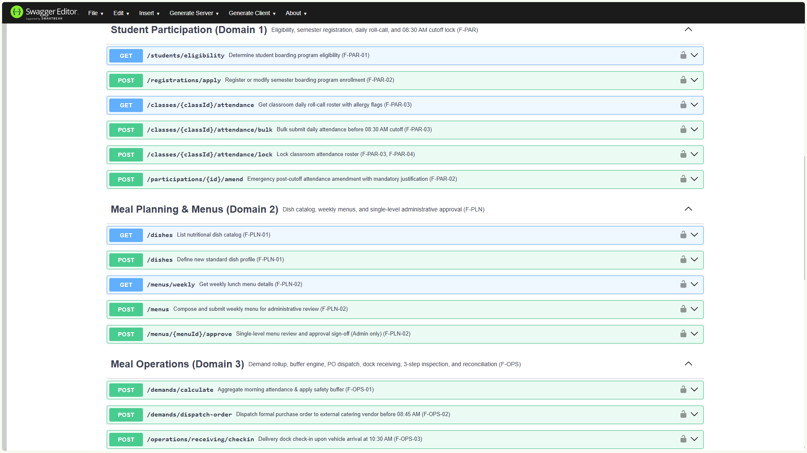

---

#### 3. Receiving Inspection, Distribution, 3-Way Reconciliation & Finance (Domains 3, 7 & 4)

*Covers 10:30 AM delivery dock check-in, statutory 3-step food safety inspection (Decision 1246/QĐ-BYT), trolley distribution confirmation, 13:00 PM 3-way reconciliation, medical allergy profiles, fee rates, monthly billing batches, and VietQR payments:*

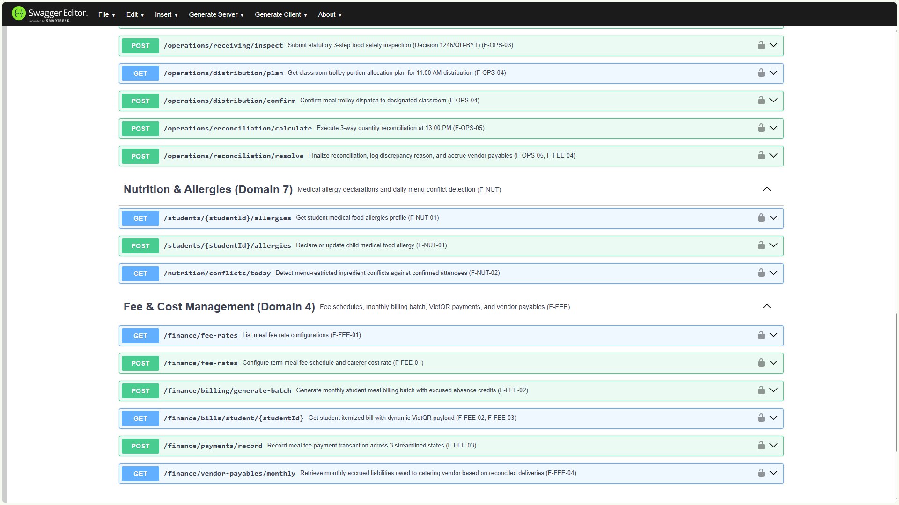

---

#### 4. Operational Reporting, Transparency & Standardized Response Envelopes (Domain 5)

*Covers daily meal operation summary reports, financial debt aging analysis, parent daily transparency feed, and standard JSON schema envelopes:*

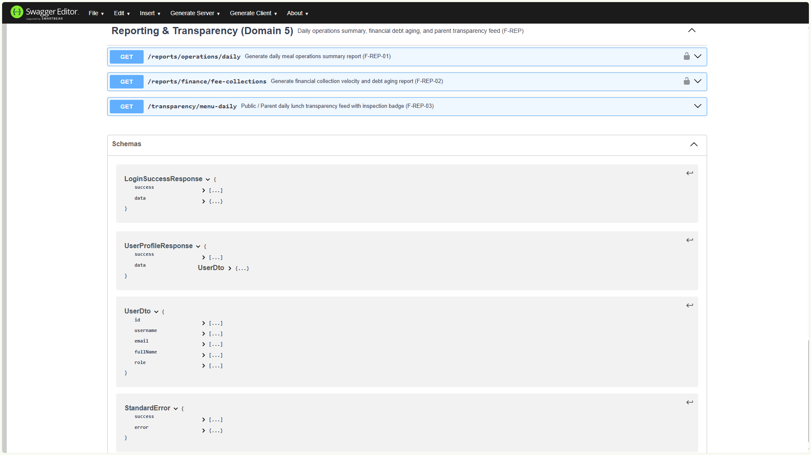

---

## Information Architecture & Portals

The information architecture enforces a **maximum navigation depth of $\le 2$ levels** across four dedicated portals:

```
App Root (/)
│
├── 📝 Teacher Portal (/teacher)
│   ├── Classroom Attendance Roster (/teacher/roster)           [SCR-TCH-01, US-PAR-01, US-PAR-03]
│   │   ├── [Modal] Status Amendment & Reason Dialog            [SCR-TCH-02, US-PAR-02]
│   │   └── [View] Roster Lock & Handover Confirmation          [SCR-TCH-03, US-PAR-03]
│   └── [Sheet] Post-Cutoff Emergency Request Form              [SCR-TCH-04, US-DMD-03]
│
├── 📋 Manager Portal (/manager)
│   ├── Demand Determination Dashboard (/manager/demand)        [SCR-MGR-01, US-DMD-01]
│   ├── Expected Raw Dish Quantities (/manager/quantities)      [SCR-MGR-02, US-DMD-02]
│   ├── Post-Lock Emergency Review Queue (/manager/changes)     [SCR-MGR-03, US-DMD-03]
│   ├── Kitchen Shift Plan Authoring (/manager/prep-plans)      [SCR-MGR-04, US-PRP-01]
│   └── Daily Yield Reconciliation & Audit (/manager/reconciliation) [SCR-MGR-05, US-PRP-04]
│
├── 🍳 Kitchen Kiosk Portal (/kitchen) [High-Contrast Kiosk Mode]
│   ├── Active Prep Shift Board (/kitchen/shift)                [SCR-KIT-01, US-PRP-01]
│   ├── Storage Ingredient Receiving Checklist (/kitchen/ingredients) [SCR-KIT-02, US-PRP-02]
│   ├── Cooking Timers & Batch Logger (/kitchen/cooking)        [SCR-KIT-03, US-PRP-03]
│   └── Prepared Yield Verification Gate (/kitchen/verification) [SCR-KIT-04, US-PRP-04]
│
└── 🔧 Admin Portal (/admin)
    ├── Student & Classroom Directory (/admin/students)         [SCR-ADM-01]
    ├── Meal Calendars & Cutoff Setup (/admin/schedules)        [SCR-ADM-02]
    ├── Dish & Recipe Master Catalog (/admin/catalog)           [SCR-ADM-03]
    └── User Roles & Access Control (/admin/users)              [SCR-ADM-04]
```

*For complete screen hierarchy, component inventory, and modal layers, refer to [docs/04-information-architecture/INFORMATION_ARCHITECTURE.md](docs/04-information-architecture/INFORMATION_ARCHITECTURE.md).*

---

## User Interface Showcase (Operational Portals)

The application delivers purpose-built interfaces tailored to each stakeholder's operational environment:

### 1. School Administrator — Executive Cockpit (`ADM`)

Monitors overall school meal operations, attendance completion rates across classrooms, and system health alerts:

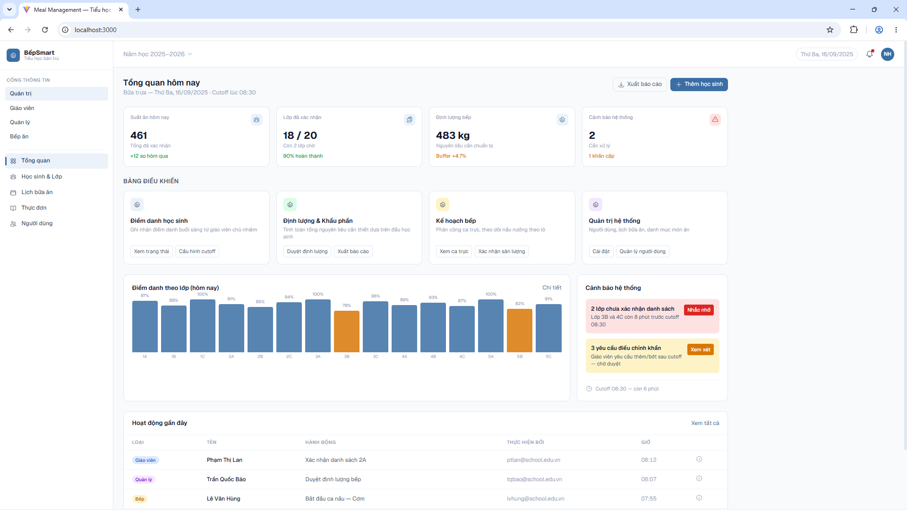

> **Key Capabilities:**
>
> - **Operational KPIs:** Real-time tracking of confirmed student meals, locked classroom count, and total required raw preparation weight.
> - **Grade-Level Completion:** Visual bar breakdown tracking roll-call progress across classes (1A to 5C).
> - **Quick Shortcuts:** Direct navigation to rosters, portioning rules, and audit logs.

---

### 2. Homeroom Teacher — Classroom Attendance Portal (`SCR-TCH-01`)

Allows fast morning student roll call on mobile/tablet devices with allergen alerts and countdown to the 08:30 AM cutoff:

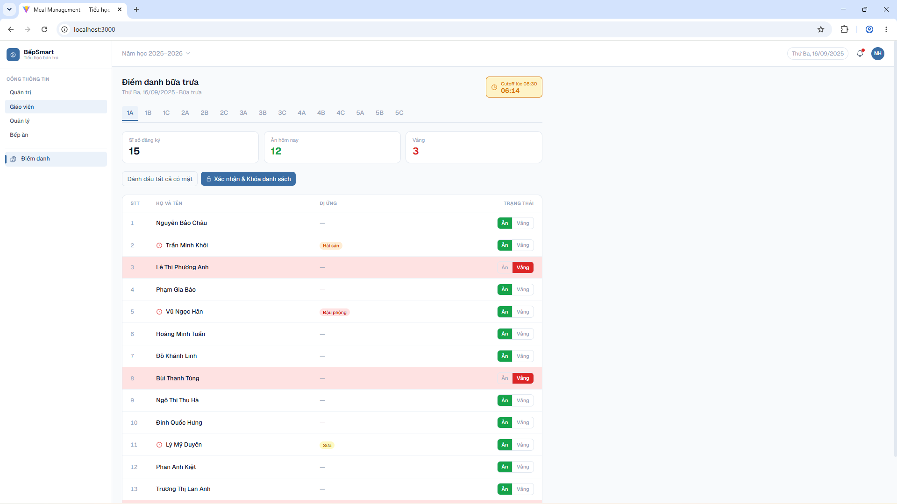

> **Key Capabilities:**
>
> - **One-Tap Attendance:** Rapid toggling (*Ăn* / *Vắng*) with real-time class headcount totals.
> - **Allergen Alert Chips:** High-visibility warnings (*Hải sản*, *Đậu phộng*, *Sữa*) to prevent contamination.
> - **Cutoff Countdown:** Live timer counting down to `08:30:00 AM` lock deadline.

---

### 3. Semi-Boarding Manager — Demand & Buffer Operations (`SCR-MGR-01`)

Aggregates attendance data across classrooms, applies dynamic safety buffers, and scales dish quantities:

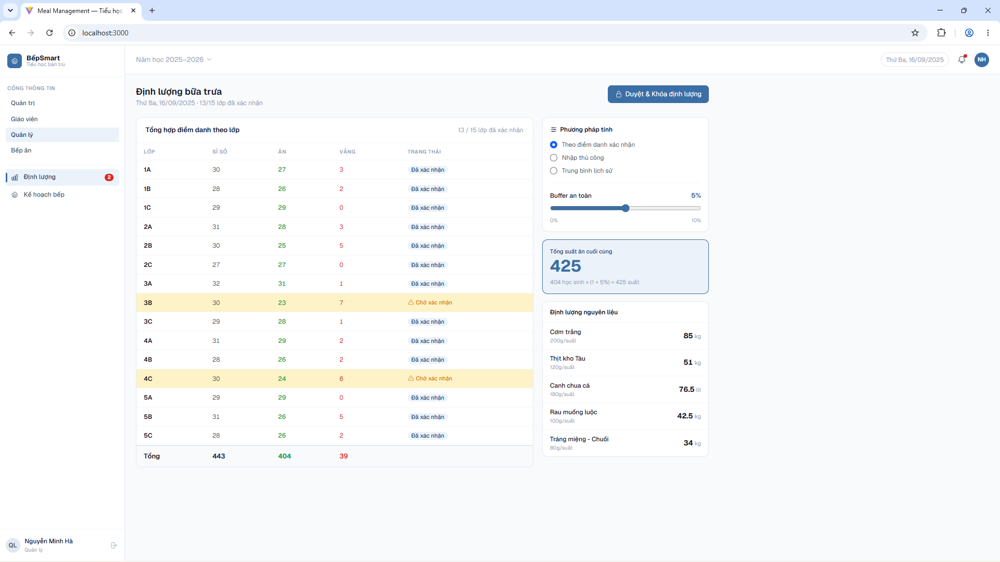

> **Key Capabilities:**
>
> - **Headcount Aggregation:** Real-time synchronization of submission progress across all grades.
> - **Interactive Safety Buffer:** Dynamic slider ($0\%\text{--}10\%$) recalculating final meal count.
> - **Ingredient Scaling:** Automatic calculation of required quantities before purchase order confirmation.

---

### 4. Kitchen / Catering Staff — Operational Floor Kiosk (`SCR-KIT-01`)

High-contrast touch interface designed for kitchen tablets or wall-mounted kiosks to guide preparation and receiving:

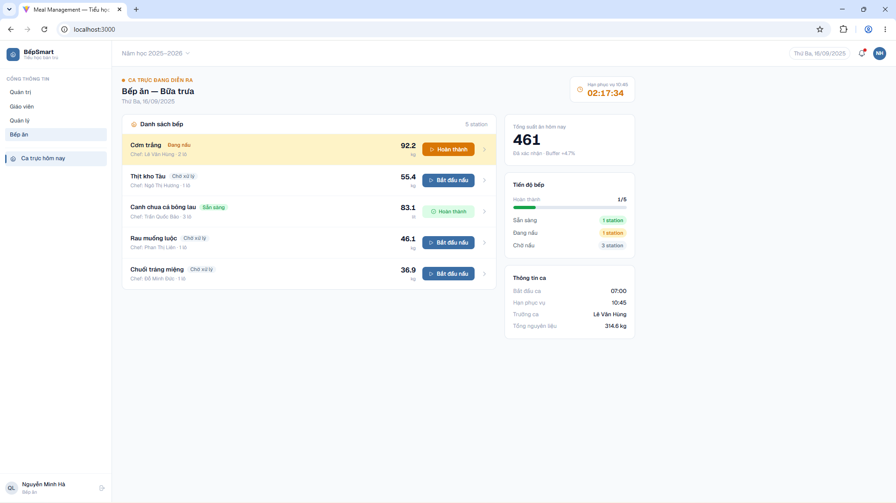

> **Key Capabilities:**
>
> - **Station-Segregated Workflow:** Clear line items by preparation station with assigned staff and target weights.
> - **Large Touch Targets:** Mistake-proof buttons (*"Bắt đầu nấu"*, *"Hoàn thành"*) suited for industrial kitchen environments.
> - **Service Deadline Countdown:** Countdown timer tracking target dispatch time (`10:45:00 AM`).

---

## Repository Structure

```
Top-Down-Approach/
├── README.md                          ← Project master documentation (You are here)
│
├── arc42/                             ← arc42 Software Architecture Suite (Sections 01–12)
│   ├── README.md                      ← arc42 master navigation index
│   ├── 01-introduction-and-goals.md   ← System goals, Q42 quality metrics, stakeholders
│   ├── 02-architecture-constraints.md ← Constraints (Cutoff, Decision 1246/QĐ-BYT)
│   ├── 03-context-and-scope.md        ← Business & technical context, external interfaces
│   ├── 04-solution-strategy.md        ← Modular Monolith, DDD, technology choices
│   ├── 05-building-block-view.md      ← Level-1 Containers & Level-2 Components
│   ├── 06-runtime-view.md             ← Dynamic sequence scenarios (Cutoff, HACCP)
│   ├── 07-deployment-view.md          ← Campus LAN, Docker containers, device profiles
│   ├── 08-crosscutting-concepts.md    ← Domain model, RBAC, temporal guards, audit
│   ├── 09-architecture-decisions.md   ← Architecture Decision Records (ADRs)
│   ├── 10-quality-requirements.md     ← Measurable quality scenarios (QS-01 to QS-08)
│   ├── 11-risks-and-technical-debt.md ← Risk register & technical debt backlog
│   └── 12-glossary.md                 ← Ubiquitous domain dictionary
│
├── c4/                                ← C4 Software Architecture Documentation Suite
│   ├── README.md                      ← C4 documentation map and index
│   ├── c4-context.md                  ← Level 1: System Context Diagram
│   ├── c4-containers.md               ← Level 2: Container Diagram
│   ├── c4-components-*.md             ← Level 3: Component Diagrams (Domains 1 to 8)
│   └── images/                        ← C4 architectural diagrams and legend keys
│
├── docs/                              ← Comprehensive 6-Phase Engineering Documentation
│   ├── README.md                      ← Documentation master index
│   ├── traceability.md                ← End-to-end forward/backward traceability matrix
│   ├── 01-top-down/                   ← Phase 01: System decomposition & mind map
│   ├── 02-core-features/              ← Phase 02: 24 Core MVP features & INVEST stories
│   ├── 03-roles-usecases/             ← Phase 03: Fixed 4-Role RBAC & UML use cases
│   ├── 04-information-architecture/   ← Phase 04: IA master spec, sitemap, 17 screens
│   ├── 05-ui-ux/                      ← Phase 05: Design system & wireframes
│   ├── 06-database/                   ← Phase 06: PostgreSQL 3NF schema, ERD, DBML
│   └── 07-api-documentation/          ← Phase 07: REST API spec, OpenAPI 3.0.3, Swagger
│
├── database/                          ← Production SQL Scripts
│   ├── PRIMARY SCHOOL SEMI-BOARDING MEAL MANAGEMENT SYSTEM.sql ← PostgreSQL 3NF DDL
│   └── DBDOCS.md                      ← Database dictionary & indexing strategy
│
├── backend/                           ← Production NestJS 10 Backend API
│   ├── src/                           ← Modular 3-tier NestJS implementation
│   ├── prisma/                        ← Prisma schema & migration scripts
│   └── package.json                   ← Backend dependencies & test scripts
│
├── frontend/                          ← Interactive React 19 + Vite Prototype
│   ├── src/                           ← React components & state management
│   ├── index.html                     ← Application entry point
│   └── package.json                   ← Frontend dependencies
│
└── screenshots/                       ← High-resolution UI captures of working prototype
    ├── s1.png                         ← Admin Dashboard
    ├── s2.png                         ← Teacher Attendance Portal
    ├── s3.png                         ← Meal Manager Operations
    └── s4.png                         ← Kitchen Kiosk Display
```

---

## Quick Start Guide

### Prerequisites

- **Node.js**: `v20.x` or higher
- **Package Manager**: `pnpm` (recommended) or `npm`
- **Database**: PostgreSQL 15+ (optional for local mock mode)

### 1. Backend Setup (NestJS + Prisma)

```bash
# Navigate to the backend directory
cd backend

# Install dependencies
pnpm install

# Configure environment variables
cp .env.example .env

# Generate Prisma client and run migrations
pnpm prisma:generate
pnpm prisma:migrate

# Start development server
pnpm start:dev
```

The API server will start at: **`http://localhost:3000/api/v1`**
Access Swagger documentation at: **`http://localhost:3000/api/docs`**

### 2. Frontend Setup (React 19 + Vite)

```bash
# Open a new terminal and navigate to the frontend directory
cd frontend

# Install dependencies
pnpm install

# Start Vite development server
pnpm dev
```

Open your browser at: **`http://localhost:5173/`** (or the port indicated in your console).

> [!TIP]
> The frontend prototype supports one-click role switching via the top navigation bar to explore the **Admin**, **Teacher**, **Manager**, and **Kitchen** views without requiring complex database seeds.
