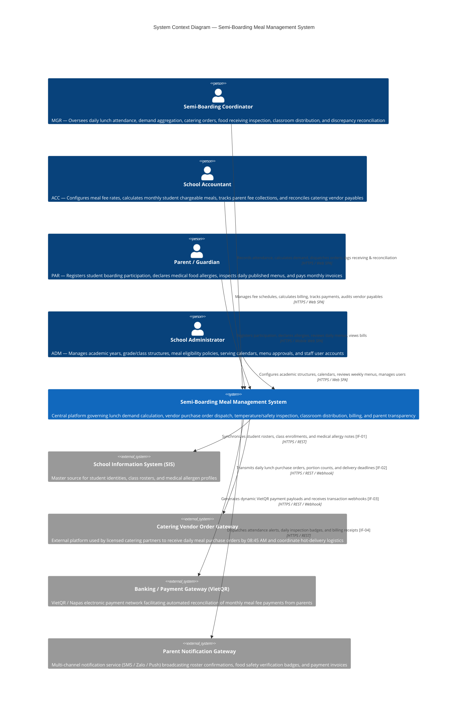

# 3. Context and Scope

## 3.1 Business Context

The **Primary School Semi-Boarding Meal Management System** operates as the central operational platform connecting school classrooms, semi-boarding coordination, financial accounting, parents, and external catering vendors. It defines the exact boundaries of automated lunch attendance, catering purchase order generation, dock food inspection, classroom trolley distribution, fee assessment, and parental transparency.

### Business Context Diagram

### Business External Interfaces

| Interface ID | Partner Entity | What Goes In (To System) | What Goes Out (From System) | Operational Cadence |
|:---:|:---|:---|:---|:---:|
| **IF-01** | **School Information System (SIS)** | Student enrollments, classroom assignments, active academic term calendar, and medical dietary restrictions (peanut, seafood, lactose, gluten). | Daily student meal attendance status confirmation (Present, Absent, Excused). | Synchronized nightly at 00:00 + on-demand classroom change webhooks. |
| **IF-02** | **Catering Vendor Order Gateway** | Order receipt acknowledgments, delivery vehicle dispatch metadata, driver contact, and arrival confirmation. | Formal electronic lunch purchase orders specifying confirmed diner counts, buffer margins, portion breakdown, and 10:30 AM arrival deadline. | Transmitted daily between 08:30 AM and 08:45 AM. |
| **IF-03** | **Banking / Payment Gateway (VietQR / Napas)** | Asynchronous payment execution webhooks (transaction reference, amount, paid timestamp, invoice ID). | Dynamic VietQR payment requests embedded with invoice identifier and exact amount. | Real-time on parent invoice viewing & webhook callback settlement. |
| **IF-04** | **Parent Notification Gateway** | Delivery receipts and SMS/push delivery status acknowledgments. | Event-driven parent alerts: morning attendance confirmation, published daily menu & food inspection badge, monthly billing statements. | Real-time push / Zalo ZNS / SMS triggered upon operational events. |

---

## 3.2 Technical Context

The technical context specifies the network boundaries, communication protocols, data encodings, and security mechanisms connecting the Semi-Boarding Meal Management System with its external environment.

| Interface ID | Channel / Medium | Protocol | Data Format | Authentication & Security |
|:---:|:---|:---|:---|:---|
| **IF-USER** | Public/Campus Intranet | HTTPS (TLS 1.3) + WSS | HTML5, JSON, WebSockets | Session Cookie + JWT Bearer, Role-Based Access Control (RBAC). |
| **IF-01 (SIS)** | Campus VPN / Private Subnet | HTTPS REST | JSON (OpenAPI 3.0) | Mutual TLS (mTLS) + API Gateway Service Token. |
| **IF-02 (Caterer)** | Public Internet / Partner VPN | HTTPS REST / Webhook | JSON (Idempotent Event Payload) | Bearer Token + HMAC-SHA256 Payload Signature. |
| **IF-03 (Payment)** | Public Internet (Banking Network) | HTTPS REST / Webhook | JSON | OAuth 2.0 / API Secret + SHA256 Signature Verification. |
| **IF-04 (Notifications)** | Public Internet | HTTPS REST | JSON | API Key + Client Credentials with upstream SMS/Push Provider. |

---

## 3.3 Scope & Boundaries (What is OUT of Scope)

To maintain architectural focus and prevent scope creep, the following domains are strictly excluded from this system's responsibility boundary:

- **Raw Ingredient Procurement & Cooking Operations:** The school does not purchase raw bulk meat/produce or manage kitchen cooking cauldrons; food preparation is entirely performed by the contracted Catering Vendor.
- **Breakfast, Afternoon Snacks, and Dinners:** The system exclusively governs the midday lunch program on standard school days (Monday–Friday).
- **Tuition & Non-Meal School Fees:** Academic tuition, facility maintenance, and extracurricular activity billing remain strictly in the primary School Accounting / ERP system.
- **General Academic Attendance:** Morning campus gate check-in and academic subject period attendance belong strictly to the School Information System (SIS).
