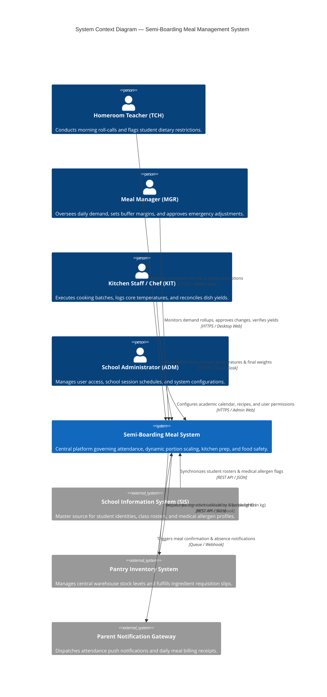

# 3. Context and Scope

## 3.1 Business Context

The **Primary School Semi-Boarding Meal Management System** operates as the operational nexus between classroom attendance, nutrition planning, kitchen culinary execution, and school administration. It defines the exact boundaries of automated meal demand calculation and kitchen batch tracking while interfacing with adjacent school information and logistics systems.

### Business Context Diagram

### Business External Interfaces

| Interface ID | Partner Entity | What Goes In (To System) | What Goes Out (From System) | Operational Cadence |
|:---:|:---|:---|:---|:---:|
| **IF-01** | **School Information System (SIS)** | Student enrollments, classroom assignments, active academic term calendar, and medical dietary restrictions (peanut, seafood, lactose, gluten). | Daily student meal attendance status confirmation (Present, Absent, Excused). | Synchronized nightly at 00:00 + on-demand classroom change webhooks. |
| **IF-02** | **Pantry Inventory System** | Raw ingredient inventory on-hand balances, expiration dates, and lot tracking numbers. | Digital ingredient allocation slips specifying dish recipe weight requirements (in kg). | Batch generated immediately upon morning cutoff lock (08:00 AM). |
| **IF-03** | **Parent Notification Gateway** | Delivery receipts and dispatch error acknowledgments. | Event-driven notifications: student meal check-in, excused absence meal credit confirmation, emergency change notices. | Real-time push / SMS triggered upon teacher lock and manager change approvals. |
| **IF-04** | **School Accounting / Billing** | Term billing schedules and student meal fee payment statuses. | Reconciled monthly meal consumption counts per student for fee credit / balance adjustments. | Monthly automated ledger export. |

---

## 3.2 Technical Context

The technical context specifies the network boundaries, communication protocols, data encodings, and security mechanisms connecting the Semi-Boarding Meal Management System with its external environment.

| Interface ID | Channel / Medium | Protocol | Data Format | Authentication & Security |
|:---:|:---|:---|:---|:---|
| **IF-USER** | Public/Campus Intranet | HTTPS (TLS 1.3) + WSS | HTML5, JSON, WebSockets | Session Cookie + JWT Bearer, Role-Based Access Control (RBAC). |
| **IF-01 (SIS)** | Campus VPN / Private Subnet | HTTPS REST | JSON (OpenAPI 3.0) | Mutual TLS (mTLS) + API Gateway Service Token. |
| **IF-02 (Inventory)** | Campus Intranet / Cloud VPC | HTTPS REST / Webhook | JSON (Idempotent Event Payload) | Bearer Token + HMAC-SHA256 Payload Signature. |
| **IF-03 (Parent Gateway)** | Public Internet | HTTPS REST | JSON | OAuth 2.0 Client Credentials with upstream SMS/Push Provider. |
| **IF-04 (Accounting)** | Internal SFTP / File Export | SFTP / HTTPS | Encrypted CSV / JSON | Scheduled batch transfer with PGP encryption. |

---

## 3.3 Scope & Boundaries (What is OUT of Scope)

To maintain architectural focus and prevent scope creep, the following domains are strictly excluded from this system's responsibility boundary:

- **Tuition & Payment Collection:** Payment gateway processing, bank card reconciliations, and direct cash collections are handled exclusively by the School Accounting System.
- **Supplier Sourcing & Purchasing:** Vendor contract negotiation, purchase order bidding, and outside supplier logistics remain in the Enterprise Procurement / ERP System.
- **Academic Attendance:** School-wide class period attendance and general academic grading belong strictly to the School Information System (SIS).
- **Physical Cooking Automation:** Smart kitchen appliance telemetry (e.g. IoT automated combi-oven controls) is out of scope; kitchen staff manually transcribe or use Bluetooth scale inputs into the kiosk.
