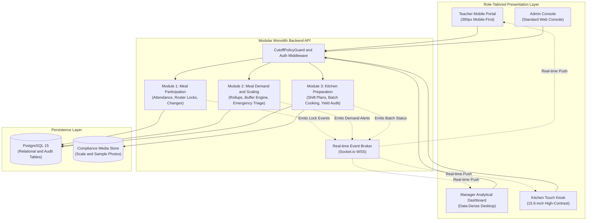

# 4. Solution Strategy

## Overview

The architecture of the **Primary School Semi-Boarding Meal Management System** follows a **Modular Monolith** paradigm paired with a **Role-Tailored Reactive Frontend** and an **Event-Driven Real-time Notification Layer**. This strategy balances high developer velocity, zero-dependency deployment simplicity, and robust transactional consistency across the morning attendance and cooking lifecycle.

Instead of adopting distributed microservices that introduce unnecessary operational latency and distributed transaction complexity across a single school campus, the system encapsulates the 3 core business domains (`Participation`, `Demand`, `Preparation`) into cleanly decoupled domain modules sharing a unified, ACID-compliant PostgreSQL database.

---

## 4.1 Technology Decisions

| Decision Area | Chosen Technology | Rationale & Architectural Drivers | Key Alternatives Considered & Rejected |
|:---|:---|:---|:---|
| **Backend Runtime** | **Node.js LTS + Express.js** | Lightweight asynchronous non-blocking I/O ideally suited for handling concurrent morning roll-call bursts (50+ classrooms submitting simultaneously) with minimal memory footprint. | *Java Spring Boot* (rejected due to excessive cold-start overhead and operational complexity for target school hardware); *Python FastAPI* (rejected due to team TypeScript/JavaScript runtime alignment). |
| **Relational Database** | **PostgreSQL 15** | Strict ACID transaction guarantees are mandatory for temporal cutoff locking, inventory allocation deductions, and immutable audit change ledgers. Rich JSONB support allows storing recipe variable parameters without schema bloat. | *MongoDB* (rejected due to lack of multi-table relational referential integrity needed for audit trails); *MySQL* (rejected due to weaker native JSON/UUID handling). |
| **Frontend Web Layer** | **Vanilla HTML5 + ES6 Modules + CSS Design Tokens** | Guarantees instant cold starts (< 500ms) on low-power classroom tablets and low-cost wall kiosks without heavy SPA framework runtime overhead (zero bundle hydration delay, zero npm dependency rot). | *React / Next.js* (rejected due to hydration overhead, client-side bundle size, and build complexity); *Flutter Web* (rejected due to heavy initial canvas download sizes). |
| **Real-Time Communication** | **WebSockets (Socket.io over WSS)** | Enables sub-second bi-directional event distribution (e.g. broadcasting classroom locks to the Manager dashboard and pushing emergency amendments). | *HTTP Short Polling* (rejected due to server connection saturation during peak morning hours); *Server-Sent Events (SSE)* (rejected due to lack of bi-directional acknowledgement). |
| **Persistence Storage** | **Object / File System Storage** | Stores photographic evidence of 24-hour food retention sample labels and digital scale display weights for regulatory food safety audits. | *Relational BLOB storage* (rejected due to database backup bloat and performance degradation). |

---

## 4.2 Decomposition Strategy

The system is decomposed using **Domain-Driven Design (DDD)** principles into 3 core operational modules and supporting crosscutting infrastructure layers:

### Core Business Capabilities:
- **Module 1 — Meal Participation Management:** Manages student daily attendance, classroom roll-call rosters, status modifications, and enforces the morning cutoff lock (`F-PAR-01` to `F-PAR-03`).
- **Module 2 — Meal Demand & Quantity Management:** Aggregates locked attendance headcounts, applies dynamic buffer margins (3%–5%), calculates recipe dish quantities, and orchestrates the emergency post-cutoff change request triage (`F-DMD-01` to `F-DMD-03`).
- **Module 3 — Kitchen Meal Preparation:** Translates dish demand into kitchen station shift plans, generates pantry requisition slips, logs batch cooking temperatures, and reconciles finished yields with photographic scale verification (`F-PRP-01` to `F-PRP-04`).

---

## 4.3 Approaches to Achieving Quality Goals

| Quality Goal (from Section 1.2) | Architectural Mechanism & Pattern | Implementation Details |
|:---|:---|:---|
| **Goal 1: `#reliable` Cutoff Lockdown & 100% Audit Trail** | **Server-Side Temporal Guard (`CutoffPolicyGuard`) & Append-Only Audit Tables** | The backend enforces a strict server-clock check interceptor on all `POST /api/v1/participations` routes. Any write after 08:00:00 AM is rejected with `409 CONFLICT` and routed to the `meal_demand_changes` table requiring manager approval. Database foreign keys and triggers ensure audit entries cannot be mutated or deleted. |
| **Goal 2: `#efficient` Sub-Second Demand Rollup & p95 < 300ms** | **Non-Blocking Asynchronous Processing, Composite Indexing, and WebSocket Push** | Teacher check-in endpoints write lean payloads indexed on `(meal_schedule_id, status)`. Demand aggregation queries use pre-compiled SQL aggregation functions. State changes emit WebSocket events (`CLASS_ROSTER_LOCKED`), updating the connected Manager dashboard in memory in $< 1\text{s}$. |
| **Goal 3: `#safe` Dietary Allergen Visibility & Core Temp Logging** | **Persistent View Decorator Pattern & Two-Phase Batch State Machine** | Student records retrieved from the database are decorated with persistent `has_allergy` boolean and allergen badges. Kitchen batch status transitions from `COOKING` to `READY_FOR_SERVING` are blocked at the service layer unless `core_temperature_celsius` $\ge 75^\circ\text{C}$ is supplied in the request body. |
| **Goal 4: `#usable` High-Speed Touch Ergonomics** | **Form-Factor Optimized UI Architecture with Native CSS Design Tokens** | Viewports are segregated by role: Teacher UI utilizes high-density touch toggles allowing 40 check-ins in $< 90\text{s}$; Kitchen Kiosk utilizes $\ge 48\text{px}$ touch buttons, virtual numeric keypads, and high-contrast color palettes operable with greasy gloves. |

---

## 4.4 Key Architectural Patterns

1. **Repository Pattern:** Decouples domain business logic from database query execution (`IParticipationRepository`, `IDemandRepository`, `IPreparationRepository`), facilitating isolated unit testing.
2. **Policy Guard Interceptor:** Enforces business rules (cutoff times, role privileges, classroom ownership) as reusable Express middleware before reaching domain controllers.
3. **Optimistic UI with WebSocket Reconciliation:** Front-end teacher mobile clients update toggle states immediately in DOM memory, committing to the server asynchronously and rolling back only on network failure.
4. **Append-Only Audit Sourcing:** For all modifications post-roster-lock, changes are recorded as incremental events (`meal_participation_changes`, `meal_demand_changes`), ensuring complete legal and financial traceability.
