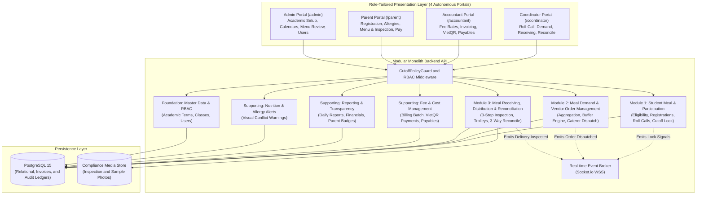

# 4. Solution Strategy

## Overview

The architecture of the **Primary School Semi-Boarding Meal Management System** follows a **Modular Monolith** paradigm paired with a **Role-Tailored Reactive Single-Page Application (SPA)** and an **Event-Driven Real-time Notification Layer**. This strategy balances high developer velocity, zero-dependency deployment simplicity, and robust transactional consistency across the morning attendance and catering lifecycle.

Instead of adopting distributed microservices that introduce unnecessary operational latency and distributed transaction complexity across a single school campus, the system encapsulates the business capabilities across 8 domains into cleanly decoupled modules sharing a unified, ACID-compliant PostgreSQL 15 database.

---

## 4.1 Technology Decisions

| Decision Area | Chosen Technology | Rationale & Architectural Drivers | Key Alternatives Considered & Rejected |
|:---|:---|:---|:---|
| **Backend Runtime** | **Node.js LTS + Express.js** | Lightweight asynchronous non-blocking I/O ideally suited for handling concurrent morning roll-call bursts (50+ classrooms submitting simultaneously) with minimal memory footprint. | *Java Spring Boot* (rejected due to excessive cold-start overhead and operational complexity for target school hardware); *Python FastAPI* (rejected due to team TypeScript/JavaScript runtime alignment). |
| **Relational Database** | **PostgreSQL 15** | Strict ACID transaction guarantees are mandatory for temporal cutoff locking, catering order dispatches, fee billing calculations, and immutable audit change ledgers. Rich JSONB support allows storing flexible nutritional parameters without schema bloat. | *MongoDB* (rejected due to lack of multi-table relational referential integrity needed for audit trails and accounting ledgers); *MySQL* (rejected due to weaker native JSON handling). |
| **Frontend Presentation** | **Vanilla HTML5 + ES6 Modules + CSS Design Tokens** | Guarantees instant cold starts (< 500ms) on low-power classroom tablets and coordinator smartphones without heavy SPA framework runtime overhead (zero bundle hydration delay, zero npm dependency rot). | *React / Next.js* (rejected due to hydration overhead, client-side bundle size, and build complexity); *Flutter Web* (rejected due to heavy initial canvas download sizes). |
| **Real-Time Communication** | **WebSockets (Socket.io over WSS)** | Enables sub-second bi-directional event distribution (e.g. broadcasting classroom locks to the Coordinator dashboard, 08:30 AM countdown pulses, and dock delivery alerts). | *HTTP Short Polling* (rejected due to server connection saturation during peak morning hours); *Server-Sent Events (SSE)* (rejected due to lack of bi-directional acknowledgement). |
| **Persistence Storage** | **Object / File System Storage (S3-compatible)** | Stores photographic evidence of dock digital thermometer readings, container seal integrity, and 24-hour food retention sample labels for regulatory food safety audits. | *Relational BLOB storage* (rejected due to database backup bloat and performance degradation). |

---

## 4.2 Decomposition Strategy

The system is decomposed using **Domain-Driven Design (DDD)** principles into 3 core operational modules matching the primary value chain, supported by crosscutting and foundation modules across all 8 business domains:

---

## 4.3 Addressing Quality Goals

The architecture achieves the Section 1.2 quality goals through targeted design decisions:

1. **Achieving `#reliable` (Cutoff Lockdown & Immutable Ledger):**
   - Implemented via `CutoffPolicyGuard` middleware intercepting attendance submissions. At 08:30:00 AM, direct updates are blocked with `409 Conflict`.
   - All subsequent changes require explicit reason capture in append-only tables (`meal_participation_changes`), ensuring 100% auditability for catering orders and monthly billing calculations.

2. **Achieving `#efficient` (High-Throughput Roll-Call & Real-Time Rollup):**
   - Lightweight JSON payloads (< 5KB per classroom submission) and non-blocking Node.js event loop ensure $p95 < 300\text{ms}$.
   - Attendance lock signals trigger in-process events to the WebSocket Broker, pushing recalculated school headcounts to the Coordinator dashboard in $< 1.0\text{ second}$.

3. **Achieving `#safe` (Food Safety & Allergen Visibility):**
   - The inspection workflow blocks state transitions to `ACCEPTED` if core temperature is $< 65^\circ\text{C}$ or if 24-hour retention sample photos are omitted.
   - Medical allergy profiles synchronized from the SIS are pre-joined with student roster payloads, rendering persistent visual warning chips on coordinator and distribution views.

4. **Achieving `#usable` (Role-Tailored Ergonomics):**
   - Segregated into 4 autonomous role portals with zero irrelevant UI clutter.
   - Teacher roll-call uses 390px mobile-first cards completing in $< 90\text{ seconds}$; dock receiving inspection uses streamlined checklist cards completing in $< 3\text{ minutes}$.
