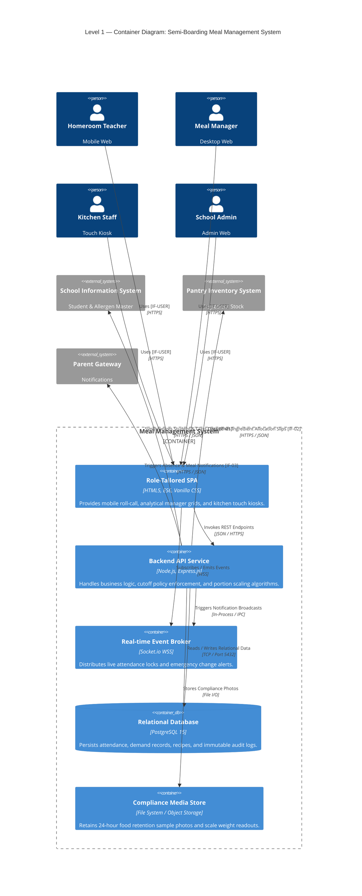
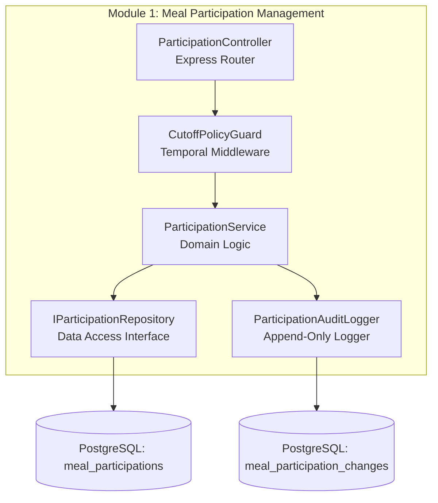
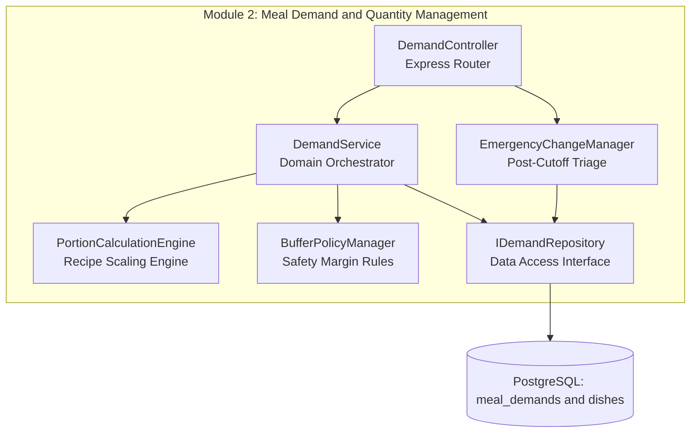
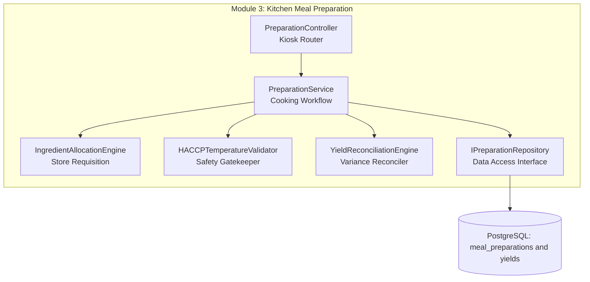

# 5. Building Block View

## Overview

The **Building Block View** shows the static decomposition of the Semi-Boarding Meal Management System into hierarchical structural units. It follows a multi-level white-box / black-box approach:
- **Level 1 (System Containers):** High-level deployable units and their communication interfaces.
- **Level 2 (Domain Components):** Internal components of the Backend API decomposed across the 3 core operational modules (`Participation`, `Demand`, `Preparation`).

---

## 5.1 Level 1 — System Containers (Whitebox)

The system is decomposed into five primary deployable containers: client-side Single-Page Application (SPA) portals, an Express.js Backend API Service, an asynchronous Real-time Event Broker, a PostgreSQL Relational Database, and an Asset Media Store.

### Container Architecture Diagram

### Level 1 Component Specifications

| Container | Technology Stack | Core Responsibilities | Directory Path |
|:---|:---|:---|:---|
| **Role-Tailored SPA** | HTML5, ES6 Modules, Vanilla CSS | Presents role-optimized viewports (390px mobile card roll-call for teachers, data-dense analytical grid for managers, 48px touch kiosks for chefs). | `frontend/` |
| **Backend API Service** | Node.js LTS, Express.js | Implements domain services, temporal cutoff policy guards (`CutoffPolicyGuard`), portion calculation engines, and ACID database operations. | `backend/src/` |
| **Real-time Event Broker** | Socket.io over WSS | Manages active WebSocket client rooms (`teachers`, `managers`, `kitchen`), broadcasting real-time roster lock signals and emergency alerts. | `backend/src/websocket/` |
| **Relational Database** | PostgreSQL 15 | Enforces relational integrity, check constraints, composite B-tree indexing, and append-only audit tables (`meal_participation_changes`, `meal_demand_changes`). | `docs/06-database/` |
| **Compliance Media Store** | Local Storage / S3 | Stores photo attachments of kitchen digital scale readouts and 24-hour food retention sample jars for regulatory audits. | `storage/media/` |

---

## 5.2 Level 2 — Internal Domain Components (Decomposition of Backend API)

The Backend API is internally structured into 3 decoupled domain modules matching the MVP business capabilities:

### Module 1: Meal Participation Management (`M1`)

Governs student attendance, daily meal inclusion, status modifications, and the 08:00 AM cutoff policy lock.

- **`ParticipationController`:** Handles HTTP requests from teacher mobile clients (`POST /api/v1/participations`, `GET /api/v1/roster`).
- **`CutoffPolicyGuard`:** Express middleware that verifies current system clock against the 08:00:00 AM cutoff parameter. Direct edits after 08:00 AM are rejected with `409 CONFLICT`.
- **`ParticipationService`:** Encapsulates business validation: enforces valid absence reasons and ensures student dietary alerts are retained.
- **`ParticipationAuditLogger`:** Persists every pre-cutoff change into `meal_participation_changes` with user ID and timestamp.

---

### Module 2: Meal Demand & Quantity Management (`M2`)

Aggregates locked classroom headcounts, executes dynamic recipe portion formulas, applies safety buffer margins (3%–5%), and orchestrates the emergency post-cutoff triage.

- **`DemandController`:** Exposes endpoints for the Manager Analytical Dashboard (`GET /api/v1/demand/summary`, `POST /api/v1/demand/emergency-approval`).
- **`PortionCalculationEngine`:** Pure domain calculation service. Multiplies confirmed headcounts by standardized recipe ingredient weights (e.g. $100\text{g protein/student}$).
- **`BufferPolicyManager`:** Applies and bounds safety buffer percentages ($3\% \le \text{buffer} \le 10\%$), preventing under-portioning while capping catering budget overrun.
- **`EmergencyChangeManager`:** Manages the two-step triage workflow: receives late absence/arrival requests from teachers and queues them for manager approval.

---

### Module 3: Kitchen Meal Preparation (`M3`)

Transforms calculated dish demand into station shift schedules, provisions pantry ingredient requisitions, captures batch cooking temperatures, and reconciles finished yields.

- **`PreparationController`:** Serves the Wall-Mounted Kitchen Kiosk interface (`GET /api/v1/prep/tasks`, `POST /api/v1/prep/temperature`).
- **`IngredientAllocationEngine`:** Derives storekeeper pantry pick-lists from recipe weights and validates ingredient availability before cooking shifts commence.
- **`HACCPTemperatureValidator`:** Enforces food safety rules: prevents transitioning cooking batches to `READY_FOR_SERVING` unless recorded temperature is $\ge 75^\circ\text{C}$.
- **`YieldReconciliationEngine`:** Compares gross finished weight (kg) against planned demand weight. Automatically flags discrepancies $> \pm 3\%$ and demands mandatory chef discrepancy notes.

---

## 5.3 Traceability to Code Layer (C4 Level 4)

Each Level 2 component maps directly to concrete domain classes, interfaces, and database entities documented in the C4 Level 4 specifications:
- **Module 1 Class Model:** [c4/c4-code-participation.md](../c4/c4-code-participation.md)
- **Module 2 Class Model:** [c4/c4-code-demand.md](../c4/c4-code-demand.md)
- **Module 3 Class Model:** [c4/c4-code-preparation.md](../c4/c4-code-preparation.md)
- **Relational Schema & DDL:** [docs/06-database/database-ddl.sql](../docs/06-database/database-ddl.sql)
