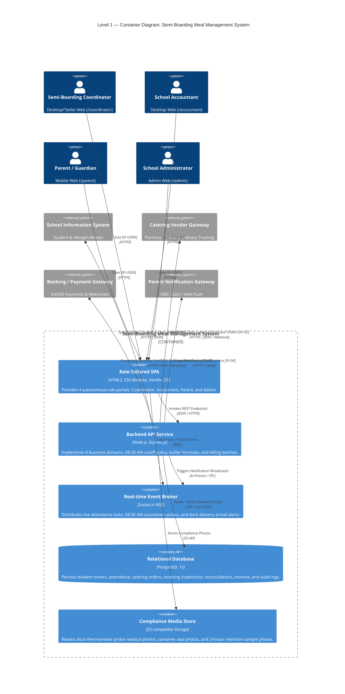
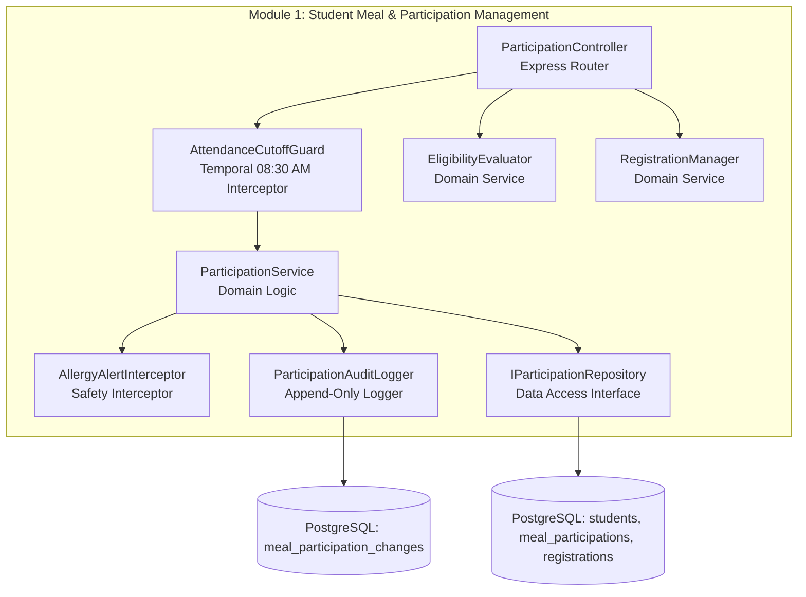
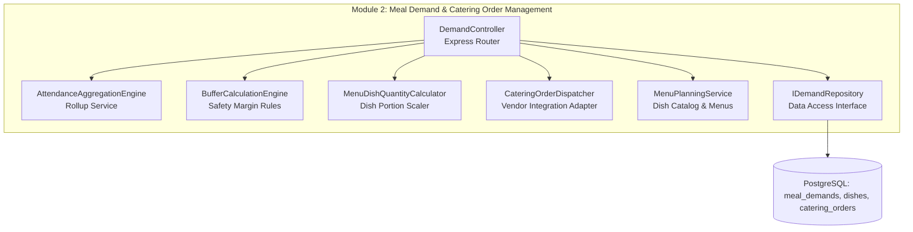
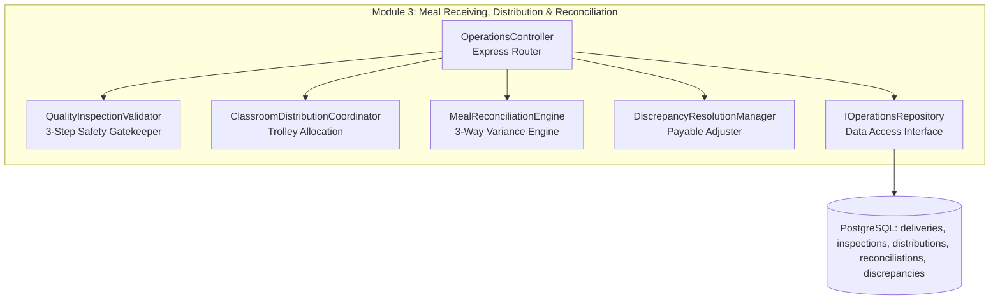

# 5. Building Block View

## Overview

The **Building Block View** shows the static decomposition of the Semi-Boarding Meal Management System into hierarchical structural units. It follows a multi-level white-box / black-box approach:
- **Level 1 (System Containers):** High-level deployable units and their communication interfaces.
- **Level 2 (Domain Components):** Internal components of the Backend API decomposed across the 3 core operational modules (`Participation`, `Demand & Vendor Orders`, `Receiving, Distribution & Reconciliation`).

---

## 5.1 Level 1 — System Containers (Whitebox)

The system is decomposed into five primary deployable containers: client-side Single-Page Application (SPA) structured into 4 autonomous role portals, an Express.js Backend API Service, an asynchronous Real-time Event Broker, a PostgreSQL 15 Relational Database, and an S3-compatible Compliance Media Store.

### Container Architecture Diagram

### Level 1 Component Specifications

| Container | Technology Stack | Core Responsibilities | Directory Path |
|:---|:---|:---|:---|
| **Role-Tailored SPA** | HTML5, ES6 Modules, Vanilla CSS | Presents 4 autonomous role portals: Coordinator Portal (`/coordinator`), Accountant Portal (`/accountant`), Parent Portal (`/parent`), Admin Portal (`/admin`). | `frontend/` |
| **Backend API Service** | Node.js LTS, Express.js | Implements domain services, temporal cutoff policy guards (`AttendanceCutoffGuard`), safety buffer calculations, order dispatchers, and ACID database operations. | `backend/src/` |
| **Real-time Event Broker** | Socket.io over WSS | Manages active WebSocket client rooms (`coordinators`, `teachers`, `accountants`, `parents`), broadcasting real-time roster lock signals, delivery arrivals, and emergency alerts. | `backend/src/websocket/` |
| **Relational Database** | PostgreSQL 15 | Enforces relational integrity, check constraints, composite B-tree indexing, and append-only audit tables (`meal_participation_changes`, `meal_discrepancies`). | `docs/06-database/` |
| **Compliance Media Store** | Local Storage / S3 | Stores photo attachments of dock thermometer probe readouts, container seals, and 24-hour food retention sample jars for regulatory audits. | `storage/media/` |

---

## 5.2 Level 2 — Internal Domain Components (Decomposition of Backend API)

The Backend API is internally structured into 3 core operational modules matching the primary value chain, supported by fee, reporting, and master data modules:

### Module 1: Student Meal & Participation Management (`M1`)

Governs student intake eligibility, semester boarding registrations, daily classroom roll-call, and the strict 08:30 AM attendance cutoff lock.

- **`ParticipationController`:** Exposes endpoints for daily classroom attendance (`POST /api/v1/classes/:classId/attendance/bulk`, `POST /api/v1/classes/:classId/attendance/lock`).
- **`AttendanceCutoffGuard`:** Express middleware enforcing the strict 08:30:00 AM daily cutoff. Direct updates after 08:30 AM are rejected with `409 Conflict`.
- **`EligibilityEvaluator`:** Evaluates boarding intake eligibility criteria based on enrollment status and health clearance.
- **`RegistrationManager`:** Manages semester-level meal program enrollments, modifications, and dietary notes.
- **`AllergyAlertInterceptor`:** Cross-checks student medical allergy profiles against daily scheduled menus to render persistent visual alert badges.
- **`ParticipationAuditLogger`:** Persists every attendance modification into `meal_participation_changes` with user ID, timestamp, and explicit reason.

---

### Module 2: Meal Demand & Vendor Order Management (`M2`)

Aggregates locked classroom headcounts, applies safety buffer margins ($0\%\text{--}10\%$), calculates expected dish quantities, and dispatches electronic purchase orders to the external catering vendor before 08:45 AM.

- **`DemandController`:** Exposes endpoints for the Coordinator Demand screen (`GET /api/v1/demands/today`, `POST /api/v1/demands/calculate`, `POST /api/v1/demands/dispatch-order`).
- **`AttendanceAggregationEngine`:** Scans locked classroom attendance records immediately after 08:30 AM to calculate total confirmed student diners.
- **`BufferCalculationEngine`:** Applies safety buffer formulas:
  $$\text{Final Demand Count} = \text{round}\Big(\text{Total Confirmed Attendance} \times (1 + \text{Buffer\%})\Big)$$
- **`MenuDishQuantityCalculator`:** Scales portion sizes according to the approved daily menu.
- **`CateringOrderDispatcher`:** Formats the formal electronic purchase order and transmits the payload to the external Catering Vendor Gateway before 08:45 AM.

---

### Module 3: Meal Receiving, Distribution & Reconciliation (`M3`)

Enforces 10:30 AM dock receiving with 3-step food safety inspection, coordinates 11:00 AM classroom trolley distribution, and executes 13:00 PM post-lunch 3-way quantity reconciliation.

- **`OperationsController`:** Serves receiving, distribution, and reconciliation screens (`/coordinator/receiving`, `/coordinator/distribution`, `/coordinator/reconciliation`).
- **`QualityInspectionValidator`:** Enforces Decision 1246/QĐ-BYT: validates core probe temp $\ge 65^\circ\text{C}$, container seals, sensory checks, and 24-hour food retention sample photos before clearance.
- **`ClassroomDistributionCoordinator`:** Allocates accepted hot meal trays to classroom delivery trolleys according to confirmed attendance.
- **`MealReconciliationEngine`:** Calculates 3-way variance: Ordered vs. Delivered vs. Consumed, detecting shortfalls, surplus, and unserved portions at 13:00 PM.
- **`DiscrepancyResolutionManager`:** Enforces mandatory discrepancy reason logging and calculates adjusted accepted billing counts for the School Accountant.

---

## 5.3 Traceability to Code Layer & C4 Architecture Models

Each Level 2 component maps directly to the C4 specifications and database schemas:
- **Participation Components:** [c4/c4-components-participation.md](../c4/c4-components-participation.md)
- **Demand Components:** [c4/c4-components-demand.md](../c4/c4-components-demand.md)
- **Preparation & Operations Components:** [c4/c4-components-preparation.md](../c4/c4-components-preparation.md)
- **Fee & Cost Components:** [c4/c4-components-fee-cost.md](../c4/c4-components-fee-cost.md)
- **Reporting Components:** [c4/c4-components-reporting.md](../c4/c4-components-reporting.md)
- **Relational Schema & DDL:** [docs/06-database/database-ddl.sql](../docs/06-database/database-ddl.sql)
