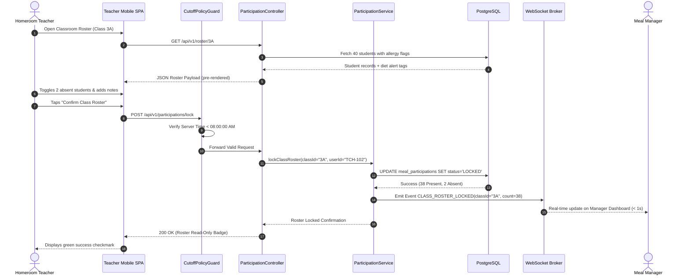
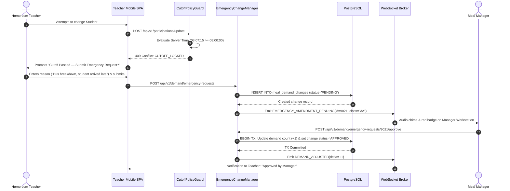
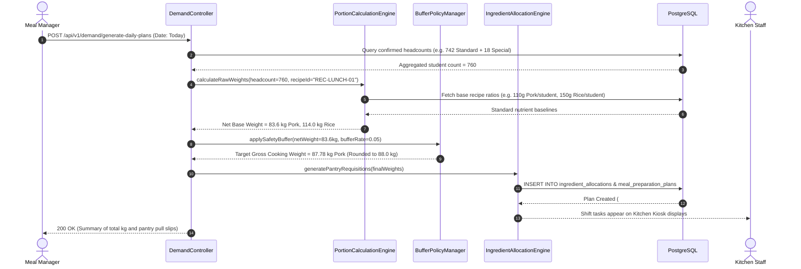
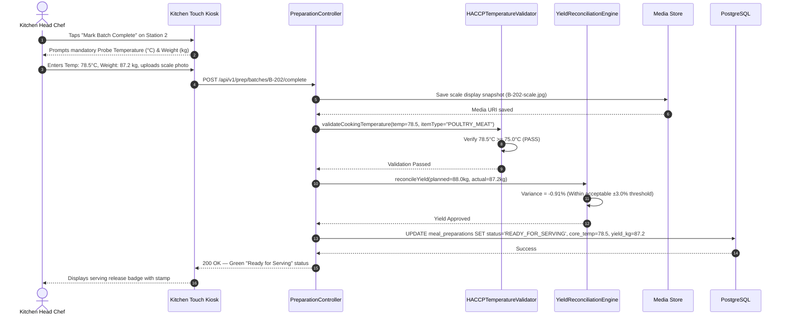

# 6. Runtime View

## Overview

The **Runtime View** captures the dynamic behavioral interactions between building blocks, data stores, and human actors during critical operational milestones. The four scenarios documented below represent the essential operational backbone of the school day:
1. **Morning Attendance Roll-Call & Roster Lock** (Happy Path — High throughput check-in).
2. **Post-08:00 Cutoff Enforcement & Emergency Change Triage** (Exception & Boundary Guard — Reliability).
3. **Dynamic Portion Scaling & Kitchen Shift Scheduling** (Domain Calculation — Algorithmic Scaling).
4. **HACCP Cooking Temperature Verification & Yield Reconciliation** (Safety Gatekeeper — Food Safety).

---

## 6.1 Scenario 1: Morning Attendance Roll-Call & Roster Lock

**Purpose:** Demonstrates high-concurrency morning check-in and sub-second demand rollup to the central manager workstation.  
**Trigger:** Homeroom Teacher (`TCH`) initiates classroom roll-call between 07:30 AM and 08:00 AM.  
**Participants:** `Teacher SPA`, `ParticipationController`, `CutoffPolicyGuard`, `ParticipationService`, `PostgreSQL`, `WebSocket Broker`, `Manager SPA`.  
**Quality Goals Illustrated:** `#efficient` (Sub-300ms p95 latency, < 1s aggregation), `#usable` (< 90s roll-call).

### Execution Steps:
1. Teacher loads classroom view; mobile UI loads pre-cached student list and allergy flags.
2. Teacher marks 2 absent students with reasons (*Sick leave*, *Family matter*).
3. Teacher taps **Confirm Class Roster** at 07:52 AM.
4. `CutoffPolicyGuard` verifies current server time is prior to 08:00:00 AM.
5. `ParticipationService` executes an atomic SQL transaction updating student statuses and locking class 3A.
6. Service triggers WebSocket event `CLASS_ROSTER_LOCKED`.
7. Manager analytical dashboard recalculates and increments confirmed headcount live without page refresh.

---

## 6.2 Scenario 2: Post-08:00 Cutoff Rejection & Emergency Change Triage

**Purpose:** Illustrates the temporal protection mechanism preventing unauthorized direct database modifications after kitchen prep has begun.  
**Trigger:** Teacher attempts to mark a late-arriving student after 08:00:00 AM.  
**Participants:** `Teacher SPA`, `CutoffPolicyGuard`, `EmergencyChangeManager`, `PostgreSQL`, `WebSocket Broker`, `Manager SPA`.  
**Quality Goals Illustrated:** `#reliable` (Strict cutoff lockdown, 100% auditable amendments).

### Execution Steps:
1. Teacher attempts a late change at 08:07 AM; `CutoffPolicyGuard` intercepts and blocks the write with `409 Conflict`.
2. Mobile UI displays the Emergency Amendment form modal (`SCR-TCH-04`).
3. Teacher submits the late arrival note; request is written to `meal_demand_changes` in `PENDING` state.
4. WebSocket broker immediately pushes an emergency alert to the Meal Manager's active session.
5. Meal Manager reviews current kitchen capacity and clicks **Approve**.
6. System atomically updates the aggregated demand count and sends notification receipts to both teacher and kitchen kiosk.

---

## 6.3 Scenario 3: Dynamic Portion Scaling & Kitchen Shift Scheduling

**Purpose:** Demonstrates how confirmed student headcounts dynamically scale into exact raw ingredient weights with safety buffers.  
**Trigger:** Central cutoff time reached (08:00:00 AM) or Manager clicks "Generate Kitchen Shift Plans".  
**Participants:** `DemandController`, `PortionCalculationEngine`, `BufferPolicyManager`, `IngredientAllocationEngine`, `PostgreSQL`.  
**Quality Goals Illustrated:** `#efficient`, Cost Transparency.

---

## 6.4 Scenario 4: HACCP Temperature Verification & Yield Reconciliation

**Purpose:** Demonstrates food safety compliance gatekeeping and variance audit logging before meals leave the kitchen.  
**Trigger:** Chef completes cooking Batch #2 of Braised Pork at 10:45 AM.  
**Participants:** `Kitchen Kiosk`, `PreparationController`, `HACCPTemperatureValidator`, `YieldReconciliationEngine`, `PostgreSQL`, `Media Store`.  
**Quality Goals Illustrated:** `#safe` (Mandatory $\ge 75^\circ\text{C}$ check), Regulatory Compliance.

### Failure / Guard Path:
- If temperature entered is $< 75.0^\circ\text{C}$, `HACCPTemperatureValidator` **rejects** state transition (`422 Unprocessable Entity: HACCP_TEMPERATURE_VIOLATION`), forcing the chef to continue cooking until temperature threshold is met.
- If yield variance exceeds $\pm 3\%$, the kiosk blocks sign-off until a mandatory discrepancy root-cause note is provided.
