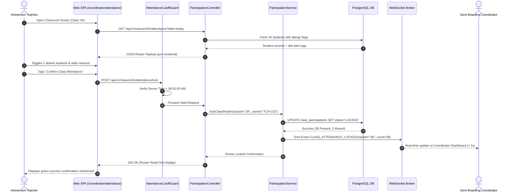
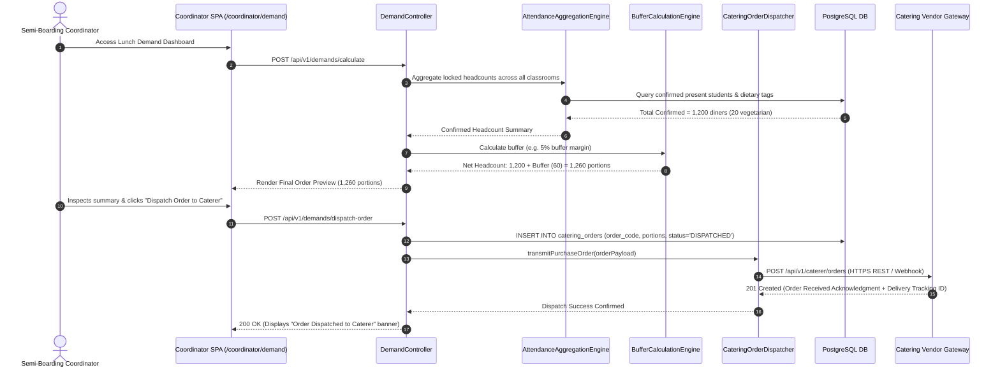
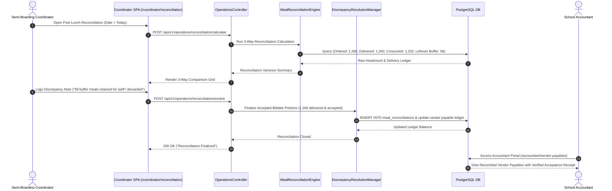

# 6. Runtime View

## Overview

The **Runtime View** captures the dynamic behavioral interactions between building blocks, data stores, external gateways, and human actors during critical operational milestones. The four scenarios documented below represent the operational backbone of the school lunch service under the External Catering Vendor Operating Model:
1. **08:30 AM Attendance Roll-Call & Roster Cutoff Lockdown** (High-concurrency check-in and temporal lock).
2. **08:45 AM Demand Calculation & Catering Vendor Purchase Order Dispatch** (Algorithmic buffer calculation and external order dispatch).
3. **10:30 AM Dock Receiving, 3-Step Food Safety Inspection & 11:00 AM Trolley Distribution** (Statutory food safety gatekeeper and classroom meal distribution).
4. **13:00 PM Post-Lunch 3-Way Quantity Reconciliation & Vendor Payable Accrual** (Financial audit, discrepancy logging, and vendor payables).

---

## 6.1 Scenario 1: 08:30 AM Attendance Roll-Call & Roster Cutoff Lockdown

**Purpose:** Demonstrates high-concurrency morning check-in, sub-second aggregation, and strict cutoff enforcement.  
**Trigger:** Homeroom Teachers submit attendance between 08:00 AM and 08:30 AM; Coordinator locks school rosters at 08:30 AM.  
**Participants:** `Teacher/Coordinator SPA`, `AttendanceCutoffGuard`, `ParticipationController`, `ParticipationService`, `PostgreSQL DB`, `WebSocket Broker`.  
**Quality Goals Illustrated:** `#reliable` (Cutoff lockdown), `#efficient` (Sub-300ms p95 latency, < 1s aggregation), `#usable` (< 90s roll-call).



### Execution Steps:
1. Teacher opens attendance screen on smartphone/tablet; mobile UI loads pre-cached student list and allergy warning chips.
2. Teacher marks 2 absent students with valid absence reasons (*Sick leave*, *Family matter*).
3. Teacher taps **Confirm Class Attendance** at 08:22 AM.
4. `AttendanceCutoffGuard` verifies current server time is prior to 08:30:00 AM.
5. `ParticipationService` executes an atomic SQL transaction updating student statuses and locking class 3A.
6. Service triggers WebSocket event `CLASS_ATTENDANCE_LOCKED`.
7. Coordinator analytical dashboard recalculates and increments confirmed school headcount live without page refresh.

---

## 6.2 Scenario 2: 08:45 AM Demand Calculation & Catering Purchase Order Dispatch

**Purpose:** Translates locked attendance into final lunch portion demand with safety buffer margins and transmits the formal order to the external caterer before the 08:45 AM deadline.  
**Trigger:** Coordinator initiates demand calculation and submits purchase order between 08:30 AM and 08:45 AM.  
**Participants:** `Coordinator SPA`, `DemandController`, `AttendanceAggregationEngine`, `BufferCalculationEngine`, `CateringOrderDispatcher`, `Catering Vendor Gateway`.  
**Quality Goals Illustrated:** `#reliable` (Automated calculation, immutable purchase order), `#efficient` (Sub-second rollup).



### Execution Steps:
1. Immediately post-08:30 AM cutoff, Coordinator accesses `/coordinator/demand`.
2. `AttendanceAggregationEngine` queries all locked classroom rosters, counting 1,200 confirmed student diners.
3. `BufferCalculationEngine` applies the configured 5% safety buffer, establishing a final order target of 1,260 portions.
4. Coordinator reviews the dish breakdown and clicks **Dispatch Order to Caterer** at 08:38 AM.
5. System inserts an immutable order record into `catering_orders` and dispatches the payload to the external Catering Vendor Gateway.
6. The caterer acknowledges order receipt with an automated delivery tracking reference.

---

## 6.3 Scenario 3: 10:30 AM Dock Receiving, 3-Step Inspection & 11:00 AM Trolley Distribution

**Purpose:** Enforces statutory 3-step food safety inspection (Decision 1246/QĐ-BYT) upon hot delivery arrival, requiring core temperature verification ($\ge 65^\circ\text{C}$), seal checks, and 24-hour food retention sample logging before clearing meals for classroom distribution.  
**Trigger:** Catering delivery truck arrives at the school delivery dock at 10:30 AM.  
**Participants:** `Coordinator SPA`, `OperationsController`, `QualityInspectionValidator`, `Compliance Storage (S3)`, `PostgreSQL DB`, `Parent Notification Gateway`.  
**Quality Goals Illustrated:** `#safe` (HACCP temperature check $\ge 65^\circ\text{C}$, sample preservation), `#usable` (< 3 min dock inspection).

```mermaid
sequenceDiagram
    autonumber
    actor MGR as Semi-Boarding Coordinator
    participant SPA as Mobile SPA (/coordinator/receiving)
    participant Ctrl as OperationsController
    participant Validator as QualityInspectionValidator
    participant S3 as Compliance Storage (S3)
    participant DB as PostgreSQL DB
    participant Notif as Parent Notification Gateway
    actor PAR as Parents

    MGR->>SPA: Dock Check-In (Vehicle Plate, Arrival Time 10:28 AM)
    SPA->>Ctrl: POST /api/v1/operations/receiving/checkin
    Ctrl->>DB: INSERT INTO meal_deliveries (arrival_time, container_count=42)

    MGR->>SPA: Enters Probe Temp (72°C), Seal OK, Sensory PASS, Uploads Sample Photo
    SPA->>Ctrl: POST /api/v1/operations/receiving/inspect
    Ctrl->>Validator: Validate food safety parameters
    Validator->>Validator: Verify Temp >= 65°C & Sample Photo Attached
    Validator->>S3: Upload 24h sample jar & probe photo
    S3-->>Validator: Photo URLs returned
    Validator->>DB: INSERT INTO meal_inspections (temp=72.0, status='PASSED')
    Validator-->>Ctrl: Inspection Cleared
    Ctrl->>Notif: Publish Food Safety Badge to Parent Portal [IF-04]
    Notif-->>PAR: Mobile Notification ("Lunch Passed 3-Step Safety Inspection")
    Ctrl-->>SPA: 200 OK ("Inspection Passed — Ready for Trolley Distribution")

    MGR->>SPA: Access Classroom Trolley Plan at 11:00 AM (/coordinator/distribution)
    SPA->>Ctrl: GET /api/v1/operations/distribution/plan
    Ctrl-->>SPA: Return portion breakdown per classroom trolley
    MGR->>SPA: Taps "Confirm Distribution to Classrooms"
```

### Execution Steps:
1. Delivery truck arrives at 10:28 AM; Coordinator logs arrival and verifies thermal container counts.
2. Coordinator inserts calibrated digital probe thermometer into main soup and protein containers, recording $72.0^\circ\text{C}$ ($\ge 65^\circ\text{C}$).
3. Coordinator verifies container tamper seals, takes sensory notes, snaps a photo of the 24-hour retention sample jars, and submits the inspection sheet.
4. `QualityInspectionValidator` verifies temperature meets legal thresholds and uploads compliance photos to S3.
5. System publishes the verified daily food safety badge to the Parent Portal.
6. At 11:00 AM, food service staff load meal trays onto classroom trolleys according to the distribution checklist.

---

## 6.4 Scenario 4: 13:00 PM Post-Lunch 3-Way Quantity Reconciliation & Payables Accrual

**Purpose:** Executes 3-way quantity reconciliation (Ordered vs. Delivered vs. Consumed), requires mandatory discrepancy reason logging, and settles vendor payables for the School Accountant.  
**Trigger:** Coordinator opens reconciliation screen at 13:00 PM following lunch service.  
**Participants:** `Coordinator SPA`, `OperationsController`, `MealReconciliationEngine`, `DiscrepancyResolutionManager`, `PostgreSQL DB`, `Accountant SPA`.  
**Quality Goals Illustrated:** `#reliable` (Zero financial discrepancy opacity, automated payable accrual).



### Execution Steps:
1. At 13:00 PM, Coordinator accesses `/coordinator/reconciliation`.
2. `MealReconciliationEngine` compares the 1,260 ordered portions against 1,260 delivered portions and 1,202 actual consumed portions.
3. Coordinator logs the variance note explaining the unconsumed 58 buffer portions.
4. System finalizes the daily reconciliation record in `meal_reconciliations` and auto-accrues the accepted payable count in the vendor ledger.
5. School Accountant immediately views the reconciled delivery voucher on `/accountant/vendor-payables` for monthly settlement.
