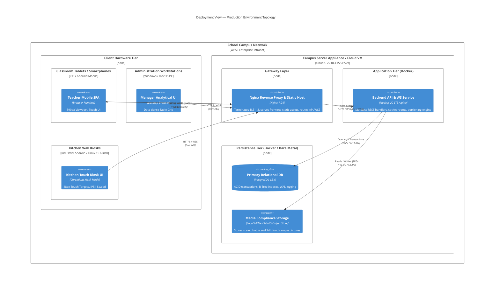

# 7. Deployment View

## Overview

The **Deployment View** describes the physical and virtual infrastructure hosting the Semi-Boarding Meal Management System, illustrating how software containers mapped in Section 5 are distributed across client devices and server environments. 

The architecture supports a **School Campus On-Premises or Private Cloud Appliance** deployment model packaged as lightweight Docker containers behind an Nginx reverse proxy, ensuring high local autonomy even during external internet connection fluctuations.

---

## 7.1 Production Deployment Infrastructure

---

## 7.2 Hardware & Client Node Profiles

| Node | Operating System & Form Factor | Hardware Specifications | Connectivity & Environmental Constraints |
|:---|:---|:---|:---|
| **Classroom Mobile Devices** | Android 10+ / iOS 15+ (Smartphones or 10" Tablets) | Quad-core ARM, 2GB+ RAM | Connected via Campus Wi-Fi (802.11ac/ax). Must tolerate high packet latency during morning arrival rush. |
| **Manager Workstation** | Windows 11 / macOS (Desktop / Laptop) | Core i5 / Apple Silicon, 8GB+ RAM, 1080p+ Screen | Connected via Gigabit Ethernet or 5GHz Wi-Fi. Hosts active WebSocket connection for continuous real-time demand monitoring. |
| **Kitchen Wall Kiosks** | Industrial Android Tablet / Linux Touch Panel | 15.6" Capacitive Touch Display, IP54 water/grease resistant enclosure | Mounted in kitchen prep areas. Connected via shielded Ethernet cable or dedicated kitchen AP. Bluetooth interface for digital kitchen scale weight readouts. |

---

## 7.3 Server Node & Container Specifications

| Container / Service | Image Base | Resource Allocation | Storage / Persistence | High Availability & Backup Strategy |
|:---|:---|:---|:---|:---|
| **`gateway-proxy`** | `nginx:1.24-alpine` | 1 vCPU, 512MB RAM | Ephemeral container storage; SSL cert volume mount | Automated TLS renewal via Certbot / Local Root CA. Fast restart on failure. |
| **`backend-api`** | `node:20-alpine` | 2 vCPU, 2GB RAM | Ephemeral; logs routed to Docker stdout / Fluentd | Health check endpoint `/api/health`. Auto-restarts on crash with Docker Compose `restart: unless-stopped`. |
| **`postgres-db`** | `postgres:15-alpine` | 2 vCPU, 4GB RAM | Persistent Docker volume mounted on NVMe SSD (`/var/lib/postgresql/data`) | Daily automated `pg_dump` snapshot scheduled at 01:00 AM; 30-day retention with WAL archival. |
| **`media-store`** | Local Host Directory / MinIO | 1 vCPU, 1GB RAM | Persistent mount (`/var/data/meal-media/`) | Retains 24-hour food retention sample photos and scale calibration snapshots for 90 days. |

---

## 7.4 Network & Security Topology

1. **Edge TLS Termination:** All incoming client connections terminate TLS 1.3 at Nginx using modern cipher suites (`TLS_AES_128_GCM_SHA256`, `TLS_AES_256_GCM_SHA384`). Plaintext HTTP (Port 80) is permanently redirected to HTTPS (Port 443).
2. **Private Docker Bridge Network:** The Backend API and PostgreSQL containers reside on an isolated internal Docker bridge network (`meal_backend_net`). PostgreSQL port 5432 is **never** exposed to the host's public network interface.
3. **WebSocket Connection Keep-Alive:** Nginx is configured with WebSocket proxying headers (`Upgrade $http_upgrade`, `Connection "upgrade"`) with a 60-second read/write timeout to preserve long-lived dashboard socket rooms without dropping packets.
4. **Bandwidth Optimization:** Static assets (JS modules, CSS tokens, SVG icons) are served with `gzip` and `brotli` compression and HTTP cache headers (`Cache-Control: public, max-age=31536000`), reducing peak network consumption during morning roll-call.
