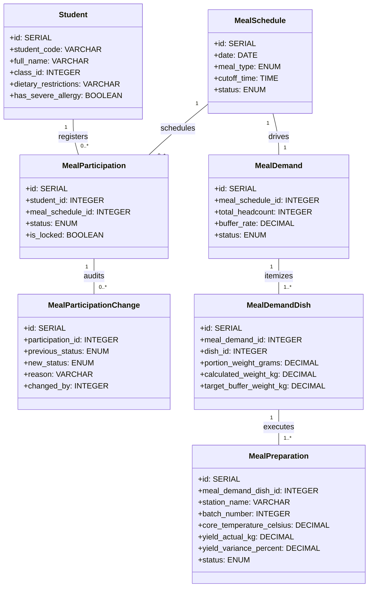
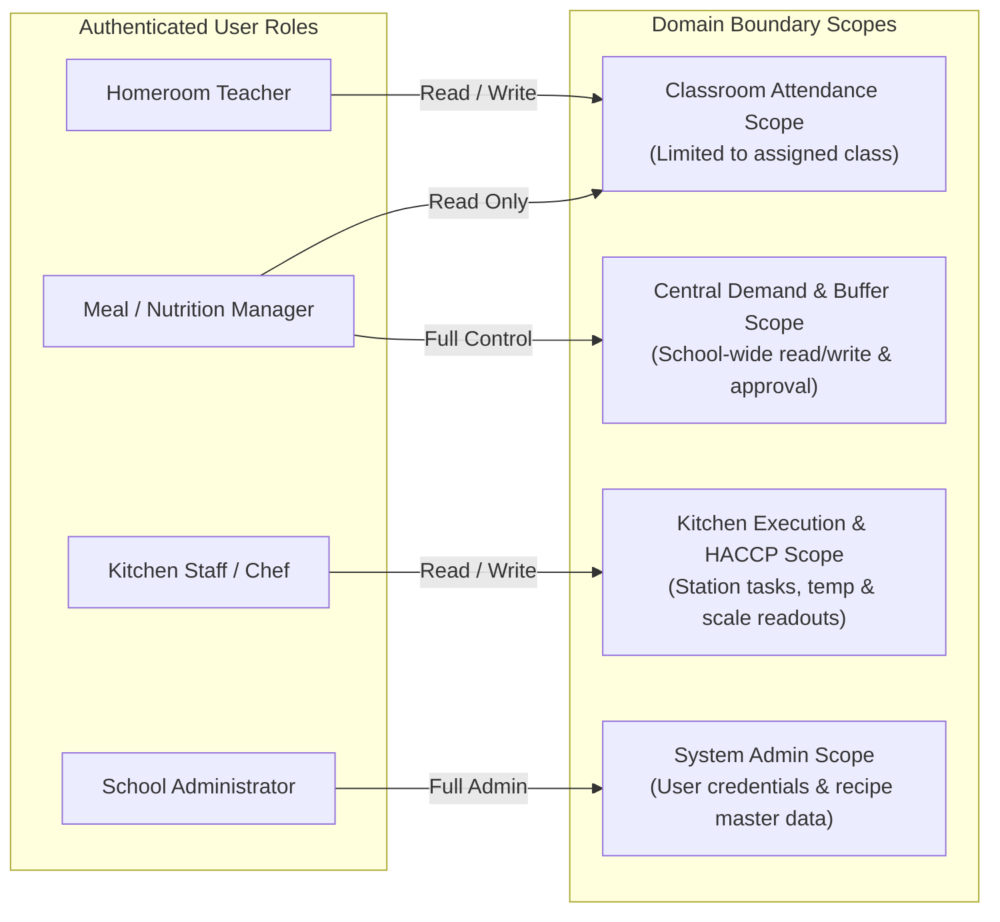
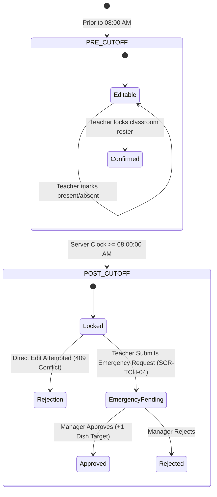

# 8. Crosscutting Concepts

## Overview

Crosscutting concepts govern rules, mechanisms, and patterns applied uniformly across multiple building blocks. In the **Semi-Boarding Meal Management System**, these overarching concepts ensure data consistency, legal food safety compliance, tamper-evident auditability, and role-based operational ergonomics across all 3 active MVP modules.

---

## 8.1 Unified Domain Model

The system's core business entities span across classroom participation, kitchen preparation, and nutritional planning. All operations are anchored to a common daily schedule dimension (`meal_schedules`).



---

## 8.2 Security & Role-Based Access Control (RBAC)

The system enforces strict boundary isolation based on user personas, adhering to the principle of least privilege:



| Security Dimension | Architectural Mechanism | Technical Implementation |
|:---|:---|:---|
| **Authentication** | JWT Bearer tokens + HTTP-only Secure Cookies | Token payload contains `userId`, `role`, and assigned `classId`. Tokens expire after 8 hours (standard school shift). |
| **Authorization Guards** | Route-level middleware (`requireRole`, `requireClassroomOwnership`) | Teacher token cannot read or mutate rosters belonging to other classrooms. Kitchen staff tokens cannot access financial demand tables. |
| **Data Privacy (PII)** | Encrypted in-transit, restricted read access | Student medical notes and dietary flags are transmitted strictly over TLS 1.3 and masked in external notification payloads. |

---

## 8.3 Temporal Cutoff Enforcement & Transactional Consistency

The 08:00 AM cutoff policy is the central operational boundary separating classroom check-in from kitchen production.



- **NTP Server Clock Synchronization:** All container hosts synchronize time via Network Time Protocol (NTP). Client device clock timestamps are ignored; the server clock is the authoritative single source of truth.
- **ACID Transaction Isolation:** Roster locking and demand recalculation are wrapped in PostgreSQL `READ COMMITTED` transactions to prevent dirty reads during peak morning submission bursts.

---

## 8.4 Food Allergen Safety & HACCP Gatekeeping

Food safety is governed by automated software checks that prevent human oversight from causing allergic reactions or microbial contamination:

1. **Persistent Allergen Red Flags:**
   - Medical allergy indicators (`has_severe_allergy = TRUE`) retrieved from the SIS are persistently attached to student models.
   - Frontend components render prominent visual badges (red border, allergy alert icon, dietary restriction chip) that cannot be collapsed or dismissed by teachers or kitchen portioning servers.
2. **Two-Phase Cooking Temperature Gatekeeper:**
   - Decision 1246/QĐ-BYT mandates core temperatures $\ge 75^\circ\text{C}$ for cooked animal proteins.
   - The backend enforces a hard state transition barrier: the API endpoint `POST /api/v1/prep/batches/{id}/complete` explicitly validates `core_temperature_celsius >= 75.0`. Requests with lower readings are rejected with `422 UNPROCESSABLE ENTITY`.

---

## 8.5 Audit Logging & Immutability

To guarantee complete financial and operational accountability, data modifications post-roster-lock are handled via dedicated append-only audit ledgers:

| Ledger Table | Trigger Event | Captured Fields | Immutability Guarantee |
|:---|:---|:---|:---|
| **`meal_participation_changes`** | Pre-cutoff edits to confirmed student attendance | `participation_id`, `previous_status`, `new_status`, `reason`, `changed_by_user_id`, `created_at` | Database triggers prohibit `UPDATE` or `DELETE` operations on this table. |
| **`meal_demand_changes`** | Post-cutoff emergency additions or cancellations | `demand_id`, `student_id`, `change_type`, `reason`, `delta_count`, `approved_by_user_id`, `timestamps` | Append-only ledger; financial auditors can trace every meal charge variance back to the approving manager. |

---

## 8.6 Standardized Error Handling & Resilience

1. **Uniform API Error Envelope:** All REST endpoints return consistent JSON error structures:
   ```json
   {
     "error": {
       "code": "CUTOFF_LOCKED",
       "message": "Classroom roster locked at 08:00 AM cutoff. Direct updates are prohibited.",
       "action": "SUBMIT_EMERGENCY_REQUEST",
       "timestamp": "2026-09-14T08:04:12Z"
     }
   }
   ```
2. **Client-Side Optimistic UI with Network Rollback:** The Teacher mobile SPA updates UI attendance toggles instantaneously in browser memory. If the backend returns a network error or HTTP 409, the UI rolls back the toggle and alerts the teacher with a toast notification.
