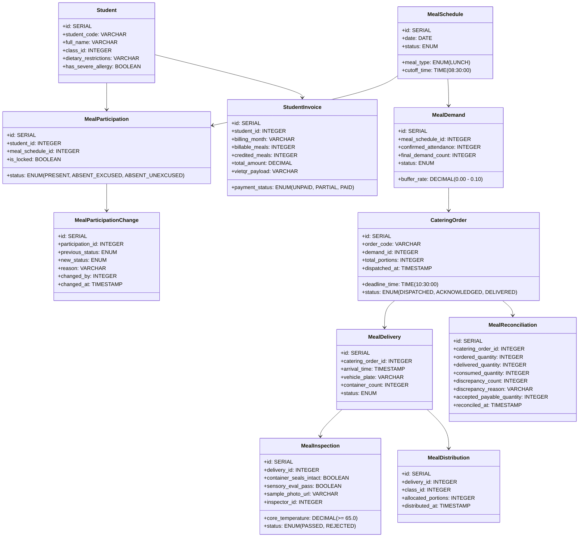

# 8. Crosscutting Concepts

## Overview

Crosscutting concepts govern rules, mechanisms, and patterns applied uniformly across multiple building blocks. In the **Semi-Boarding Meal Management System**, these overarching concepts ensure data consistency, legal food safety compliance, tamper-evident auditability, financial accuracy, and role-based operational ergonomics across all 8 business domains under the External Catering Vendor Operating Model.

---

## 8.1 Unified Domain Model

The system's core business entities span across classroom participation, demand calculations, catering purchase orders, receiving inspections, distributions, reconciliations, fee schedules, and parental billing:

---

## 8.2 Security, Identity & Fixed 4-Role RBAC

The system enforces a strict **Fixed 4-Role RBAC Model** without runtime custom permissions:
1. **ADM (School Administrator):** Academic structure setup, serving calendars, 1-level menu reviews, user management.
2. **MGR (Semi-Boarding Coordinator):** Morning attendance monitoring, demand aggregation, order dispatch, receiving inspection, trolley distribution, post-lunch reconciliation.
3. **ACC (School Accountant):** Fee schedule configuration, monthly billing batch runs, payment recording (VietQR), vendor payables accrual.
4. **PAR (Parent / Guardian):** Boarding registration, medical allergy declaration, daily published menus & inspection badges, monthly bill payments.

All HTTP requests carry an HTTP-only JWT session cookie. Route handlers pass through `RBACMiddleware(roleCode)`, which verifies role claims before delegating execution to the domain controller.

---

## 8.3 Food Safety & Regulatory Compliance (Decision 1246/QĐ-BYT)

To fulfill the statutory requirements of the Vietnamese Ministry of Health:
- **3-Step Food Inspection (*Kiểm thực 3 bước*):**
  1. *Step 1 (Dock Receiving):* Recorded when external catering truck arrives. Digital thermometer reading must be $\ge 65.0^\circ\text{C}$ for cooked hot dishes. Container seals must be verified intact.
  2. *Step 2 (Pre-Serving & Distribution):* Visual sensory check (odor, color, consistency) before meals are loaded onto classroom trolleys at 11:00 AM.
  3. *Step 3 (Food Retention Sampling):* Mandatory preservation of 24-hour food retention samples (*Lưu mẫu 24h*) in standardized sterile jars labeled with dish name, batch timestamp, and inspector signature.
- **Enforcement Mechanism:** `QualityInspectionValidator` intercepts inspection submissions. If core temperature $< 65^\circ\text{C}$, the system blocks delivery acceptance with `422 UNPROCESSABLE ENTITY: HACCP_TEMP_DEFICIT`.

---

## 8.4 Medical Allergy & Dietary Protection Concept

- **Data Capture:** Parents declare severe medical allergies (peanuts, seafood, gluten, dairy) during intake registration (`F-PAR-02`).
- **Safety Interception:** The `AllergyAlertInterceptor` scans daily scheduled menu ingredients against registered student allergy flags.
- **Non-Blocking Visual Decorators:** Instead of hard-blocking catering orders (which could cause operational deadlock), the system renders prominent, un-dismissible amber/red warning badges (`ALLERGY_ALERT: PEANUT`) directly adjacent to the student's name on teacher roll-call screens and classroom trolley portion sheets.

---

## 8.5 Auditability & Tamper-Evident Ledgers

Financial and operational accountability requires immutable tracking:
- Attendance modifications occurring after pre-cutoff roll-call are logged in `meal_participation_changes` with previous status, new status, change reason, user ID, and timestamp.
- Discrepancies between ordered catering portions, delivered portions, and consumed portions require mandatory textual explanation notes in `meal_reconciliations` before vendor payables can be accrued.
- Audit tables are configured with append-only permissions (`INSERT` and `SELECT` only; `UPDATE` and `DELETE` revoked).
