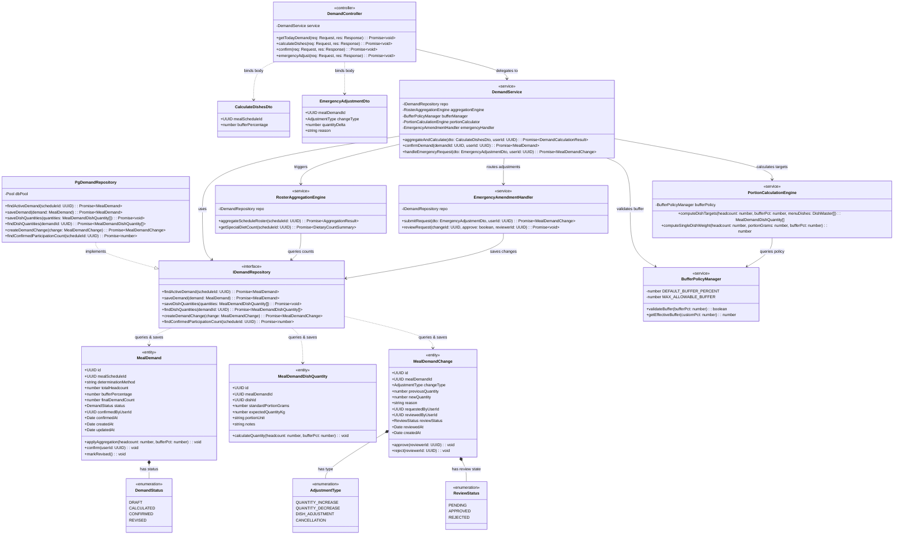

# C4 Level 4 — Code Diagram: Meal Demand & Quantity Management (Module 2)

## 1. Overview

The **Level 4 Code Diagram** for **Module 2: Meal Demand & Quantity Management** details the class and interface architecture implementing headcount aggregation, portion size calculations, safety buffer rules, and post-cutoff emergency amendments as documented in [c4-components-demand.md](c4-components-demand.md).

---

## 2. Class Diagram (UML classDiagram)



---

## 3. Class & Method Specifications

### 3.1. Domain Entities & Value Objects

- **`MealDemand`:** Aggregate root representing school-wide demand for a single meal session.
  - `applyAggregation(headcount, bufferPct)`: Multiplies headcount by $(1 + \text{bufferPct}/100)$ to set `finalDemandCount` and transitions status to `CALCULATED`.
  - `confirm(userId)`: Transitions status from `CALCULATED` to `CONFIRMED`, locking targets for the kitchen.
  - `markRevised()`: Transitions status to `REVISED` following an approved emergency adjustment.

- **`MealDemandDishQuantity`:** Detailed planned target weight for an individual dish on the scheduled menu.
  - `calculateQuantity(headcount, bufferPct)`: Executes formula:
    $$\text{Expected Quantity (kg)} = \frac{\text{Headcount} \times \text{Standard Portion (g)} \times (1 + \frac{\text{Buffer}}{100})}{1000}$$

- **`MealDemandChange`:** Captures post-cutoff increase/decrease requests submitted by teachers after 08:00 AM.
  - Required fields: `previousQuantity`, `newQuantity`, `reason`, `requestedByUserId`, `reviewedByUserId`, `reviewStatus`.

### 3.2. Calculation & Policy Services

- **`BufferPolicyManager`:**
  - Enforces institutional guidelines: bounds `bufferPercentage` between $0\%$ and $10\%$ (nominal: $3\% - 5\%$).
  - Prevents food wastage by rejecting excessive buffer inputs.

- **`PortionCalculationEngine`:**
  - Mathematical engine converting aggregated headcounts into production batch targets for each menu dish item.

- **`EmergencyAmendmentHandler`:**
  - Processes post-cutoff requests; conditionally adjusts active kitchen demands and dispatches real-time broadcast alerts.

---

## 4. Method Invocation Workflow (Demand Calculation & Approval)

```
[Client: Manager Dashboard SPA]
       │
       ▼ (HTTP POST /calculate-dishes)
[DemandController.calculateDishes]
       │
       ▼ (aggregateAndCalculate(dto, userId))
[DemandService]
       │
       ├──► [RosterAggregationEngine.aggregateScheduleRoster(scheduleId)]
       │         └── Queries confirmed roll call counts across all classrooms
       │
       ├──► [BufferPolicyManager.validateBuffer(bufferPct)]
       │
       ├──► [PortionCalculationEngine.computeDishTargets(headcount, bufferPct, dishes)]
       │         └── Calculates kilogram targets for each menu dish
       │
       └──► [IDemandRepository.saveDemand & saveDishQuantities]
                 └── Persists meal_demands and meal_demand_dish_quantities
```
