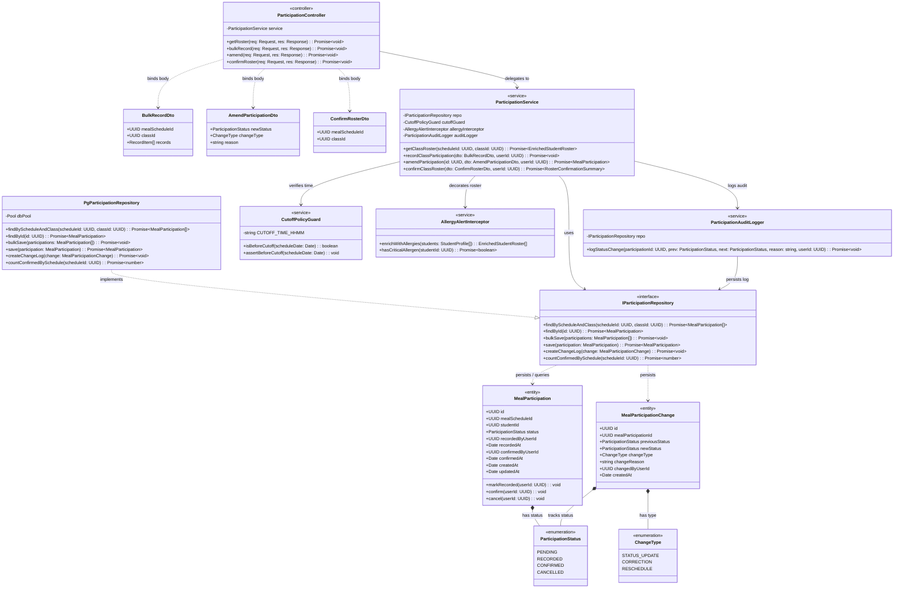

# C4 Level 4 — Code Diagram: Meal Participation Management (Module 1)

## 1. Overview

The **Level 4 Code Diagram** provides the finest granularity of architectural detail in the C4 model for **Module 1: Meal Participation Management**. It zooms into the internal implementation structure of the components defined in [c4-components-participation.md](c4-components-participation.md), modeling the classes, interfaces, domain entities, value objects, and repository contracts following Domain-Driven Design (DDD) and TypeScript conventions.

---

## 2. Class Diagram (UML classDiagram)



---

## 3. Class & Method Specifications

### 3.1. Domain Entities & Value Objects

- **`MealParticipation`:** Aggregate root representing a single student's meal participation intent for a scheduled meal.
  - `status`: Transitions through `PENDING` $\rightarrow$ `RECORDED` $\rightarrow$ `CONFIRMED` $\rightarrow$ `CANCELLED`.
  - `markRecorded(userId)`: Transitions status from `PENDING` to `RECORDED`, stamping `recordedAt`.
  - `confirm(userId)`: Locks status to `CONFIRMED`, stamping `confirmedAt` and `confirmedByUserId`.

- **`MealParticipationChange`:** Immutable audit entity recording any modification after initial creation.
  - Required fields: `previousStatus`, `newStatus`, `changeReason`, `changedByUserId`.
  - Maps to database table `meal_participation_changes`.

### 3.2. Service & Guard Classes

- **`CutoffPolicyGuard`:**
  - Evaluates system timestamp against configured schedule cutoff (default: 08:00 AM).
  - Throws `CutoffExceededException` if a teacher attempts direct roster modifications after cutoff.

- **`AllergyAlertInterceptor`:**
  - Inspects medical records; decorates student roster entries with allergen flags (`isAllergic: true`, `allergyTags: string[]`).

- **`ParticipationAuditLogger`:**
  - Decoupled logging mechanism guaranteeing an audit record is generated synchronously within the transactional boundary.

- **`ParticipationService`:**
  - Main application orchestrator for Module 1.
  - Wraps `confirmClassRoster` in a database transaction, updates all classroom student rows to `CONFIRMED`, and publishes the event `CLASS_ROSTER_LOCKED`.

---

## 4. Method Invocation Workflow (Roster Confirmation)

```
[Client: Teacher Mobile SPA]
       │
       ▼ (HTTP POST /confirm-roster)
[ParticipationController.confirmRoster]
       │
       ▼ (confirmClassRoster(dto, userId))
[ParticipationService] ──► [CutoffPolicyGuard.assertBeforeCutoff(today)]  (Pass if < 08:00)
       │
       ├──► [IParticipationRepository.findByScheduleAndClass]
       │         └── Returns all MealParticipation entities for class
       │
       ├──► Loop: entity.confirm(userId)
       │
       ├──► [IParticipationRepository.bulkSave(entities)] (Transactional COMMIT)
       │
       └──► [EventPublisher.publish("CLASS_ROSTER_LOCKED")]
```
