# C4 Level 4 — Code Diagram: Meal Preparation & Kitchen Operations (Module 3)

## 1. Overview

The **Level 4 Code Diagram** for **Module 3: Meal Preparation** details the class and interface architecture governing kitchen shift plan generation, pantry ingredient allocations, station batch timers, and finished yield reconciliation with variance enforcement as documented in [c4-components-preparation.md](c4-components-preparation.md).

---

## 2. Class Diagram (UML classDiagram)

```mermaid
classDiagram
  direction TB

  class PlanStatus {
    <<enumeration>>
    PLANNED
    IN_PROGRESS
    COMPLETED
    CANCELLED
  }

  class AllocationStatus {
    <<enumeration>>
    ALLOCATED
    ADJUSTED
    RETURNED
  }

  class ConfirmationStatus {
    <<enumeration>>
    MATCHED
    DISCREPANCY
  }

  class MealPreparationPlan {
    <<entity>>
    +UUID id
    +UUID mealDemandId
    +string shiftName
    +PlanStatus status
    +Date scheduledStartTime
    +Date scheduledEndTime
    +Date createdAt
    +startShift(): void
    +completeShift(): void
  }

  class MealPreparationPlanDish {
    <<entity>>
    +UUID id
    +UUID preparationPlanId
    +UUID dishId
    +number targetQuantityKg
    +string assignedStation
  }

  class IngredientAllocation {
    <<entity>>
    +UUID id
    +UUID preparationPlanId
    +UUID ingredientId
    +number allocatedQuantity
    +string unit
    +AllocationStatus status
    +markAdjusted(delta: number): void
    +markReturned(returnedQty: number): void
  }

  class MealPreparation {
    <<entity>>
    +UUID id
    +UUID preparationPlanId
    +string stationName
    +number batchNumber
    +Date cookingStartTime
    +Date cookingEndTime
    +number coreTemperatureCelsius
    +UUID chefUserId
    +completeBatch(coreTempC: number): void
  }

  class MealPreparationDishRecord {
    <<entity>>
    +UUID id
    +UUID mealPreparationId
    +UUID dishId
    +number actualPreparedQuantityKg
  }

  class PreparedQuantityConfirmation {
    <<entity>>
    +UUID id
    +UUID mealPreparationPlanId
    +UUID dishId
    +number plannedQuantityKg
    +number confirmedQuantityKg
    +ConfirmationStatus status
    +string discrepancyReason
    +UUID confirmedByUserId
    +Date confirmedAt
    +evaluateVariance(tolerancePct: number): ConfirmationStatus
  }

  class YieldSignoffDto {
    +UUID planId
    +UUID dishId
    +number measuredWeightKg
    +string discrepancyReason
  }

  class IPreparationRepository {
    <<interface>>
    +findActivePlanByDemand(demandId: UUID): Promise~MealPreparationPlan~
    +savePlan(plan: MealPreparationPlan): Promise~MealPreparationPlan~
    +savePlanDishes(dishes: MealPreparationPlanDish[]): Promise~void~
    +saveAllocations(allocations: IngredientAllocation[]): Promise~void~
    +createCookingBatch(batch: MealPreparation): Promise~MealPreparation~
    +saveDishRecord(record: MealPreparationDishRecord): Promise~void~
    +saveConfirmation(confirmation: PreparedQuantityConfirmation): Promise~PreparedQuantityConfirmation~
  }

  class PgPreparationRepository {
    -Pool dbPool
    +findActivePlanByDemand(demandId: UUID): Promise~MealPreparationPlan~
    +savePlan(plan: MealPreparationPlan): Promise~MealPreparationPlan~
    +savePlanDishes(dishes: MealPreparationPlanDish[]): Promise~void~
    +saveAllocations(allocations: IngredientAllocation[]): Promise~void~
    +createCookingBatch(batch: MealPreparation): Promise~MealPreparation~
    +saveDishRecord(record: MealPreparationDishRecord): Promise~void~
    +saveConfirmation(confirmation: PreparedQuantityConfirmation): Promise~PreparedQuantityConfirmation~
  }

  class KitchenPlanCoordinator {
    <<service>>
    -IPreparationRepository repo
    +generateShiftPlan(demandId: UUID, targets: DishTargetSummary[]): Promise~MealPreparationPlan~
    +assignStations(planDishes: MealPreparationPlanDish[]): void
  }

  class IngredientAllocationManager {
    <<service>>
    -IPreparationRepository repo
    +calculateRequisition(targets: DishTargetSummary[]): IngredientAllocation[]
    +dispatchPantryOrder(allocations: IngredientAllocation[]): Promise~boolean~
  }

  class CookingBatchTracker {
    <<service>>
    -IPreparationRepository repo
    +startBatch(planId: UUID, station: string, chefId: UUID): Promise~MealPreparation~
    +completeBatch(prepId: UUID, tempC: number, measuredKg: number): Promise~MealPreparation~
  }

  class YieldReconciliationEngine {
    <<service>>
    -number TOLERANCE_PERCENTAGE
    +reconcileYield(targetKg: number, actualKg: number, reason: string, reviewerId: UUID): PreparedQuantityConfirmation
    +isWithinTolerance(targetKg: number, actualKg: number): boolean
  }

  class PreparationService {
    <<service>>
    -IPreparationRepository repo
    -KitchenPlanCoordinator coordinator
    -IngredientAllocationManager allocationMgr
    -CookingBatchTracker batchTracker
    -YieldReconciliationEngine yieldEngine
    +getTodayKitchenPlan(demandId: UUID): Promise~FullKitchenPlan~
    +startCookingBatch(planId: UUID, station: string, chefId: UUID): Promise~MealPreparation~
    +recordYieldSignoff(dto: YieldSignoffDto, userId: UUID): Promise~PreparedQuantityConfirmation~
  }

  class PreparationController {
    <<controller>>
    -PreparationService service
    +getShiftPlan(req: Request, res: Response): Promise~void~
    +startBatch(req: Request, res: Response): Promise~void~
    +completeBatch(req: Request, res: Response): Promise~void~
    +signoffYield(req: Request, res: Response): Promise~void~
  }

  %% Relationships
  PgPreparationRepository ..|> IPreparationRepository : implements
  PreparationController --> PreparationService : delegates to
  PreparationService --> IPreparationRepository : uses
  PreparationService --> KitchenPlanCoordinator : coordinates plans
  PreparationService --> IngredientAllocationManager : allocates ingredients
  PreparationService --> CookingBatchTracker : monitors batches
  PreparationService --> YieldReconciliationEngine : evaluates yields
  IPreparationRepository ..> MealPreparationPlan : persists
  IPreparationRepository ..> IngredientAllocation : persists
  IPreparationRepository ..> MealPreparation : persists
  IPreparationRepository ..> PreparedQuantityConfirmation : persists
  MealPreparationPlan *-- PlanStatus : has status
  IngredientAllocation *-- AllocationStatus : has status
  PreparedQuantityConfirmation *-- ConfirmationStatus : has status
  PreparationController ..> YieldSignoffDto : binds body
```



---

## 3. Class & Method Specifications

### 3.1. Domain Entities & Value Objects

- **`MealPreparationPlan`:** Represents the master kitchen shift plan for a specific meal session.
  - Controls transition from `PLANNED` $\rightarrow$ `IN_PROGRESS` $\rightarrow$ `COMPLETED`.

- **`IngredientAllocation`:** Represents reserved/dispatched pantry inventory required to fulfill the meal schedule.
  - `status`: `ALLOCATED` $\rightarrow$ `ADJUSTED` $\rightarrow$ `RETURNED`.

- **`MealPreparation`:** Represents an execution batch at a designated station.
  - `completeBatch(coreTempC)`: Enforces recording of food safety core temperature ($\ge 75^\circ\text{C}$).

- **`PreparedQuantityConfirmation`:** Official compliance and verification entity.
  - `evaluateVariance(tolerancePct)`: Evaluates $|\text{actual} - \text{planned}| / \text{planned} \le \text{tolerancePct}/100$.
  - Requires non-empty `discrepancyReason` if variance exceeds threshold.

### 3.2. Domain & Inspection Services

- **`YieldReconciliationEngine`:**
  - Evaluates finished dish output against planned targets ($3\%$ allowable variance threshold).
  - Flags records as `DISCREPANCY` if yields deviate significantly from calculated portions.

- **`CookingBatchTracker`:**
  - Manages active cooking station timers and streams progress events to client kiosks.

---

## 4. Method Invocation Workflow (Finished Yield Sign-Off)

```
[Client: Kitchen Touch Kiosk]
       │
       ▼ (HTTP POST /confirmations/signoff)
[PreparationController.signoffYield]
       │
       ▼ (recordYieldSignoff(dto, userId))
[PreparationService]
       │
       ├──► [YieldReconciliationEngine.reconcileYield(targetKg, actualKg, reason, userId)]
       │         │
       │         ├── Check variance <= 3%
       │         │     ├─ Yes: Status = MATCHED
       │         │     └─ No:  Status = DISCREPANCY (Requires non-empty reason)
       │         └── Returns PreparedQuantityConfirmation entity
       │
       ├──► [IPreparationRepository.saveConfirmation(confirmation)]
       │         └── Writes to prepared_quantity_confirmations table
       │
       └──► [EventPublisher.publish("YIELD_CONFIRMATION_RECORDED")]
                 └── Notifies Nutrition Manager on Desktop Dashboard
```
