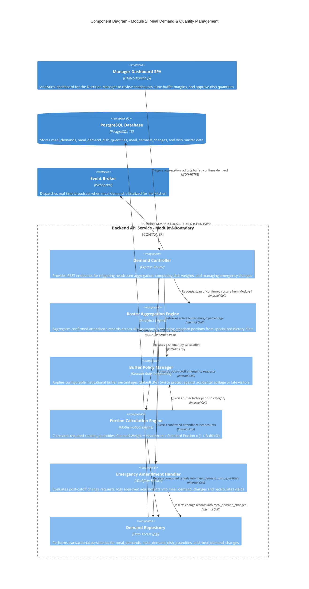

# C4 Level 3 — Component Diagram: Meal Demand & Quantity Management (Module 2)

## 1. Overview

This document specifies the internal components within the `Backend API Service` container that implement **Module 2: Meal Demand & Quantity Management**. Serving as the mathematical engine of the system, this module aggregates classroom-level attendance into whole-school meal counts, computes exact dish cooking weights with safety buffer margins, and orchestrates post-cutoff emergency adjustments.

---

## 2. Component Diagram (C4Component)

---

## 3. Component Details & Operational Responsibilities

### 3.1. Demand Controller
- **Endpoint Definitions:**
  - `GET /api/v1/demands/today`: Retrieves active demand status (`draft`, `calculated`, `confirmed`, `revised`).
  - `POST /api/v1/demands/aggregate`: Scans all locked class attendance records to calculate total attendance (`F-DMD-01`).
  - `POST /api/v1/demands/calculate-dishes`: Derives planned cooking weights for every scheduled menu dish (`F-DMD-02`).
  - `POST /api/v1/demands/emergency-adjust`: Reviews, approves, or rejects post-cutoff classroom requests (`F-DMD-03`).

### 3.2. Roster Aggregation Engine
- Aggregates confirmed roll calls across all active school classes:
  - Total confirmed student diners.
  - Number of students requiring separate non-allergen or vegetarian meal preparation trays.
  - Tracking class submission progress (e.g., 29 out of 30 classes submitted by 08:05 AM).

### 3.3. Portion Calculation Engine & Buffer Policy Manager
- **Formula Specification:**
  $$\text{Planned Quantity} = \text{Final Headcount} \times \text{Standard Portion Size} \times (1 + \text{Buffer\%})$$
- *Demonstration Example:*
  - Dish: *Braised Pork with Quail Eggs*
  - Baseline standard portion: $75\text{ g}$ cooked meat per student.
  - Total confirmed diners: $850$ students.
  - Safety buffer margin: $4\%$.
  - Target production weight = $850 \times 75\text{ g} \times 1.04 = 66.3\text{ kg}$ finished yield.
- Detailed results are recorded in `meal_demand_dish_quantities` with appropriate metric units (`kg`, `liters`, `portions`).

### 3.4. Emergency Amendment Handler
- Manages exceptional change requests submitted after the morning cutoff:
  1. Compares requested change against current kitchen progress (whether cooking has started).
  2. If approved, inserts an audit entry into `meal_demand_changes`.
  3. Updates parent `meal_demands.status` to `revised` and broadcasts an immediate alert to the kitchen kiosk.

### 3.5. Demand Repository
- Employs database row-level locking (`SELECT ... FOR UPDATE`) during recalculations to prevent race conditions during high-volume morning updates.
- Maintains strict foreign key references connecting demands with corresponding `meal_schedules` and `dishes`.
