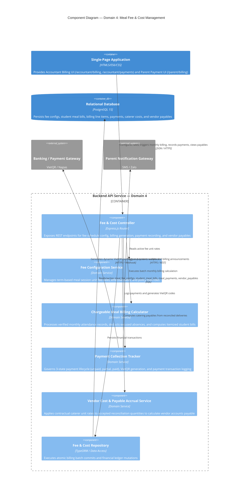

# C4 Level 3 — Component Diagram: Meal Fee & Cost Management (Domain 4)

## 1. Overview

This document specifies the internal software components within the **Backend API Service** container that implement **Domain 4: Meal Fee & Cost Management** (`F-FEE`).

### Operational Objectives
- Maintain meal fee unit rates and effective validity periods per academic term (`F-FEE-01`).
- Execute the monthly billing batch calculation, deriving chargeable meals from verified attendance snapshots and automatically crediting excused absences (`F-FEE-02`).
- Track parent meal fee payments across 3 streamlined states (`unpaid`, `partial`, `paid`) with dynamic VietQR generation (`F-FEE-03`).
- Reconcile catering vendor operational unit costs against accepted delivery quantities to accrue vendor payables (`F-FEE-04`).

---

## 2. Component Diagram (C4Component)

---

## 3. Component Details & Operational Responsibilities

### 3.1. Fee & Cost Controller
- **Endpoint Definitions:**
  - `GET /api/v1/finance/fee-rates`: Retrieves active meal fee configurations (`F-FEE-01`).
  - `POST /api/v1/finance/fee-rates`: Sets unit rate (e.g., $35,000\text{ VND / meal}$) and term validity window (`F-FEE-01`).
  - `POST /api/v1/finance/billing/generate-batch`: Triggers monthly billing run across classrooms (`F-FEE-02`).
  - `GET /api/v1/finance/bills/student/:studentId`: Returns student itemized invoice and absence credits (`F-FEE-02`).
  - `POST /api/v1/finance/payments/record`: Records parent fee payment transaction (`F-FEE-03`).
  - `GET /api/v1/finance/vendor-payables/monthly`: Computes monthly catering vendor payables based on reconciled deliveries (`F-FEE-04`).

### 3.2. Chargeable Meal Billing Calculator
- **Mathematical Billing Formula:**
  $$\text{Total Chargeable Meals} = \text{Scheduled Serving Days} - \text{Valid Excused Absences}$$
  $$\text{Invoice Amount} = \text{Total Chargeable Meals} \times \text{Unit Fee Rate}$$
- *Absence Credit Policy:*
  - An absence logged before the daily 08:30 AM cutoff with an excused note is automatically credited.
  - Unexcused late absences after cutoff are non-refundable since meals were already dispatched and delivered by the caterer.

### 3.3. Payment Collection Tracker
- **Streamlined 3-State Payment Lifecycle:**
  - `unpaid` $\rightarrow$ `partial` (if partial installment submitted) $\rightarrow$ `paid`.
- Generates dynamic banking VietQR payload:
  - Account Number, Bank BIN, Invoice ID as transfer memo, and exact remaining balance.
- Reconciles incoming bank webhooks to update bill status immediately.

### 3.4. Vendor Cost & Payable Accrual Service
- Calculates exact school liabilities owed to the catering vendor:
  $$\text{Accrued Caterer Payable} = \sum \text{Accepted Delivered Quantities} \times \text{Contractual Unit Cost}$$
- Deducts verified delivery shortfalls and quality rejects documented during the 13:00 PM reconciliation (`F-OPS-05`), protecting the school from paying for unserved meals.
