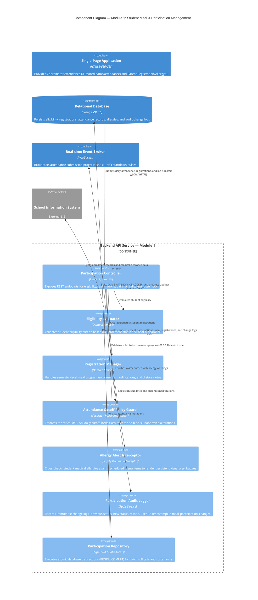

# C4 Level 3 — Component Diagram: Student Meal & Participation Management (Module 1)

## 1. Overview

This document specifies the internal software components within the **Backend API Service** container that implement **Module 1: Student Meal & Participation Management** (Domain 1: Student Meal Management & Domain 7: Nutrition & Health Management).

### Operational Objectives
- Manage student meal eligibility evaluation and semester-level boarding registrations (`F-PAR-01`, `F-PAR-02`).
- Provide fast, tactile morning classroom attendance recording and monitor submission progress (`F-PAR-03`, `F-PAR-04`).
- Enforce the non-negotiable **08:30 AM Cutoff Rule**: locks attendance rosters and rejects unapproved post-cutoff modifications.
- Intercept student medical profiles to generate active visual allergy conflict warnings (`F-NUT-01`, `F-NUT-02`).
- Guarantee institutional transparency through an immutable audit ledger (`meal_participation_changes`).

---

## 2. Component Diagram (C4Component)

---

## 3. Component Details & Operational Responsibilities

### 3.1. Participation Controller
- **Endpoint Definitions:**
  - `GET /api/v1/students/eligibility`: Returns student intake eligibility status (`F-PAR-01`).
  - `POST /api/v1/registrations/apply`: Creates or updates semester meal program registration (`F-PAR-02`).
  - `GET /api/v1/classes/:classId/attendance?date=:date`: Retrieves classroom roll call roster with pre-populated attendance status and allergy chips (`F-PAR-03`).
  - `POST /api/v1/classes/:classId/attendance/bulk`: Records batch roll call (`Present` vs. `Absent`) before cutoff.
  - `POST /api/v1/classes/:classId/attendance/lock`: Formally locks classroom attendance roster (`F-PAR-03`, `F-PAR-04`).
  - `POST /api/v1/participations/:id/amend`: Emergency attendance adjustment with mandatory justification note.

### 3.2. Attendance Cutoff Policy Guard
- **Operational Rules:**
  - **Before 08:30 AM**: Homeroom teachers and coordinators have full editing permissions on daily attendance (`eating` vs. `absent`).
  - **At / After 08:30 AM**: Direct mutations are rejected (`403 Forbidden: Roster Locked`). Any subsequent modification requires supervisor override with mandatory reason logging.
  - Generates real-time countdown pulses transmitted via WebSocket to active Coordinator workstations.

### 3.3. Allergy Alert Interceptor
- Inspects student medical allergy profiles (`student_allergies`, `students.medical_dietary_notes`).
- Enriches attendance records with high-visibility safety flags:
  - Example: `ALLERGY_ALERT: PEANUTS (Severe)` or `DIETARY_RESTRICTION: NO_BEEF`.
  - Propagates alerts to downstream Module 2 and Module 3 so special trays and allergen-free portions are reserved.

### 3.4. Participation Audit Logger
- Enforces institutional traceability:
  - Automatically captures every change to attendance or registration into `meal_participation_changes`.
  - Recorded attributes: `participation_id`, `previous_status`, `new_status`, `change_type` (`status_update`, `absence_logging`, `emergency_correction`), `change_reason`, `changed_by_user_id`, and `timestamp`.

### 3.5. Participation Repository
- Ensures transactional atomicity:
  - Wraps class-wide lock operations inside a PostgreSQL transaction (`BEGIN ... COMMIT`) to prevent partial submissions.
  - Maintains strict unique composite constraint on `(meal_schedule_id, student_id)`.
