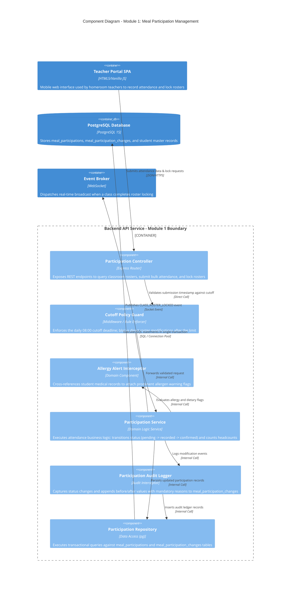

# C4 Level 3 — Component Diagram: Meal Participation Management (Module 1)

## 1. Overview

This document specifies the internal software components within the `Backend API Service` container that implement **Module 1: Meal Participation Management**. This module governs classroom student attendance capture, dietary and allergen notice tracking, morning cutoff rule enforcement, and audit ledger tracking.

---

## 2. Component Diagram (C4Component)

---

## 3. Component Details & Operational Responsibilities

### 3.1. Participation Controller
- **Endpoint Definitions:**
  - `GET /api/v1/classes/{classId}/participations`: Retrieves the daily roll call list for a specified meal schedule.
  - `POST /api/v1/participations/bulk-record`: Batch updates initial attendance records (`F-PAR-01`).
  - `PUT /api/v1/participations/{id}/amend`: Adjusts an individual student's status with a mandatory justification (`F-PAR-02`).
  - `POST /api/v1/classes/{classId}/confirm-roster`: Formally locks the classroom attendance roster (`F-PAR-03`).

### 3.2. Cutoff Policy Guard
- **Operational Rules:**
  - **Before 08:00 AM:** Homeroom teachers have full editing privileges (`present`, `absent`, `dietary_exception`).
  - **At / After 08:00 AM:** Direct edits to `meal_participations` are strictly locked. Any subsequent alterations must be routed through `Emergency Request` workflows targeting Module 2.

### 3.3. Allergy Alert Interceptor
- Inspects student medical profiles from `students.medical_dietary_notes`.
- Automatically injects high-priority visual flags (e.g., `ALLERGY_CRITICAL: PEANUTS`) to ensure both teachers and kitchen staff recognize children requiring dedicated, separate food trays.

### 3.4. Participation Audit Logger
- Enforces institutional transparency:
  - Whenever an existing participation record is modified, this component automatically creates a row in `meal_participation_changes`.
  - Captures: `meal_participation_id`, `previous_status`, `new_status`, `change_type` (`status_update`, `correction`, `reschedule`), `change_reason`, `changed_by_user_id`, and `created_at`.

### 3.5. Participation Repository
- Ensures relational atomicity:
  - Wraps class-wide lock operations inside a PostgreSQL `BEGIN ... COMMIT` block, preventing partial class confirmations.
  - Enforces unique index constraints on `(meal_schedule_id, student_id)` to prevent duplicate daily entries.
