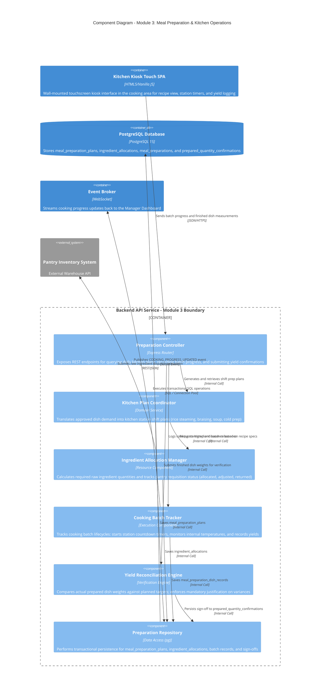

# C4 Level 3 — Component Diagram: Meal Preparation & Kitchen Operations (Module 3)

## 1. Overview

This document specifies the internal components within the `Backend API Service` container that implement **Module 3: Meal Preparation**. This module coordinates operational kitchen cooking shifts, manages raw ingredient allocations from the pantry, tracks batch executions and station cooking timers via the kitchen touchscreen kiosk, and performs final finished dish yield reconciliation.

---

## 2. Component Diagram (C4Component)

---

## 3. Component Details & Operational Responsibilities

### 3.1. Preparation Controller
- **Endpoint Definitions:**
  - `GET /api/v1/kitchen/plans/today`: Retrieves active cooking shift plans categorized by station (`F-PRP-01`).
  - `POST /api/v1/kitchen/ingredients/receive`: Acknowledges receipt of raw materials delivered from the pantry (`F-PRP-02`).
  - `POST /api/v1/kitchen/batches/start` & `/complete`: Tracks station cooking timers and yields (`F-PRP-03`).
  - `POST /api/v1/kitchen/confirmations/signoff`: Submits measured finished yields for automated reconciliation (`F-PRP-04`).

### 3.2. Kitchen Plan Coordinator
- Links directly to Module 2's approved `meal_demands`.
- Automatically schedules cooking workloads across dedicated kitchen preparation stations:
  - *Station 1 (Staples):* Industrial steam cabinets for rice and porridge.
  - *Station 2 (Main Entrees):* Tilting braising pans, stewing cauldrons, and fryers.
  - *Station 3 (Soups & Vegetables):* Steam-jacketed soup kettles and vegetable steamers.
  - *Station 4 (Cold Prep & Fruits):* Washed raw fruits, yogurt, and milk trays.

### 3.3. Ingredient Allocation Manager
- Multiplies target dish quantities by standard ingredient bill-of-materials (`recipe_items`):
  - Life cycle states: `allocated` $\rightarrow$ `adjusted` $\rightarrow$ `returned`.
  - Transmits automated pick-lists to the pantry system before 08:30 AM to ensure zero prep bottlenecks.

### 3.4. Cooking Batch Tracker
- Designed specifically for touch kiosk ergonomics in humid, high-temperature kitchen environments:
  - Big visual buttons initiate countdown timers for specific recipe cooking times.
  - Supports multi-batch runs (`batch_number = 1, 2, 3...`) for dishes requiring staggered frying/steaming.
  - Captures critical control point temperatures (target $\ge 75^\circ\text{C}$ core temp for poultry/meat dishes).

### 3.5. Yield Reconciliation Engine
- **Anti-Waste & Verification Guardrails:**
  - Compares `actual_prepared_quantity` against the planned `expected_quantity`.
  - Evaluates variances against the allowed tolerance band ($\pm 3\%$):
    - *Within tolerance:* Automatically marked as `matched`.
    - *Outside tolerance:* Marked as `discrepancy`. **Mandatory input** is required for `discrepancy_reason` before the supervisor can sign off.
  - Final authenticated signatures are permanently stored in `prepared_quantity_confirmations`.
