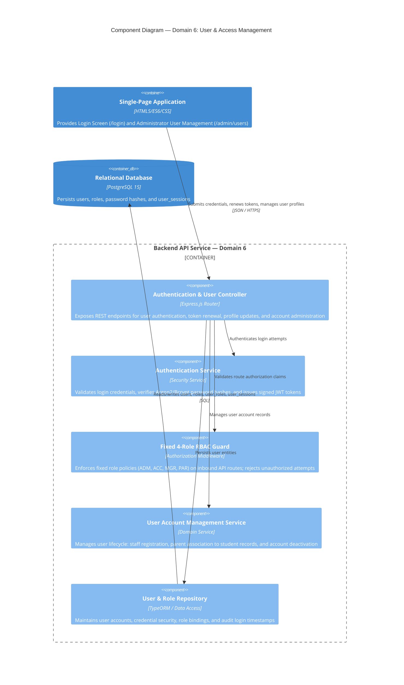

# C4 Level 3 — Component Diagram: User & Access Management (Domain 6)

## 1. Overview

This document specifies the internal software components within the **Backend API Service** container that implement **Domain 6: User & Access Management** (`F-USR`).

### Operational Objectives
- Manage staff and parent user accounts, secure credentials, and profile details (`F-USR-01`).
- Enforce the **Fixed 4-Role RBAC Model** without runtime custom permission overrides as required by the baseline MVP scope (`F-USR-02`):
  1. `ADM`: School Administrator / Principal
  2. `ACC`: School Accountant
  3. `MGR`: Semi-Boarding Coordinator / Meal Manager
  4. `PAR`: Student Parent / Guardian
- Issue cryptographically signed JSON Web Tokens (JWT) and validate route-level authorization guards across all API endpoints.

---

## 2. Component Diagram (C4Component)

---

## 3. Component Details & Operational Responsibilities

### 3.1. Authentication & User Controller
- **Endpoint Definitions:**
  - `POST /api/v1/auth/login`: Authenticates user with username/password, returns JWT and role claims (`F-USR-01`).
  - `POST /api/v1/auth/refresh`: Issues refreshed session token.
  - `GET /api/v1/users/profile`: Retrieves current authenticated user profile and permissions (`F-USR-01`).
  - `GET /api/v1/admin/users`: Lists registered staff and parent accounts (`F-USR-01`).
  - `POST /api/v1/admin/users`: Creates user account with assigned fixed role (`F-USR-02`).
  - `PUT /api/v1/admin/users/:userId/role`: Assigns one of the 4 fixed system roles (`F-USR-02`).

### 3.2. Authentication Service
- **Credential Security:**
  - Salted and hashed password verification via Argon2id or Bcrypt.
  - JWT token payload: `userId`, `username`, `role` (`ADM` | `ACC` | `MGR` | `PAR`), and `studentIds` (for parent persona).
  - Configurable expiration (e.g., 8-hour shift token for staff, 30-day refresh token for parents).

### 3.3. Fixed 4-Role RBAC Guard
- **Policy Enforcement Table:**

| Role Code | Role Name | Authorized Route Prefixes | Forbidden Route Prefixes |
|:---|:---|:---|:---|
| **ADM** | School Administrator | `/api/v1/admin/*`, `/api/v1/master-data/*`, `/api/v1/menus/*/approve` | Direct attendance overrides during meal service |
| **MGR** | Semi-Boarding Coordinator | `/api/v1/operations/*`, `/api/v1/demands/*`, `/api/v1/attendance/*`, `/api/v1/menus/*` | Fee rate configuration, user administration |
| **ACC** | School Accountant | `/api/v1/finance/*`, `/api/v1/reports/finance/*` | Attendance modification, order dispatching |
| **PAR** | Parent / Guardian | `/api/v1/parent/*`, `/api/v1/registrations/*` (own children only) | Staff operations, accounting reports, admin consoles |

- Any request violating role bounds is blocked with `403 Forbidden: Insufficient Institutional Permissions`.

### 3.4. User Account Management Service
- Staff account provisioning:
  - Administrator creates accounts for Coordinators and Accountants.
- Parent account association:
  - Binds parent identity to specific `student_id` records in the student master directory, ensuring parents only access billing and allergy data for their own children.
