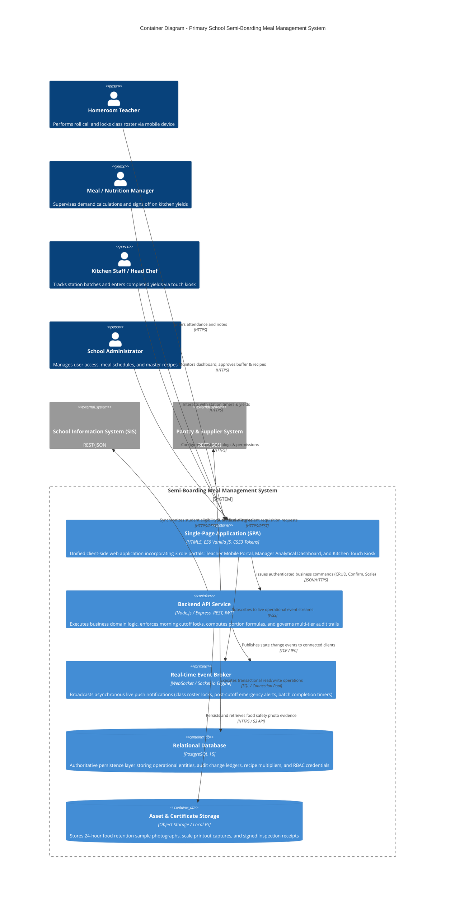

# C4 Level 2 — Container Diagram

## 1. Overview

The **Container Diagram** unpacks the Semi-Boarding Meal Management System into its high-level technical building blocks and independently deployable software units. It establishes how client interfaces, backend application services, asynchronous real-time brokers, and persistent databases communicate across network boundaries.

---

## 2. Container Diagram (C4Container)

---

## 3. Container Technical Responsibilities & Stack

### 3.1. Single-Page Application (SPA)
- **Technology Stack:** Semantic HTML5, Vanilla ES6 JavaScript Modules, Modular Vanilla CSS Design Tokens (zero heavy framework overhead, instant cold start, high reliability).
- **Embedded Portals:**
  1. *Teacher Portal:* Mobile-first viewport (390px responsive container), card-based roster, single-tap toggle buttons (`Present`, `Absent`, `Dietary Exception`), and cutoff countdown badge.
  2. *Manager Dashboard:* Dense analytical table grid with sticky headers, dynamic headcount summary chips, buffer slider (0% - 10%), and post-cutoff adjustment approval dialogs.
  3. *Kitchen Kiosk:* Wall-mount layout with high contrast, large 48px+ touch targets, station countdown timers, and integrated keypad for entering measured kilograms.

### 3.2. Backend API Service
- **Technology Stack:** Node.js runtime with Express.js REST routing and JSON schema validation.
- **Architectural Responsibilities:**
  - **RBAC & Token Verification:** Enforces role-based guards across 4 user personas (`TCH`, `MGR`, `KIT`, `ADM`).
  - **Temporal Cutoff Enforcement:** Rejects direct updates to `meal_participations` submitted after 08:00 AM, automatically requiring downstream emergency change requests.
  - **Recipe Scaling & Buffer Calculation Engine:** Applies nutritional formulas translating confirmed student numbers into raw ingredient grams and final finished dish kilograms.
  - **Immutable Audit Engine:** Automatically intercepts changes to confirmed records and generates immutable change history records (`meal_participation_changes`, `meal_demand_changes`).

### 3.3. Real-time Event Broker (WebSocket Service)
- **Technology Stack:** WebSocket Server (Socket.io protocol over WSS).
- **Core Event Channels:**
  - `CLASS_ROSTER_LOCKED`: Alerts the Manager Dashboard when a homeroom teacher confirms their room.
  - `EMERGENCY_AMENDMENT_PENDING`: Raises an urgent visual badge and sound alert on the Manager workstation when a post-cutoff absence is logged.
  - `STATION_BATCH_COMPLETED`: Signals that a cooking station has finished its scheduled batch, alerting the kitchen lead to perform yield weighing.

### 3.4. Relational Database (PostgreSQL 15)
- **Storage Model:** Normalized relational schema enforcing referential integrity, check constraints, foreign keys, and unique indexes.
- **Audit Compliance:** Explicit `meal_participation_changes` and `meal_demand_changes` tables track `previous_status`, `new_status`, `reason`, `changed_by_user_id`, and exact timestamps.
- **Query Performance:** Optimized B-Tree composite indexes on `(meal_schedule_id, status)` and `(student_id, date)` supporting sub-10ms response times under peak morning load.

### 3.5. Asset & Certificate Storage
- Serves as the repository for compliance media required under school health regulations:
  - 24-hour retention food sample photos (sealed container, labeled with date, meal session, and handler).
  - High-resolution photographs of digital scale readouts for kitchen yield verification.
