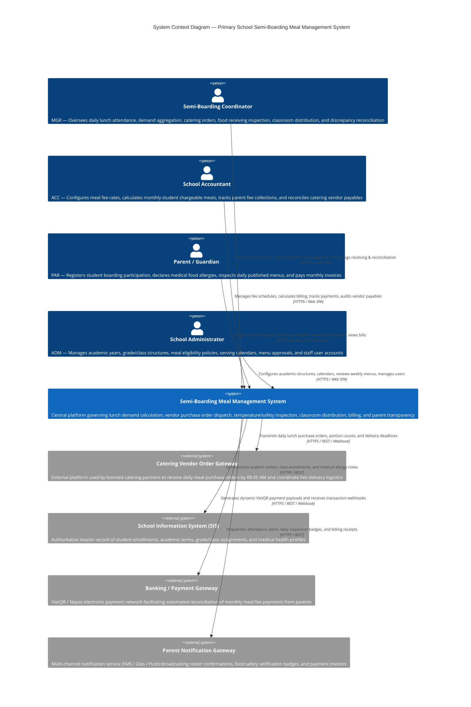

# C4 Level 1 — System Context Diagram

## 1. Overview

The **System Context Diagram** defines the operational boundary of the **Primary School Semi-Boarding Meal Management System** within the school ecosystem.

### Operational Scope & Principles
- **Dedicated Lunch-Only Scope**: The system governs the daily lunch service during standard school days (Monday–Friday). Breakfast, afternoon snacks, and dinners are strictly excluded.
- **External Catering Vendor Operating Model**: Prepared hot meals are supplied by a licensed external catering partner. The school team does not manage raw ingredients or in-house cooking cauldrons; instead, the school manages demand aggregation, purchase order dispatch, receiving inspection, classroom trolley distribution, and consumption reconciliation.
- **Fixed 4-Role RBAC Model**: User interaction is strictly governed across four fixed institutional personas (`MGR`, `ACC`, `PAR`, `ADM`) without custom runtime permission overrides.

---

## 2. System Context Diagram (C4Context)

---

## 3. Actor & External System Specifications

### 3.1. Human Actors (Fixed 4-Role Model)

| Role Code | Role Name | Core Responsibilities | Primary Interface Touchpoint | Operational Cadence |
|:---|:---|:---|:---|:---:|
| **MGR** | **Semi-Boarding Coordinator** | Acts as the operational commander of the daily lunch service: finalizes morning classroom attendance by 08:30 AM, calculates aggregate demand with safety buffer ($3\%\text{--}5\%$), dispatches catering orders by 08:45 AM, inspects hot deliveries at 10:30 AM (core temp $\ge 65^\circ\text{C}$), supervises 11:00 AM classroom trolley distribution, and completes post-lunch consumption reconciliation at 13:00 PM. | Desktop/Tablet Web SPA (`/coordinator/*`) featuring attendance monitors, buffer steppers, receiving sheets, and reconciliation grids. | Continuous daily operational shift (07:30 – 14:00) |
| **ACC** | **School Accountant** | Manages financial health: defines semester meal fee unit rates, calculates monthly billable meals from verified attendance (crediting valid absences), records parent payments across 3 streamlined states (`unpaid`, `partial`, `paid`), and settles vendor payables based on accepted delivery quantities. | Desktop Financial Dashboard (`/accountant/*`) with billing batch wizards, payment ledgers, and debt aging reports. | Monthly billing cycles & daily payment recording |
| **PAR** | **Parent / Guardian** | Service beneficiaries and transparency monitors: registers student for semester boarding programs, submits medical dietary restriction profiles, reviews published daily menus and food safety inspection badges, and pays monthly invoices via banking QR codes. | Mobile-first Responsive Web SPA (`/parent/*`) optimized for smartphone viewports and thumb-zone interactions. | Term enrollment, daily menu checks, monthly fee settlement |
| **ADM** | **School Administrator** | Institutional governance: maintains academic years, semesters, grades, classes, student directories, meal eligibility rules, lunch-serving and holiday calendars, conducts 1-level weekly menu approvals, and provisions user accounts with fixed roles. | Desktop Administration Console (`/admin/*`) with academic hierarchy trees, calendar pickers, and user tables. | Term-based setup & weekly menu review |

### 3.2. External System Integrations

1. **Catering Vendor Order Gateway:**
   - **Protocol:** Outbound HTTPS REST API / Automated Webhook / PDF Order Dispatch.
   - **Payload Content:** Aggregated meal headcount, configurable buffer quantity, breakdown by dish and dietary exception (e.g., non-pork, vegetarian, allergen-safe portions), delivery dock location, and mandatory arrival deadline (**10:30 AM**).
   - **Operational Purpose:** Guarantees contracted catering kitchens receive legally binding meal quantities in time to complete packaging and heated transport.

2. **School Information System (SIS):**
   - **Protocol:** Inbound REST API / Scheduled Nightly Synchronization.
   - **Data Exchanged:** Student master records, active class assignments, homeroom teacher identifiers, and critical student health data.
   - **Allergy Safety Synchronization:** Flags high-risk medical alerts (peanut, seafood, egg, dairy allergies) so persistent warning badges automatically render across Coordinator and Parent views.

3. **Banking & Payment Gateway (VietQR / Napas):**
   - **Protocol:** Outbound dynamic QR generation / Inbound asynchronous webhook.
   - **Workflow:** For each issued student meal bill, generates a standardized VietQR code embedded with invoice ID and exact amount. Payment notifications automatically update invoice statuses from `unpaid` to `paid`.

4. **Parent Notification Gateway:**
   - **Protocol:** Multi-channel notification dispatch (SMS, Zalo ZNS, Web Push).
   - **Triggers:** Dispatches notifications upon:
     - Morning student absence alerts if not registered for lunch.
     - Publishing of daily verified food inspection passes (photo & temperature badge).
     - Issuance of monthly fee billing statements and payment receipts.
