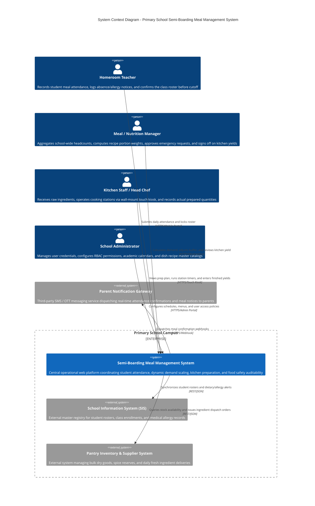

# C4 Level 1 — System Context Diagram

## 1. Overview

The **System Context Diagram** establishes the boundary of the **Primary School Semi-Boarding Meal Management System** within the school's operational ecosystem. It highlights the internal human actors interacting with the system and illustrates the external software platforms with which it interfaces.

---

## 2. System Context Diagram (C4Context)

---

## 3. Actor & External System Specifications

### 3.1. Human Actors

| Actor | Role & Core Responsibilities | Primary Interface Touchpoint | Operational Cadence |
|:---|:---|:---|:---:|
| **Homeroom Teacher (`TCH`)** | Represents classrooms; performs morning student roll calls, flags dietary exceptions/allergies, and confirms the final roster before the **08:00 cutoff**. | Mobile-first Web UI optimized for single-hand touch navigation on smartphones or classroom tablets. | Daily (07:30 - 08:00) |
| **Meal / Nutrition Manager (`MGR`)** | Central operational supervisor; analyzes confirmed attendance, applies safety buffer margins (3% - 5%), translates headcounts to recipe weights, and oversees compliance. | Desktop analytical dashboard featuring data-dense portion tables, live aggregation counters, and approval modals. | Continuous during morning shift |
| **Kitchen Staff / Chef (`KIT`)** | Culinary operations team; receives raw ingredients from storage, tracks cooking batches across stations, records cooking temperatures, and weighs completed yields. | Wall-mounted industrial touchscreen kiosk (15.6"+) with large tactile touch targets and high-contrast styling. | Active shift (08:00 - 11:30) |
| **School Administrator (`ADM`)** | System maintainer; configures user accounts, roles, meal session windows, holiday calendars, and recipe nutrition baselines. | Standard administrative web console. | Periodic / Term-based |

### 3.2. External System Integrations

1. **School Information System (SIS):**
   - Serves as the authoritative master source for student identities, class room assignments, and academic terms.
   - Supplies critical **medical dietary restriction profiles** (e.g., severe peanut, seafood, lactose, or gluten sensitivities) to automatically display persistent red alert flags across teacher and kitchen views.

2. **Pantry Inventory & Supplier System:**
   - Receives automatic material requisition slips generated by Module 3 (`ingredient_allocations`) based on confirmed meal counts.
   - Provides inventory stock availability signals to prevent scheduling dishes whose raw ingredients are depleted.

3. **Parent Notification Gateway:**
   - Triggered upon teacher roster confirmation or emergency absence adjustments, automatically sending push notifications or SMS receipts to parents for billing transparency and trust.
