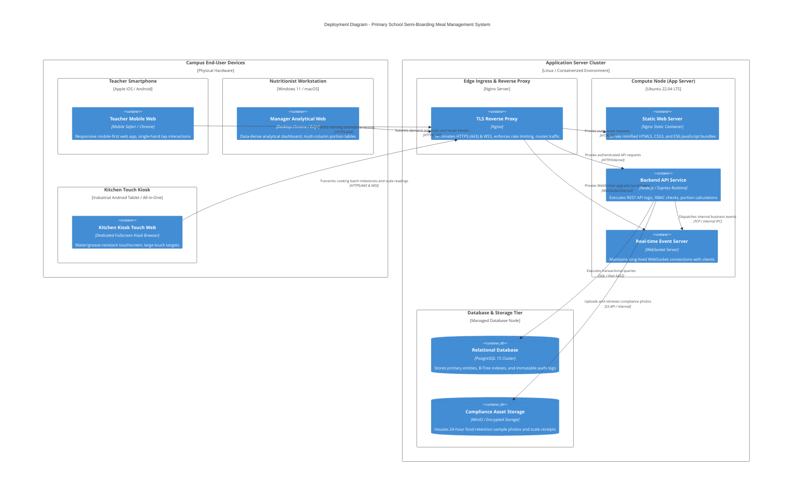

# C4 Level 4 — Deployment Diagram

## 1. Overview

The **Deployment Diagram** maps the runtime software containers to physical and virtual hardware infrastructure, network ingress boundaries, and client devices deployed across the primary school campus.

---

## 2. Infrastructure Deployment Diagram (C4Deployment)

---

## 3. Infrastructure & Node Specifications

### 3.1. Client Device Requirements
1. **Teacher Mobile Devices:**
   - Runs standard mobile browsers (Safari on iOS 15+, Google Chrome on Android 10+).
   - Utilizes lightweight client-side caching to maintain responsiveness even if school Wi-Fi experiences intermittent degradation.
2. **Kitchen Wall-Mount Kiosk:**
   - Industrial 15.6"+ touchscreen tablet with an IP54-rated enclosure protecting against steam, humidity, and grease.
   - Operates in locked fullscreen kiosk mode to prevent accidental application exits.

### 3.2. Server Compute & Ingress Architecture
- **Nginx Ingress Proxy:**
  - Automated SSL/TLS termination using modern TLS 1.3 cipher suites.
  - Granular rate limiting configured to prevent request surges during the peak 07:45 - 08:15 AM window.
- **Node.js API Runtime:**
  - Deployed in lightweight Docker containers with automated health checks (`/healthz`).
  - Stateless architecture allowing horizontal scaling if the system expands to multiple school campuses.
- **PostgreSQL 15 Database Cluster:**
  - Connection pooling managed via internal poolers (e.g., PgBouncer or native node-postgres connection pool).
  - Configured with daily automated snapshot backups and 30-day Point-In-Time Recovery (PITR) retention.
