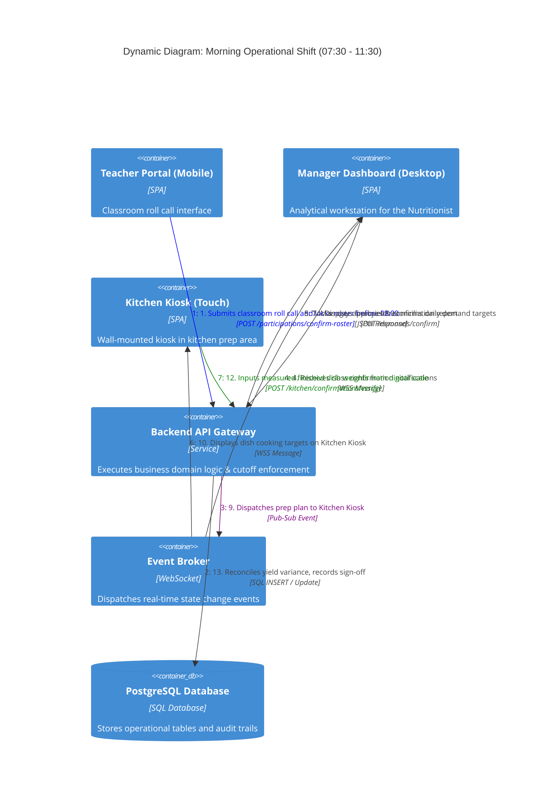

# C4 Dynamic Diagram — Morning Operational Lifecycle (07:30 - 11:30)

## 1. Overview

The **Dynamic Diagram** captures the chronological, message-by-message interactions that occur during the critical morning operational window (07:30 AM to 11:30 AM). It illustrates how data flows seamlessly across the three core MVP modules: **Attendance & Participation (M1) $\rightarrow$ Demand & Portioning (M2) $\rightarrow$ Kitchen Cooking & Yield Reconciliation (M3)**.

---

## 2. Sequential Operational Flow (C4Dynamic)



---

## 3. Operational Timeline Walkthrough

```
Operational Timeline:
07:30 ────────► 08:00 ────────► 08:15 ────────► 08:30 ────────► 10:45 ────────► 11:15
[Class Roll Call] [Cutoff Lock]  [Portion Calc]  [Pantry & Cook]  [Yield Weighing] [Tray Assembly]
```

### Stage 1: Class Roll Call & Morning Cutoff Lock (07:30 - 08:00 AM)
- **Steps 1 - 3:** During the first 15 minutes of school, homeroom teachers take attendance on their smartphones via the **Teacher Mobile Portal**. They flag absent students with reasons (sick leave, family travel) and click **"Lock Class Roster"**.
- The API verifies the current timestamp. If before 08:00 AM, it commits a database transaction marking the classroom's `meal_participations` as `confirmed` and emits a `CLASS_ROSTER_LOCKED` event.

### Stage 2: Whole-School Aggregation & Recipe Scaling (08:00 - 08:15 AM)
- **Steps 4 - 7:** The Nutrition Manager monitors the live progress gauge on the **Manager Analytical Dashboard** (e.g., 30 of 30 classes confirmed, total 1,050 diners).
- The Manager reviews the safety buffer slider (configured at 4%) and triggers **"Calculate Dish Quantities"**. The system multiplies the confirmed diners by standard nutrition portion sizes and generates rows in `meal_demand_dish_quantities`.
- The Manager performs a visual check and clicks **"Approve & Dispatch to Kitchen"**.

### Stage 3: Pantry Issuance & Station Batch Cooking (08:15 - 10:45 AM)
- **Steps 8 - 10:** The approved plan automatically arrives at the **Kitchen Touch Kiosk** located in the kitchen.
- Kitchen staff verify incoming raw ingredients delivered from the pantry against the recipe bill-of-materials and start their cooking shift.
- **Step 11:** As each dish begins cooking, chefs tap the dish card on the kiosk to activate station countdown timers. Multi-batch cooking milestones stream live to the Manager's desk.

### Stage 4: Finished Yield Weighing & Final Sign-Off (10:45 - 11:15 AM)
- **Steps 12 - 14:** When cooking concludes, the Head Chef places the bulk hotel pans on a certified digital floor scale and enters the actual finished weight into the kiosk.
- The **Yield Reconciliation Engine** verifies the actual weight against the planned target:
  - If variance is within the allowable $\pm 3\%$ margin, the system awards a green `matched` badge.
  - If outside tolerance, the chef must record an explicit `discrepancy_reason` before completing verification.
- With mutual sign-off achieved, staff proceed to tray distribution for the student lunch period at 11:15 AM.
