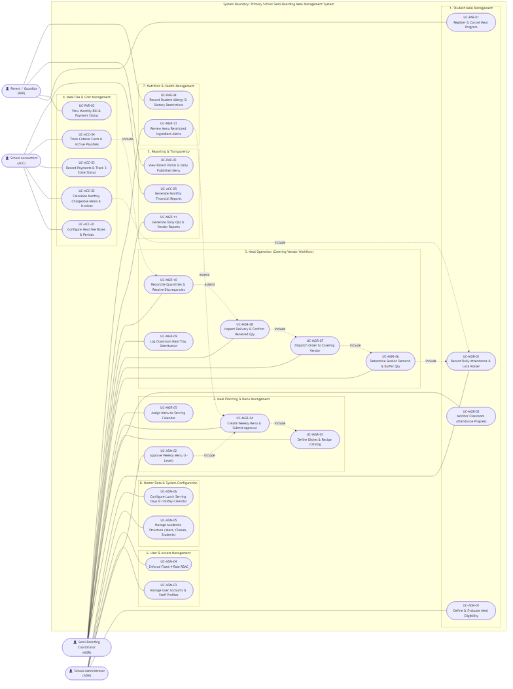
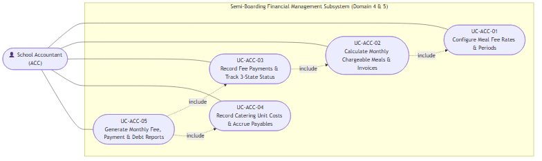
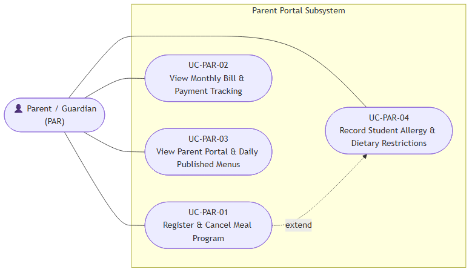
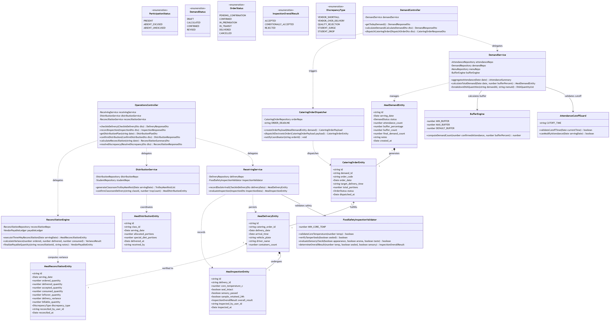
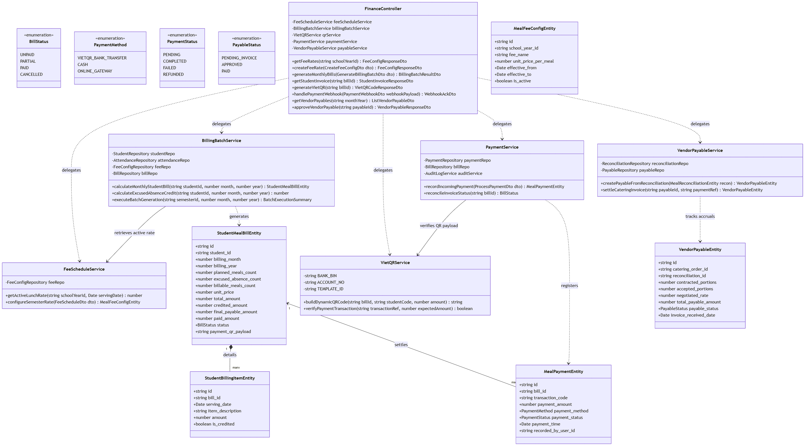
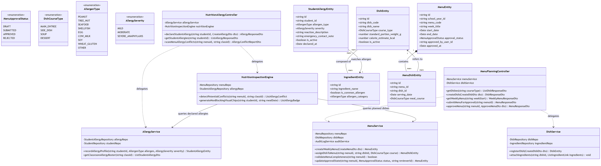
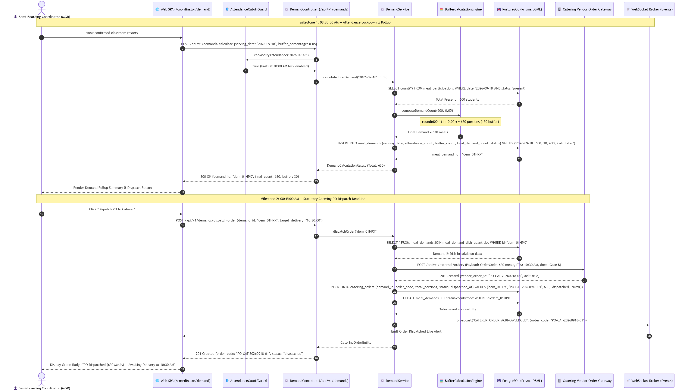
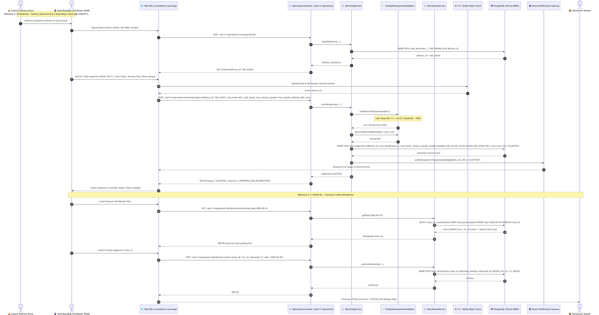
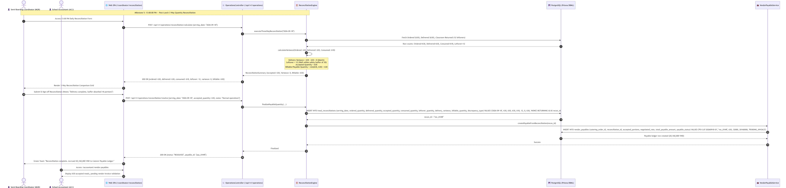
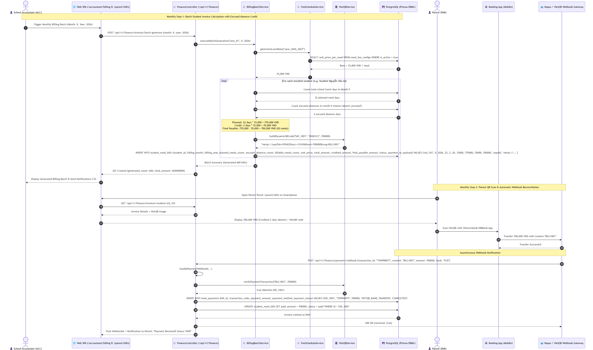

# Architecture & Operational Diagrams Suite

> **System**: Primary School Semi-Boarding Meal Management System  
> **Operational Scope**: Dedicated Lunch-Only Scope (Monday – Friday)  
> **Supply Model**: External Catering Vendor Operating Model (Prepared Hot Meals)  
> **Diagram Standards**: UML Class & Sequence Diagrams (Mermaid), Actor Use Case Flowcharts  

This directory centrally maintains the full suite of system architecture diagrams, encompassing both version-controlled Mermaid source models (`.mmd`) and high-resolution compiled image assets (`.png`). All models strictly align with the [C4 Architecture Model](../c4/README.md), [Database Persistence Schema (DBML)](../docs/06-database/README.md), and [RESTful API Specification (OpenAPI 3.0)](../docs/07-api-documentation/README.md).

---

## Table of Contents

- [1. Diagram Inventory](#1-diagram-inventory)
- [2. Diagram Visualization & Detailed Specifications](#2-diagram-visualization--detailed-specifications)
  - [2.1. Use Case Diagrams (Fixed 4-Role RBAC Model)](#21-use-case-diagrams-fixed-4-role-rbac-model)
  - [2.2. UML Class Diagrams (3-Tier & Domain Entities)](#22-uml-class-diagrams-3-tier--domain-entities)
  - [2.3. UML Sequence Diagrams (Statutory Operational Milestones)](#23-uml-sequence-diagrams-statutory-operational-milestones)
- [3. Architecture Traceability Matrix](#3-architecture-traceability-matrix)
- [4. Compilation & Image Generation Guide](#4-compilation--image-generation-guide)

---

## 1. Diagram Inventory

| # | Diagram Title | Diagram Type | Target Business Domain | Mermaid Source | Rendered PNG Image |
|:---:|---|:---:|---|---|---|
| 1 | **System-Level Use Case Overview** | `flowchart` | Entire System: 4 Roles & 8 Business Domains | [`usecase-overview.mmd`](usecase-overview.mmd) | [`usecase-overview.png`](usecase-overview.png) |
| 2 | **Use Case: Semi-Boarding Coordinator (MGR)** | `flowchart` | Domains 1, 2, 3, 5, 7: Attendance, Demand & Operations | [`usecase-manager.mmd`](usecase-manager.mmd) | [`usecase-manager.png`](usecase-manager.png) |
| 3 | **Use Case: School Accountant (ACC)** | `flowchart` | Domains 4, 5: Pricing, Monthly Billing, VietQR & Payables | [`usecase-accountant.mmd`](usecase-accountant.mmd) | [`usecase-accountant.png`](usecase-accountant.png) |
| 4 | **Use Case: School Administrator (ADM)** | `flowchart` | Domains 1, 2, 6, 8: Master Data, Menus, Calendar & RBAC | [`usecase-admin.mmd`](usecase-admin.mmd) | [`usecase-admin.png`](usecase-admin.png) |
| 5 | **Use Case: Student Parent / Guardian (PAR)** | `flowchart` | Domains 1, 4, 5, 7: Registration, Allergy & QR Payments | [`usecase-parent.mmd`](usecase-parent.mmd) | [`usecase-parent.png`](usecase-parent.png) |
| 6 | **Operations, Demand & Caterer Domain** | `classDiagram` | Domain 3: Meal Operations, Buffer Engine & 3-Way Reconciliation | [`class-domain-operations-and-caterer.mmd`](class-domain-operations-and-caterer.mmd) | [`class-domain-operations-and-caterer.png`](class-domain-operations-and-caterer.png) |
| 7 | **Finance, Billing & VietQR Domain** | `classDiagram` | Domain 4: Rates, Billing Batches, VietQR & Vendor Accruals | [`class-domain-finance-and-billing.mmd`](class-domain-finance-and-billing.mmd) | [`class-domain-finance-and-billing.png`](class-domain-finance-and-billing.png) |
| 8 | **Nutrition, Menu & Allergy Alerts Domain** | `classDiagram` | Domains 2 & 7: Weekly Menus, Recipes & Allergy Detection | [`class-domain-nutrition-and-menu.mmd`](class-domain-nutrition-and-menu.mmd) | [`class-domain-nutrition-and-menu.png`](class-domain-nutrition-and-menu.png) |
| 9 | **08:30 – 08:45 AM Demand & Order Dispatch** | `sequenceDiagram` | Milestones 1 & 2: Attendance Cutoff $\to$ Buffer $\to$ Caterer PO | [`sequence-01-morning-demand-and-order.mmd`](sequence-01-morning-demand-and-order.mmd) | [`sequence-01-morning-demand-and-order.png`](sequence-01-morning-demand-and-order.png) |
| 10 | **10:30 – 11:00 AM Receiving & Distribution** | `sequenceDiagram` | Milestones 3 & 4: 3-Step Inspection ($T \ge 65^\circ\text{C}$) $\to$ Trolleys | [`sequence-02-receiving-inspection-and-distribution.mmd`](sequence-02-receiving-inspection-and-distribution.mmd) | [`sequence-02-receiving-inspection-and-distribution.png`](sequence-02-receiving-inspection-and-distribution.png) |
| 11 | **13:00 PM Post-Lunch 3-Way Reconciliation** | `sequenceDiagram` | Milestone 5: 3-Way Reconciliation $\to$ Vendor Payables Accrual | [`sequence-03-post-lunch-reconciliation.mmd`](sequence-03-post-lunch-reconciliation.mmd) | [`sequence-03-post-lunch-reconciliation.png`](sequence-03-post-lunch-reconciliation.png) |
| 12 | **Monthly Billing Batch & VietQR Payment** | `sequenceDiagram` | Monthly Cycle: Billing Batch (Absence Credits) $\to$ VietQR | [`sequence-04-monthly-billing-and-vietqr.mmd`](sequence-04-monthly-billing-and-vietqr.mmd) | [`sequence-04-monthly-billing-and-vietqr.png`](sequence-04-monthly-billing-and-vietqr.png) |

---

## 2. Diagram Visualization & Detailed Specifications

### 2.1. Use Case Diagrams (Fixed 4-Role RBAC Model)

#### System-Level UML Use Case Overview
Captures the primary system boundary, 4 human actors (`ADM`, `MGR`, `ACC`, `PAR`), and standard UML `include` / `extend` relationships across all 8 business domains:


#### Actor Use Case: Semi-Boarding Coordinator / Meal Manager (`MGR`)
Specifies core operational use cases: attendance monitoring, 08:30 AM cutoff locking, recipe and menu planning, demand aggregation with safety buffer, dock receiving, trolley distribution, and 13:00 PM reconciliation:


#### Actor Use Case: School Accountant (`ACC`)
Specifies financial management use cases: semester fee rate setup, monthly student billing batch calculations (with excused absence credits), 3-state payment tracking, VietQR verification, and vendor payable accruals:


#### Actor Use Case: School Administrator / Principal (`ADM`)
Specifies administrative governance use cases: academic years, grades, classes, student profiles, meal eligibility criteria, lunch serving calendars, 1-level weekly menu approvals, and staff account management:


#### Actor Use Case: Student Parent / Guardian (`PAR`)
Specifies mobile-first parent portal interactions: semester meal enrollment, medical allergy declarations, daily published menu & food inspection badges, and electronic invoice payments:


---

### 2.2. UML Class Diagrams (3-Tier & Domain Entities)

#### Domain 3: Operations, Demand Calculation & Catering Vendor Management
Models Presentation Tier controllers and DTOs, Business Logic engines (`AttendanceCutoffGuard`, `BufferEngine`, `FoodSafetyInspectionValidator`, `ReconciliationEngine`), and Prisma DBML persistence entities:


#### Domain 4: Meal Fee, Cost Management & VietQR Billing
Models the financial lifecycle: `FeeScheduleService`, `BillingBatchService`, `VietQRService`, `PaymentService`, and `VendorPayableService` mapped to student invoices and payment records:


#### Domain 2 & 7: Nutrition, Menu Planning & Food Allergy Alert Engine
Models weekly menus, standard recipe catalogs, ingredient composition, student allergy profiles, and the non-blocking visual conflict alert engine:


---

### 2.3. UML Sequence Diagrams (Statutory Operational Milestones)

#### Milestone 1 & 2 (08:30 – 08:45 AM): Morning Attendance Lockdown, Buffer & Caterer PO Dispatch
Visualizes morning attendance lock at 08:30:00 AM, dynamic safety buffer application ($0\%\text{--}10\%$), portion breakdown, and formal electronic purchase order dispatch before the 08:45:00 AM deadline:


#### Milestone 3 & 4 (10:30 – 11:00 AM): 3-Step Food Receiving Inspection (≥65°C) & Classroom Distribution
Visualizes delivery dock receiving, statutory 3-step food inspection under Decision 1246/QĐ-BYT (core probe temp $\ge 65^\circ\text{C}$, container seals, sensory evaluation, 24-hour sample retention), and 11:00 AM classroom trolley distribution:


#### Milestone 5 (13:00 PM): Post-Lunch 3-Way Reconciliation & Vendor Payables Accrual
Visualizes post-service 3-way quantity variance verification (Ordered vs. Delivered vs. Consumed), discrepancy categorization, and automated accrual into the School Accountant's vendor payable ledger:


#### Monthly Cycle: Student Fee Billing Batch, Dynamic VietQR & Payment Webhook Reconciliation
Visualizes automated monthly invoice generation with excused absence credits, dynamic VietQR generation with embedded transaction codes, parent mobile banking scans, and real-time webhook reconciliation:


---

## 3. Architecture Traceability Matrix

Ensures bidirectional consistency across C4 Components, Class Diagrams, Sequence Flows, OpenAPI 3.0 Endpoints, and DBML Relational Tables:

| Core Operational Milestone | C4 Component Reference | Class Method / Service | Sequence Flow | OpenAPI 3.0 REST Endpoint | Database Entity (PostgreSQL / DBML) |
|---|---|---|---|---|---|
| **Classroom Attendance Lock (08:30 AM)** | `c4-components-participation.md` | `AttendanceCutoffGuard.canModifyAttendance` | `sequence-01` (Steps 1–3) | `POST /api/v1/students/participations/roll-call` | `meal_participations`, `meal_participation_changes` |
| **Demand Rollup & Buffer Math (0–10%)** | `c4-components-demand.md` | `DemandService.calculateTotalDemand`<br>`BufferEngine.computeDemandCount` | `sequence-01` (Steps 4–10) | `POST /api/v1/demands/calculate` | `meal_demands`, `meal_demand_dish_quantities` |
| **Caterer PO Electronic Dispatch (08:45 AM)** | `c4-components-demand.md` | `CateringOrderDispatcher.dispatchElectronicOrder` | `sequence-01` (Steps 11–19) | `POST /api/v1/demands/dispatch-order` | `catering_orders` |
| **3-Step Food Inspection (10:30 AM, ≥65°C)** | `c4-components-preparation.md` | `FoodSafetyInspectionValidator.validateCoreTemperature` | `sequence-02` (Steps 1–13) | `POST /api/v1/operations/receiving/inspect` | `meal_deliveries`, `meal_inspections` |
| **Classroom Trolley Distribution (11:00 AM)** | `c4-components-preparation.md` | `DistributionService.generateClassroomTrolleyManifest` | `sequence-02` (Steps 14–20) | `POST /api/v1/operations/distribution/confirm` | `meal_distributions` |
| **Post-Lunch 3-Way Reconciliation (13:00 PM)** | `c4-components-preparation.md` | `ReconciliationEngine.executeThreeWayReconciliation` | `sequence-03` (Steps 1–8) | `POST /api/v1/operations/reconciliation/calculate` | `meal_reconciliations`, `meal_discrepancies` |
| **Caterer Payable Accrual Settlement** | `c4-components-fee-cost.md` | `VendorPayableService.createPayableFromReconciliation` | `sequence-03` (Steps 9–16) | `POST /api/v1/operations/reconciliation/resolve` | `vendor_payables` |
| **Monthly Billing Batch (Absence Credits)** | `c4-components-fee-cost.md` | `BillingBatchService.calculateMonthlyStudentBill` | `sequence-04` (Steps 1–9) | `POST /api/v1/finance/invoices/batch-generate` | `student_meal_bills`, `student_billing_items` |
| **Dynamic VietQR & Webhook Settlement** | `c4-components-fee-cost.md` | `VietQRService.buildDynamicQRCode`<br>`PaymentService.recordIncomingPayment` | `sequence-04` (Steps 10–18) | `POST /api/v1/finance/payments/webhook` | `meal_payments`, `student_meal_bills` |

---

## 4. Compilation & Image Generation Guide

All `.mmd` diagram files in this directory are compiled using **Mermaid CLI (`@mermaid-js/mermaid-cli`)**:

```bash
# Compile a single diagram to high-resolution PNG with white background:
npx @mermaid-js/mermaid-cli -i diagrams/<diagram-name>.mmd -o diagrams/<diagram-name>.png -b white

# Example:
npx @mermaid-js/mermaid-cli -i diagrams/usecase-overview.mmd -o diagrams/usecase-overview.png -b white
```
