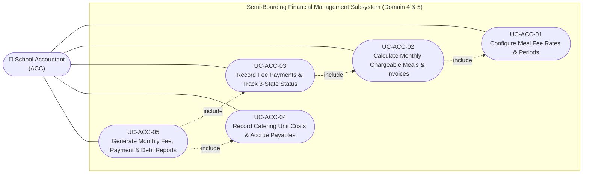

# Use Case Specifications — School Accountant (ACC)

## Actor Overview

- **Actor Code:** `ACC`
- **Actor Name:** School Accountant
- **Primary Operational Scope:** Domain 4 (Meal Fee & Cost Management) & Domain 5 (Cost & Fee Reporting). Responsible for configuring unit meal fee schedules, calculating chargeable meals based on verified attendance records, issuing monthly parent meal bills, tracking collections across 3 streamlined payment states (`unpaid`, `partial`, `paid`), accruing catering vendor costs, and generating institutional financial audit reports.

---

## Use Case Diagram — School Accountant

---

## UC-ACC-01 — Configure Meal Fee Rates & Effective Periods

- **Core Feature:** `F-FEE-01`
- **Primary DB Entity:** `meal_fee_configs`
- **Secondary Entities:** `school_years`

### Preconditions
1. Accountant is authenticated with role `ACC`.
2. Academic year and semester structures are configured in system master data.

### Main Success Scenario
1. Accountant accesses the **Meal Fee Schedule Configuration** screen.
2. Inputs price schedule details:
   - Meal Session: Lunch (`lunch`), Afternoon Snack (`snack`).
   - Unit Rate: e.g., `35,000 VND / meal`.
   - Effective Period: From `2026-09-01` to `2027-01-15`.
   - Status: `active`.
3. Clicks **Save Fee Configuration**.
4. System stores the record in `meal_fee_configs`. All subsequent automated billing calculations apply this unit rate.

---

## UC-ACC-02 — Calculate Monthly Chargeable Meals & Generate Invoices

- **Core Feature:** `F-FEE-02`
- **Primary DB Entities:** `student_meal_bills`, `student_billing_items`
- **Secondary Entities:** `meal_participations`, `students`, `classes`

### Preconditions
1. Service month has concluded (or running mid-month calculation).
2. Daily classroom attendance records (`meal_participations`) are finalized and locked.

### Main Success Scenario
1. Accountant opens the **Meal Fee Assessment & Invoice Generator** screen.
2. Selects billing month/year (e.g., October 2026) and target grade or whole school.
3. Clicks **Run Batch Fee Calculation**.
4. System scans historical attendance for every enrolled student:
   - Total scheduled meal days in month: 22 days.
   - Actual attended meal count: e.g., 20 meals.
   - Excused absences submitted before cutoff: 2 days (credited/deducted).
   - Chargeable meal count (`chargeable_meals`): 20 meals.
   - Total fee assessment: $20 \times 35,000 = 700,000\text{ VND}$.
5. System creates an invoice in `student_meal_bills` with initial status `unpaid`.
6. Daily breakdown is saved into `student_billing_items`.
7. Accountant reviews aggregate billing totals and clicks **Publish Monthly Invoices** to parents ([UC-PAR-02](usecase-parent.md#uc-par-02)).

---

## UC-ACC-03 — Record Fee Payments & Track 3-State Status

- **Core Feature:** `F-FEE-03`
- **Primary DB Entities:** `meal_payments`, `student_meal_bills`

### Preconditions
1. Meal invoices have been published in status `unpaid` or `partial`.
2. Parent submits payment via electronic bank transfer or cash at the financial office.

### Main Success Scenario
1. Accountant accesses the **Meal Payment Collections** module.
2. Queries student by Student ID, Student Name, or Classroom (e.g., "Le Nam", Class 2A).
3. Inputs payment amount (e.g., 700,000 VND), payment method (Bank Transfer / Cash), transaction reference code, and payment date.
4. Clicks **Confirm Payment Receipt**.
5. System inserts a transaction record in `meal_payments`.
6. System automatically updates the status of `student_meal_bills`:
   - If paid amount equals total invoice $\rightarrow$ Status transitions to `paid`.
   - If paid amount is less than total invoice $\rightarrow$ Status transitions to `partial`.
   - If no payment recorded $\rightarrow$ Retains status `unpaid`.
7. An electronic payment receipt becomes immediately accessible on the parent portal.

---

## UC-ACC-04 — Record Catering Unit Costs & Accrue Vendor Payables

- **Core Feature:** `F-FEE-04`
- **Primary DB Entities:** `catering_costs`, `vendor_payables`
- **Secondary Entities:** `meal_reconciliations`

### Preconditions
1. Daily meal reconciliation records (`meal_reconciliations`) are signed off by the coordinator.
2. Service contract stipulates agreed catering unit cost (e.g., 28,000 VND / accepted meal).

### Main Success Scenario
1. Accountant opens the **Catering Vendor Cost & Payables Ledger**.
2. Selects audit billing cycle (e.g., October 2026).
3. System aggregates the net total of accepted, quality-certified meals delivered during the cycle (e.g., 12,000 verified meals).
4. System computes total contractual payable amount:
   $$\text{Total Payable} = 12,000 \times 28,000\text{ VND} = 336,000,000\text{ VND}$$
5. Accountant audits the calculation against the commercial tax invoice submitted by the vendor.
6. Accountant clicks **Accrue Vendor Payable**, committing the record in `vendor_payables` for disbursement approval.

---

## UC-ACC-05 — Generate Monthly Fee, Payment & Debt Reports

- **Core Feature:** `F-REP-02`
- **Primary DB Entity:** Financial Materialized Views / Reports

### Main Success Scenario
1. Accountant opens the **Financial & Cost Reporting Module**.
2. Selects target reporting template:
   - **Classroom Fee Collection Report:** Billed amounts, collection rates, and outstanding balances.
   - **Catering Cost & Payable Ledger:** Delivery tallies, gross payables, and penalty deductions for short deliveries.
   - **Semi-Boarding Financial Balance Summary:** Net comparison between parent fee revenues and catering vendor food expenses.
3. Reviews data tables and clicks **Export Excel / PDF Report**.

