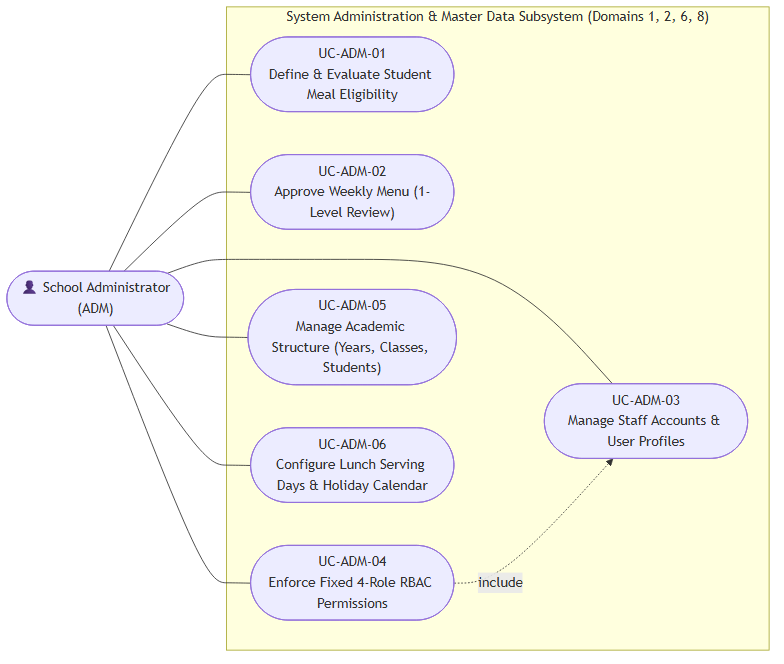

# Use Case Specifications — School Administrator (ADM)

## Actor Overview

- **Actor Code:** `ADM`
- **Actor Name:** School Administrator / Principal
- **Primary Operational Scope:** Domain 1 (Eligibility Criteria), Domain 2 (Single-Level Menu Approval), Domain 6 (User & Fixed RBAC Management), Domain 8 (Master Data: Academic Structure & Calendars). Ensures baseline master data integrity, manages staff account permissions, and approves school-level operational decisions.

---

## Use Case Diagram — School Administrator

---

## UC-ADM-01 — Define & Evaluate Student Meal Eligibility

- **Core Feature:** `F-PAR-01`
- **Primary DB Entities:** `meal_eligibility`, `students`

### Main Success Scenario
1. Administrator navigates to **Boarding Eligibility Configuration**.
2. Configures eligibility criteria (e.g., Grade 1–5 students who submitted mandatory medical clearance forms and parent commitments).
3. Triggers the automated eligibility evaluation batch for the new school year.
4. System updates `students.eligibility_status = 'eligible'` for all qualifying students.

---

## UC-ADM-02 — Approve Weekly Menu (1-Level Review)

- **Core Feature:** `F-PLN-02`
- **Primary DB Entity:** `menus`
- **Secondary Entities:** `menu_dishes`, `dishes`

### Preconditions
1. Semi-Boarding Coordinator has submitted the weekly menu with status `submitted` ([UC-MGR-04](usecase-manager.md#uc-mgr-04)).

### Main Success Scenario
1. School Principal / Administrator opens the **Weekly Menu Approval** screen.
2. Reviews daily dish composition (main dishes, side dishes, vegetable soups, desserts, total Kcal energy intake).
3. Verifies that there are no allergen conflicts or nutritional imbalances.
4. Clicks **Approve Menu**.
5. System updates status to `menus.status = 'approved'` and locks the menu against further edits.

---

## UC-ADM-03 — Manage Staff Accounts & User Profiles

- **Core Feature:** `F-USR-01`
- **Primary DB Entity:** `users`

### Main Success Scenario
1. Administrator navigates to **Account & Staff Management**.
2. Enters staff profile details: Full Name, Email, Phone Number, and Active Status.
3. Issues initial temporary credentials or sends an account activation email.
4. System creates a new record in the `users` table.

---

## UC-ADM-04 — Enforce Fixed 4-Role RBAC Permissions

- **Core Feature:** `F-USR-02`
- **Primary DB Entities:** `users`, `roles`

### Main Success Scenario
1. On the user profile detail screen, Administrator assigns exactly 1 of the 4 fixed system roles:
   - `Admin` (System Administration & Governance)
   - `Accountant` (Financial Billing & Payables)
   - `Manager` (Semi-Boarding Operations Coordinator)
   - `Parent` (Guardian & Family Portal)
2. System enforces immutable role-permission sets per [MVP.md](../01-top-down/MVP.md) (no runtime custom permission tampering allowed in UI).
3. The authenticated user is strictly bounded by their assigned role permissions upon subsequent logins.

---

## UC-ADM-05 — Manage Academic Structure (Years, Classes, Students)

- **Core Feature:** `F-MST-01`
- **Primary DB Entities:** `school_years`, `grades`, `classes`, `students`

### Main Success Scenario
1. Administrator establishes a new school year (e.g., `2026-2027`) partitioned into 2 academic terms.
2. Initializes grade levels (Grade 1 through Grade 5) and classrooms (1A, 1B, 2A, etc.).
3. Executes batch import of enrolled student rosters from standardized Excel templates into designated classes.
4. Master organizational records form the baseline student identity references across the entire boarding lifecycle.

---

## UC-ADM-06 — Configure Lunch Serving Days & Holiday Calendar

- **Core Feature:** `F-MST-02`
- **Primary DB Entities:** `meal_calendars`, `holidays`

### Main Success Scenario
1. Administrator opens **School Academic & Boarding Calendar**.
2. Configures standard meal-serving days: Monday through Friday each week.
3. Defines national public holidays, term breaks, and non-boarding event days (e.g., National Teachers' Day, Lunar New Year).
4. System saves records to `holidays` and automatically excludes these dates from `meal_schedules`, preventing unauthorized billing generation or vendor ordering on non-operational days.
