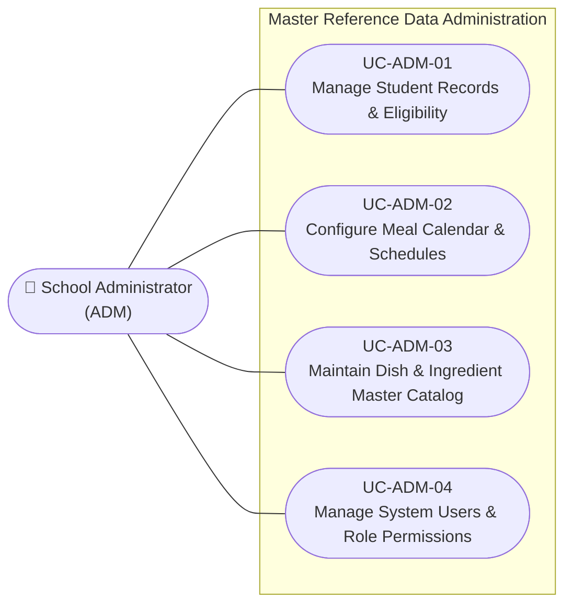

# Use Case Specifications — School Administrator (ADM)

## Actor Overview

- **Actor Name:** School Administrator (`ADM`)
- **Primary Domain:** System Master Data & Boundary References
- **Key Objectives:** Maintain foundational entities (students, classrooms, meal schedules, users, dishes, and ingredients) that enable daily operations across Modules 1, 2, and 3.

---

## Use Case Diagram — School Administrator

---

## UC-ADM-01 — Manage Student Records & Eligibility

- **Primary DB Entity:** `students`
- **Secondary Entities:** `meal_registrations`

### Preconditions
1. Administrator is authenticated with administrative rights.
2. Academic year and classroom designations are established.

### Main Success Scenario
1. Administrator accesses the **Student Master Directory** ([SCR-ADM-01](../04-information-architecture/screen-inventory.md)).
2. Administrator creates or imports student profiles (`full_name`, `class_name`).
3. Administrator updates `eligibility_status` (e.g. `eligible`, `suspended`, `withdrawn`).
4. System persists records in `students` table.
5. Eligible students automatically populate classroom rosters for Module 1.

---

## UC-ADM-02 — Configure Meal Calendar & Daily Schedules

- **Primary DB Entity:** `meal_schedules`
- **Secondary Entities:** `dishes`

### Preconditions
1. School term dates are known.

### Main Success Scenario
1. Administrator opens the **Meal Calendar Setup Screen** ([SCR-ADM-02](../04-information-architecture/screen-inventory.md)).
2. Administrator creates meal sessions:
   - Sets `meal_date` (e.g., `2026-09-15`).
   - Selects `meal_type` from `meal_type_enum` (`breakfast`, `lunch`, `snack`, `dinner`).
   - Associates scheduled menu reference `menu_id`.
3. System saves records into `meal_schedules`.
4. These schedules become the anchor points for Module 1 (`meal_participations`) and Module 2 (`meal_demands`).

---

## UC-ADM-03 — Maintain Dish & Ingredient Master Catalog

- **Primary DB Entities:** `dishes`, `ingredients`

### Preconditions
1. Standard recipes and nutrition guidelines are approved.

### Main Success Scenario
1. Administrator accesses the **Dish & Recipe Management Panel** ([SCR-ADM-03](../04-information-architecture/screen-inventory.md)).
2. Administrator creates or updates dish entries in `dishes` (`name`, `status`).
3. Administrator maintains ingredient records in `ingredients` (`name`, `unit` e.g., kg, liters).
4. Data feeds into Module 2 dish quantity calculations and Module 3 kitchen prep plans.

---

## UC-ADM-04 — Manage System Users & Role Permissions

- **Primary DB Entity:** `users`

### Preconditions
1. School staff rosters are verified.

### Main Success Scenario
1. Administrator accesses **User Account & Role Management** ([SCR-ADM-04](../04-information-architecture/screen-inventory.md)).
2. Administrator registers staff accounts with `full_name` and assigns operational roles:
   - `teacher`: Grants access to Module 1 class participation.
   - `manager`: Grants access to Module 2 demand determination and preparation shift planning.
   - `kitchen`: Grants access to Module 3 kitchen cooking boards and ingredient receipts.
   - `admin`: Full system administration.
3. System provisions credentials and access tokens.
