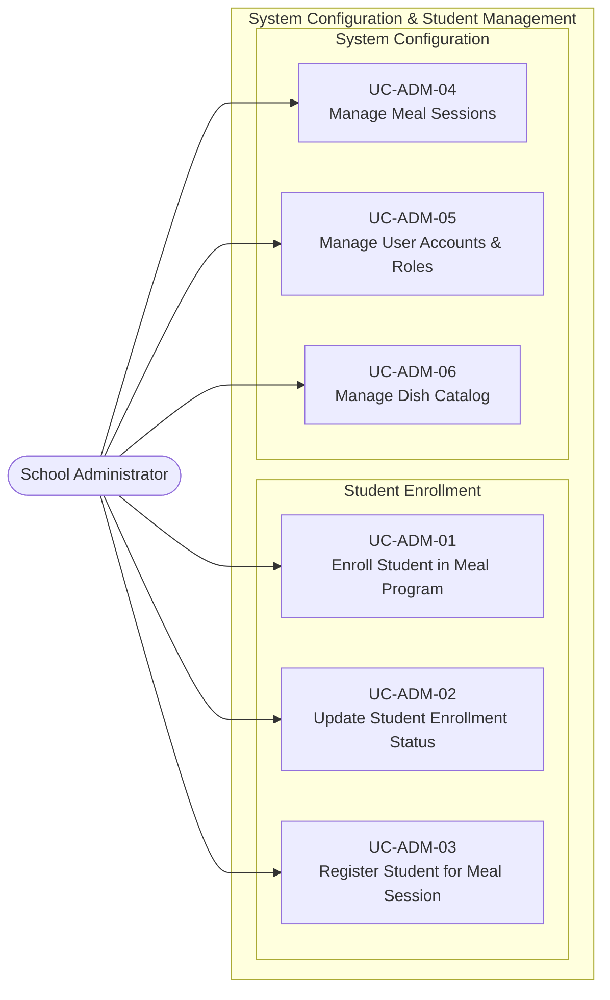

# UC-ADM — School Administrator Use Cases

## Use Case Diagram

---

## Use Case Specifications

### UC-ADM-01 — Enroll Student in Meal Program

| Field | Value |
|-------|-------|
| **Actor** | School Administrator |
| **Feature** | F-STU-01 Manage Student Meal Eligibility |
| **Precondition** | Student exists in the school system. Classes are configured. |
| **Trigger** | Administrator enrolls a student at the start of the school year or upon transfer |

**Main Flow:**
1. Administrator navigates to Student Management
2. Administrator searches for and selects the student
3. Administrator marks the student as eligible for the semi-boarding meal program
4. System sets `students.status = 'active'`
5. System creates the student's class association (`students.class_id`)
6. Student becomes visible in class attendance rolls for meal sessions

**Postcondition:** Student is enrolled and appears in meal attendance rosters.

---

### UC-ADM-02 — Update Student Enrollment Status

| Field | Value |
|-------|-------|
| **Actor** | School Administrator |
| **Feature** | F-STU-01 Manage Student Meal Eligibility |
| **Trigger** | A student transfers out, withdraws, or is temporarily suspended from the meal program |

**Main Flow:**
1. Administrator selects the student
2. Administrator changes status: `active` → `inactive` or `transferred`
3. System removes the student from future demand calculations
4. System preserves historical records for audit

**Postcondition:** Student no longer appears in future attendance rolls.

---

### UC-ADM-03 — Register Student for Meal Session

| Field | Value |
|-------|-------|
| **Actor** | School Administrator |
| **Feature** | F-STU-02 Register Student for Meal Session |
| **Precondition** | Student is enrolled (UC-ADM-01). Meal sessions are configured. |

**Main Flow:**
1. Administrator opens the student's meal registration profile
2. Administrator selects the meal session(s) the student participates in (e.g., Lunch only; or Breakfast + Lunch)
3. Administrator sets `effective_from` and `effective_to` date range
4. System creates `meal_registrations` records
5. The student's participation is now captured in the `base_registered_count` for daily demand

**Postcondition:** Student is registered for one or more meal sessions with a valid date range.

---

### UC-ADM-04 — Manage Meal Sessions

| Field | Value |
|-------|-------|
| **Actor** | School Administrator |
| **Feature** | System configuration |
| **Trigger** | Setup at start of school year or when session times change |

**Main Flow:**
1. Administrator opens Meal Session Configuration
2. Administrator creates or edits a session: code (breakfast/lunch/snack), name, start_time, end_time, registration_cutoff_time
3. System saves to `meal_sessions`
4. All demand calculations and cutoff logic reference these session parameters

**Postcondition:** Meal sessions are configured with correct cutoff times.

---

### UC-ADM-05 — Manage User Accounts & Roles

| Field | Value |
|-------|-------|
| **Actor** | School Administrator |
| **Feature** | System configuration |

**Main Flow:**
1. Administrator creates a user account for a staff member
2. Administrator assigns a role: MGR / KIT / TCH / STO
3. System grants the user access to their role-specific screens and actions
4. For TCH: Administrator assigns the teacher to their class

**Postcondition:** Staff member can log in and access only their permitted functions.

---

### UC-ADM-06 — Manage Dish Catalog

| Field | Value |
|-------|-------|
| **Actor** | School Administrator |
| **Feature** | System configuration — enables F-MPN-02 |
| **Trigger** | New dishes are introduced to the school menu rotation |

**Main Flow:**
1. Administrator opens the Dish Catalog
2. Administrator creates a new dish record: dish_name, category (Main/Staple/Soup/Vegetable/Dessert)
3. System saves to `dishes`
4. Dishes become available for the Meal/Nutrition Manager to assign to menus (UC-MGR-02)

**Postcondition:** Dish catalog is up to date and available for menu planning.
