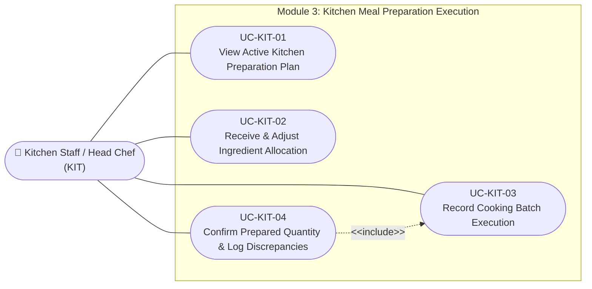

# Use Case Specifications — Kitchen Staff / Head Chef (KIT)

## Actor Overview

- **Actor Name:** Kitchen Staff / Head Chef (`KIT`)
- **Primary Domain:** Module 3: Meal Preparation
- **Key Objectives:** Review scheduled prep targets, accept allocated ingredients from storage, record physical cooking batches, and verify final prepared yields against demand.

---

## Use Case Diagram — Kitchen Staff

---

## UC-KIT-01 — View Active Kitchen Preparation Plan

- **Core Feature:** `F-PRP-01`
- **Primary DB Entity:** `meal_preparation_plans`, `meal_preparation_plan_dishes`
- **Secondary Entities:** `dishes`, `meal_demands`

### Preconditions

1. Kitchen shift has started.
2. Manager (MGR) has published a preparation plan (`plan_status = 'planned'`).

### Main Success Scenario

1. Kitchen staff open the **Kitchen Kiosk Preparation Board** ([SCR-KIT-01](../04-information-architecture/screen-inventory.md)).
2. System displays target dishes, scheduled meal service, target completion times, and planned quantities (e.g., Steamed Rice: 100 kg, Braised Pork: 65 kg, Vegetable Soup: 130 L).
3. Kitchen lead clicks **Start Shift Execution**.
4. System updates `meal_preparation_plans.plan_status = 'in_progress'`.
5. System guides staff to the ingredient requisition and allocation checklist ([UC-KIT-02](#uc-kit-02)).

---

## UC-KIT-02 — Receive & Adjust Ingredient Allocation

- **Core Feature:** `F-PRP-02`
- **Primary DB Entity:** `ingredient_allocations`
- **Secondary Entities:** `ingredients`, `meal_preparation_plans`

### Preconditions

1. Preparation plan is in progress.
2. Ingredients have been assigned from pantry storage for the meal plan.

### Main Success Scenario

1. Kitchen staff navigate to the **Ingredient Allocation Checklist** ([SCR-KIT-02](../04-information-architecture/screen-inventory.md)).
2. System displays required raw ingredients with allocated quantities (e.g., Jasmine Rice: 50 kg raw, Pork belly: 40 kg, Cabbage: 30 kg).
3. Staff physically inspect and weigh items received at the kitchen station.
4. Staff tap **Confirm Receipt** for each item:
   - System updates `ingredient_allocations.allocation_status = 'allocated'`.
   - Records `allocated_by = current_user.id`, `allocated_at = now()`.
5. If raw stock is defective or adjusted, staff update quantity (`allocation_status = 'adjusted'` or `'returned'`) with reason.

---

## UC-KIT-03 — Record Cooking Batch Execution

- **Core Feature:** `F-PRP-03`
- **Primary DB Entity:** `meal_preparations`, `meal_preparation_dish_records`
- **Secondary Entities:** `dishes`, `meal_preparation_plans`

### Preconditions

1. Ingredients are allocated and verified.
2. Cooking equipment and cooking staff are assigned.

### Main Success Scenario

1. Chef opens the **Cooking Execution Monitor** ([SCR-KIT-03](../04-information-architecture/screen-inventory.md)).
2. Chef taps **Start Batch** for a specific dish (e.g., Rice Steamer #1).
3. System creates a preparation session in `meal_preparations` with `prep_status = 'in_progress'`, `prepared_by = current_user.id`, and `started_at = now()`.
4. Upon batch completion, chef weighs or counts the finished product.
5. Chef inputs actual batch output and taps **Complete Batch**.
6. System logs a record in `meal_preparation_dish_records`:
   - `dish_id`
   - `actual_prepared_quantity` (e.g., 98.5 kg)
7. Chef repeats for all dishes until all scheduled items are cooked.
8. System updates `meal_preparations.prep_status = 'completed'` and `completed_at = now()`.

---

## UC-KIT-04 — Confirm Prepared Quantity & Log Discrepancies

- **Core Feature:** `F-PRP-04`
- **Primary DB Entity:** `prepared_quantity_confirmations`
- **Secondary Entities:** `meal_preparation_dish_records`, `meal_preparation_plan_dishes`

### Preconditions

1. Cooking batches for all dishes have reached `completed` status.
2. Target planned quantities from `meal_preparation_plan_dishes` are available for comparison.

### Main Success Scenario

1. Head Chef or Kitchen Lead accesses the **Prepared Quantity Verification Screen** ([SCR-KIT-04](../04-information-architecture/screen-inventory.md)).
2. System computes reconciliation between Planned vs. Actual Yield:
   - Example 1: Rice planned 100 kg, actual 99 kg (Variance: -1%, within $\pm 2\%$ tolerance) $\rightarrow$ `confirmation_status = 'matched'`.
   - Example 2: Pork planned 65 kg, actual 57 kg (Variance: -12.3%, exceeding tolerance) $\rightarrow$ `confirmation_status = 'discrepancy'`.
3. For matched dishes, chef clicks **Confirm Batch**.
4. For discrepancy dishes, system prompts for a mandatory **Discrepancy Reason** (e.g., "Meat over-trimmed due to excessive fat proportion").
5. Chef inputs explanation and submits verification.
6. System creates records in `prepared_quantity_confirmations`:
   - `meal_preparation_dish_record_id`
   - `confirmed_quantity`
   - `confirmation_status` (`matched` or `discrepancy`)
   - `discrepancy_reason`
   - `confirmed_by = current_user.id`
   - `confirmed_at = now()`
7. An alert is dispatched to Meal Manager (MGR) for final daily sign-off ([UC-MGR-05](usecase-manager.md#uc-mgr-05)).
