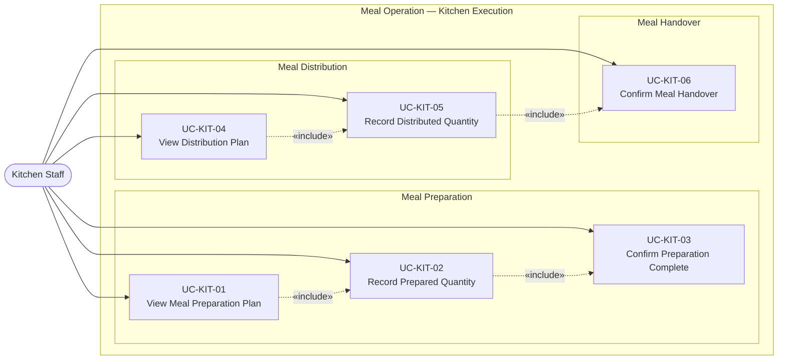

# UC-KIT — Kitchen Staff Use Cases

## Use Case Diagram

---

## Use Case Specifications

### UC-KIT-01 — View Meal Preparation Plan

| Field | Value |
|-------|-------|
| **Actor** | Kitchen Staff |
| **Feature** | F-MOP-03 Record Meal Preparation |
| **Precondition** | Meal demand is locked (`determination_status = 'locked'`). Menu is published. Expected quantities have been calculated. |
| **Trigger** | Kitchen staff opens the preparation plan for the current meal session |

**Main Flow:**
1. Kitchen staff selects the current date and meal session
2. System retrieves the published menu for the session
3. System displays `expected_meal_quantities` per dish: dish name, category, expected quantity, unit, buffer %
4. Kitchen staff reviews the plan

**Postcondition:** Kitchen staff has a clear view of what and how much to prepare.

---

### UC-KIT-02 — Record Prepared Quantity

| Field | Value |
|-------|-------|
| **Actor** | Kitchen Staff |
| **Feature** | F-MOP-03 Record Meal Preparation |
| **Precondition** | Preparation plan is loaded (UC-KIT-01 completed) |
| **Trigger** | Kitchen staff finishes preparing a dish and records the quantity |

**Main Flow:**
1. Kitchen staff selects a dish from the preparation plan
2. System displays the expected quantity
3. Kitchen staff enters the actual quantity prepared
4. System validates: quantity must be > 0 and ≤ 150% of expected
5. System saves the record and updates preparation status for the dish to `in_progress`
6. System highlights any dishes still pending entry

**Alternative Flow — Quantity Outside Tolerance:**
- 4a. Entered quantity exceeds 150% of expected → System shows warning: "Quantity significantly higher than expected. Confirm?"
- 4b. Kitchen staff confirms → System records with a `discrepancy_flag = true`

**Postcondition:** Prepared quantity is recorded for the dish.

---

### UC-KIT-03 — Confirm Preparation Complete

| Field | Value |
|-------|-------|
| **Actor** | Kitchen Staff |
| **Feature** | F-MOP-03 Record Meal Preparation |
| **Precondition** | All dishes have an actual quantity recorded |
| **Trigger** | Kitchen staff confirms that all dishes for the session are prepared |

**Main Flow:**
1. Kitchen staff reviews the summary (all dishes + actual quantities)
2. System shows overall completion status: all dishes marked ✅
3. Kitchen staff taps "Confirm Preparation Complete"
4. System transitions preparation status to `completed`
5. System notifies the Meal/Nutrition Manager that preparation is done

**Alternative Flow — Incomplete Dishes:**
- 2a. One or more dishes have no quantity recorded → System shows warning listing incomplete dishes
- 2b. Kitchen staff may proceed anyway by acknowledging: "Some dishes not recorded — confirm anyway?"

**Postcondition:** Preparation phase is marked complete; distribution plan is unlocked.

---

### UC-KIT-04 — View Distribution Plan

| Field | Value |
|-------|-------|
| **Actor** | Kitchen Staff |
| **Feature** | F-MOP-04 Record Meal Distribution |
| **Precondition** | Preparation is confirmed complete (UC-KIT-03). Demand is locked with class-level breakdowns. |
| **Trigger** | Kitchen staff opens the distribution plan |

**Main Flow:**
1. Kitchen staff selects the current meal session
2. System displays per-class distribution plan: class name, confirmed headcount, expected portions per dish
3. Kitchen staff reviews plan before starting distribution rounds

**Postcondition:** Kitchen staff knows how many portions to deliver to each class.

---

### UC-KIT-05 — Record Distributed Quantity

| Field | Value |
|-------|-------|
| **Actor** | Kitchen Staff |
| **Feature** | F-MOP-04 Record Meal Distribution |
| **Precondition** | Distribution plan is loaded (UC-KIT-04) |
| **Trigger** | Kitchen staff delivers a dish to a class and records the quantity |

**Main Flow:**
1. Kitchen staff selects a class
2. System shows the expected portion count for the class
3. Kitchen staff enters the actual quantity distributed
4. System saves and marks that class as distributed
5. System updates the running total: distributed vs. expected

**Alternative Flow — Under-Distribution:**
- 3a. Quantity distributed is less than expected → System flags the class with `underdistributed`
- 3b. Kitchen staff records reason (e.g., "class absent for field trip")

**Postcondition:** Distribution quantity is recorded for the class.

---

### UC-KIT-06 — Confirm Meal Handover

| Field | Value |
|-------|-------|
| **Actor** | Kitchen Staff |
| **Feature** | F-MOP-05 Confirm Meal Handover & Reconcile |
| **Precondition** | Distribution quantity recorded for the class (UC-KIT-05) |
| **Trigger** | Kitchen staff physically hands over the meal batch to the class supervisor |

**Main Flow:**
1. Kitchen staff selects the class for handover
2. System shows summary: expected portions, distributed quantity
3. Kitchen staff confirms handover with timestamp
4. System records handover event and notifies the Homeroom Teacher (UC-TCH-04 triggered)
5. System runs reconciliation: Planned vs. Prepared vs. Distributed

**Postcondition:** Handover is recorded. Reconciliation discrepancies (if any) are surfaced to the Meal/Nutrition Manager.
