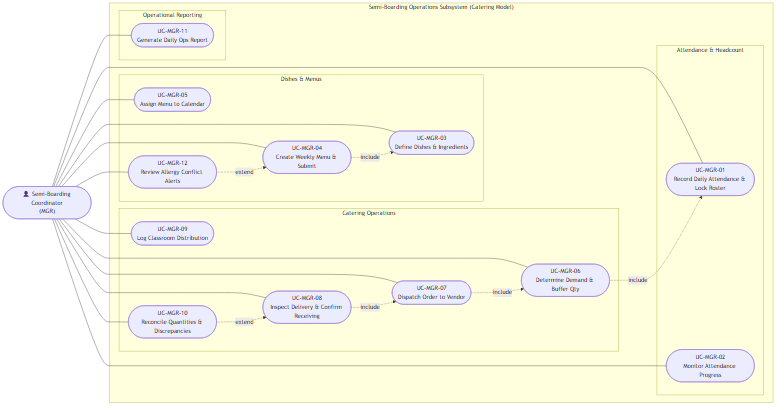

# Use Case Specifications — Semi-Boarding Coordinator / Meal Manager (MGR)

## Actor Overview

- **Actor Code:** `MGR`
- **Actor Name:** Semi-Boarding Coordinator / Meal Manager
- **Primary Operational Scope:** Orchestrates the end-to-end daily semi-boarding lifecycle: Recipe and weekly menu planning, morning attendance monitoring and cutoff locking, session demand calculation with safety buffers, catering order dispatch, 3-step receiving inspection, classroom tray distribution oversight, post-service discrepancy reconciliation, and daily operational reporting.

---

## Use Case Diagram — Semi-Boarding Coordinator

---

## UC-MGR-01 — Record Daily Attendance, Absence Notes & Lock Roster

- **Core Feature:** `F-PAR-03`
- **Primary DB Entity:** `meal_participations`
- **Secondary Entities:** `meal_participation_changes`, `students`, `meal_schedules`

### Preconditions
1. Active `meal_schedules` record exists for the current service date.
2. Verified student meal registration rosters are loaded per classroom.
3. Operation is performed prior to the morning deadline (Cutoff: `08:30 AM`).

### Main Success Scenario
1. Coordinator opens the **Daily Classroom Attendance & Roster Lock** screen.
2. System loads student lists per classroom, defaulting to `pending` or `recorded` (present).
3. Coordinator updates absent students (`absent`), specifying mandatory absence reasons (e.g., medical leave, excused family event).
4. Coordinator clicks **Confirm & Lock Classroom Roster**.
5. System transitions `meal_participations` to status `confirmed`, recording `confirmed_by = current_user.id`, `confirmed_at = now()`.
6. Verified attendance counts are immediately queued for session demand aggregation ([UC-MGR-06](#uc-mgr-06)).

---

## UC-MGR-02 — Monitor Classroom Attendance Progress & Chase Deadlines

- **Core Feature:** `F-PAR-04`
- **Primary DB Entity:** `meal_participations` (Classroom summary views)

### Preconditions
1. Morning attendance window opens at 07:45 AM.

### Main Success Scenario
1. Coordinator reviews the real-time **Attendance Submission Monitor Dashboard**.
2. System displays institutional submission progress (e.g., `18/20 Classrooms Confirmed — 90%`).
3. System applies a prominent yellow warning indicator to unsubmitted classrooms after 08:20 AM.
4. Coordinator triggers automated reminders or logs attendance directly for pending classrooms to guarantee 100% data completion by 08:30 AM.

---

## UC-MGR-03 — Define Nutritional Dishes & Recipe Information

- **Core Feature:** `F-PLN-01`
- **Primary DB Entities:** `dishes`, `ingredients`

### Main Success Scenario
1. Coordinator accesses the **Dish & Nutrition Catalog**.
2. Inputs dish name (e.g., "Braised Pork with Quail Eggs"), standard portion size (e.g., 100g pork, 2 eggs), and dish category (Main Dish, Side Dish, Soup, Dessert).
3. Associates constituent ingredients (Pork belly, Quail eggs, Fish sauce, Shallots...).
4. System persists the record in `dishes` with status `active`.

---

## UC-MGR-04 — Create Weekly Menu & Submit for Approval

- **Core Feature:** `F-PLN-02`
- **Primary DB Entities:** `menus`, `menu_dishes`

### Main Success Scenario
1. Coordinator creates a new weekly menu cycle (e.g., Week 42 Menu: Monday through Friday).
2. Assigns catalog dishes to meal sessions across each school day.
3. System automatically evaluates nutritional balance and scans for allergen conflicts ([UC-MGR-12](#uc-mgr-12)).
4. Coordinator clicks **Submit Menu for Approval**.
5. System stores the menu in `menus` with status `submitted` and notifies the School Administrator / Principal (`ADM`) for single-level review ([UC-ADM-02](usecase-admin.md#uc-adm-02)).

---

## UC-MGR-05 — Assign Approved Menu to Serving Calendar

- **Core Feature:** `F-PLN-03`
- **Primary DB Entities:** `meal_schedules`, `menus`

### Preconditions
1. Target weekly menu is approved by the Principal (`menus.status = 'approved'`).

### Main Success Scenario
1. Coordinator opens the **Meal Serving Calendar**.
2. Applies the approved menu across the scheduled school dates.
3. System creates corresponding `meal_schedules` records linked with `menu_id`.
4. Serving schedules become active anchors for daily morning attendance and catering orders.

---

## UC-MGR-06 — Determine Session Demand & Calculate Expected Dish Quantities

- **Core Feature:** `F-OPS-01`
- **Primary DB Entities:** `meal_demands`, `meal_demand_dish_quantities`

### Preconditions
1. 08:30 AM roster lock is finalized for 100% of classrooms.

### Main Success Scenario
1. Coordinator accesses the **Meal Demand Aggregation Dashboard**.
2. System aggregates confirmed attendance across all classrooms (`total_headcount` = 600 students).
3. Coordinator verifies or adjusts the safety buffer percentage (`buffer_percentage` = 5.0%).
4. System computes final production demand:
   - $\text{Final Demand} = \text{round}(600 \times 1.05) = 630 \text{ portions}$ (hoặc `final_demand_count = round(total_headcount * (1 + buffer_percentage)) = 630`).
5. System calculates scaled portion quantities for all scheduled menu dishes and populates `meal_demand_dish_quantities`.
6. Coordinator clicks **Confirm Demand**. System updates `meal_demands` to status `confirmed`.

---

## UC-MGR-07 — Dispatch Formal Purchase Order to Catering Vendor

- **Core Feature:** `F-OPS-02`
- **Primary DB Entities:** `catering_orders`, `meal_demands`

### Preconditions
1. Daily meal demand is confirmed (`meal_demands.demand_status = 'confirmed'`).
2. Current time is before the 08:45 AM dispatch deadline.

### Main Success Scenario
1. Coordinator clicks **Send Purchase Order to Catering Vendor**.
2. System generates an electronic purchase order snapshot recording total portions (630 meals) and delivery deadline (10:30 AM).
3. System creates a record in `catering_orders` with status `dispatched` and sends an electronic notification to the vendor.

---

## UC-MGR-08 — Inspect Food Temperature/Quality & Confirm Receiving

- **Core Feature:** `F-OPS-03`
- **Primary DB Entities:** `meal_deliveries`, `meal_inspections`

### Preconditions
1. Catering delivery truck arrives at the school staging dock at 10:30 AM.

### Main Success Scenario
1. Coordinator opens the **3-Step Food Receiving & Inspection** screen.
2. Verifies the count of insulated delivery containers delivered against the order (e.g., 630 portions).
3. Measures core food temperature using a calibrated food probe and records:
   - Hot food temperature $\ge 65^\circ\text{C}$ (e.g., measured at $72^\circ\text{C}$).
   - Sensory check: Odor, color, and container tamper seals verified as "Pass".
4. Coordinator clicks **Accept Delivery**.
5. System persists the inspection log in `meal_inspections` and updates `meal_deliveries.status = 'accepted'`. Food is cleared for classroom distribution.

---

## UC-MGR-09 — Log Classroom Meal Tray Distribution

- **Core Feature:** `F-OPS-04`
- **Primary DB Entity:** `meal_distributions`

### Preconditions
1. Delivered food is accepted and certified (`meal_deliveries.status = 'accepted'`).
2. Classroom trolley loading begins at 11:00 AM.

### Main Success Scenario
1. Coordinator accesses the **Classroom Meal Distribution** interface.
2. System displays target tray quantities required per classroom trolley based on morning attendance.
3. As staff dispatch each trolley (e.g., Class 1A loaded with 30 hot meal sets), coordinator taps **Confirm Dispatch**.
4. System logs distributed quantity and dispatch timestamp into `meal_distributions`.

---

## UC-MGR-10 — Reconcile Ordered vs Delivered Quantities & Discrepancies

- **Core Feature:** `F-OPS-05`
- **Primary DB Entities:** `meal_reconciliations`, `meal_discrepancies`

### Preconditions
1. Lunch service concludes at 13:00 PM.

### Main Success Scenario
1. Coordinator opens the **Daily Quantity Reconciliation & Discrepancy Board**.
2. System matches operational figures:
   - Ordered Quantity (`Ordered` = 630)
   - Delivered Quantity (`Delivered` = 630)
   - Actual Consumed Count (`Consumed` = 600)
   - Leftover / Reserve Buffer (`Surplus` = 30)
3. If discrepancies exist (e.g., vendor delivered 10 fewer portions), system logs a record into `meal_discrepancies`, captures coordinator comments, and adjusts payable amounts.
4. Coordinator clicks **Confirm Daily Reconciliation**. Data is transmitted to School Accounting for vendor debt accrual (`F-FEE-04`).

---

## UC-MGR-11 — Generate Daily Operations Report & Vendor Summary

- **Core Feature:** `F-REP-01`
- **Primary DB Entity:** Materialized Views / Reports

### Main Success Scenario
1. Coordinator clicks **Export Daily Operations Summary**.
2. System aggregates the complete daily lifecycle: Attendance tallies, cutoff timestamps, catering order IDs, temperature logs, receiving counts, and leftover audits.
3. System outputs printable PDF/audit summary for school administration.

---

## UC-MGR-12 — Review Menu Restricted Ingredient Alerts

- **Core Feature:** `F-NUT-02`
- **Primary DB Entities:** `dietary_alerts`, `menus`

### Main Success Scenario
1. When viewing weekly menus or daily rosters, system cross-references dish ingredients against registered student allergy records.
2. If an allergen conflict is detected (e.g., dessert contains crushed peanuts while a student in Class 1A has a severe peanut allergy), system renders a prominent orange warning chip.
3. Coordinator coordinates with catering staff to ensure a certified allergen-free substitute meal is prepared and tagged for the student.

