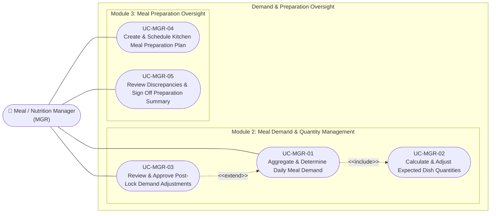

# Use Case Specifications — Meal / Nutrition Manager (MGR)

## Actor Overview

- **Actor Name:** Meal / Nutrition Manager (`MGR`)
- **Primary Domains:** Module 2 (Demand & Quantity Management) & Module 3 (Preparation Oversight)
- **Key Objectives:** Aggregate confirmed classroom participation into official demand headcounts, calculate precise raw dish quantities with safety buffers, review post-lock adjustment requests, and author daily kitchen prep plans.

---

## Use Case Diagram — Meal / Nutrition Manager

---

## UC-MGR-01 — Aggregate & Determine Daily Meal Demand

- **Core Feature:** `F-DMD-01`
- **Primary DB Entity:** `meal_demands`
- **Secondary Entities:** `meal_schedules`, `meal_participations`

### Preconditions
1. Active meal schedule exists for current service date.
2. Homeroom teachers have submitted class rosters, or cutoff deadline has passed.

### Main Success Scenario
1. Manager accesses the **Demand Determination Dashboard** ([SCR-MGR-01](../04-information-architecture/screen-inventory.md)).
2. System displays class submission progress (e.g. 18 of 20 classes submitted).
3. Manager selects determination method:
   - `participation_based`: Direct count of confirmed student participations.
   - `manual_forecast`: Override based on anticipated school attendance.
   - `historical_average`: Impute from rolling weekday averages.
4. System computes:
   - `total_headcount` (e.g., 620 students)
   - `buffer_percentage` (default: 5.0%)
   - `final_demand_count` = $\text{round}(\text{total\_headcount} \times (1 + \frac{\text{buffer}}{100}))$ (e.g., 651 portions).
5. Manager reviews headcount figures and clicks **Confirm Demand**.
6. System creates/updates `meal_demands`:
   - `demand_status = 'confirmed'`
   - `determined_by = current_user.id`
   - `confirmed_by = current_user.id`
   - `confirmed_at = now()`
7. System automatically triggers dish quantity calculation ([UC-MGR-02](#uc-mgr-02)).

---

## UC-MGR-02 — Calculate & Adjust Expected Dish Quantities

- **Core Feature:** `F-DMD-02`
- **Primary DB Entity:** `meal_demand_dish_quantities`
- **Secondary Entities:** `meal_demands`, `dishes`

### Preconditions
1. `meal_demands` record is in status `confirmed` or `calculated`.
2. Target menu dishes and standard portion sizes are configured in master reference.

### Main Success Scenario
1. Manager opens the **Dish Quantity Calculation View** ([SCR-MGR-02](../04-information-architecture/screen-inventory.md)).
2. System iterates through all scheduled dishes and applies standard formulas:
   $$\text{expected\_quantity} = \text{final\_demand\_count} \times \text{standard\_portion\_size}$$
3. System renders calculated requirements (e.g., Rice: 97.65 kg; Pork Stew: 65.10 kg; Cabbage Soup: 130.20 liters).
4. Manager reviews calculated amounts and may apply dish-specific manual overrides (e.g., round rice to full 100 kg bag).
5. Manager clicks **Save Expected Quantities**.
6. System persists records into `meal_demand_dish_quantities` with `dish_id`, `expected_quantity`, and portion unit.

---

## UC-MGR-03 — Review & Approve Post-Lock Demand Adjustments

- **Core Feature:** `F-DMD-03`
- **Primary DB Entity:** `meal_demand_changes`
- **Secondary Entities:** `meal_demands`, `meal_demand_dish_quantities`

### Preconditions
1. Demand has already been confirmed/locked.
2. A teacher or supervisor submitted a post-lock amendment request.

### Main Success Scenario
1. Manager receives notification of pending change request on the **Demand Changes Queue** ([SCR-MGR-03](../04-information-architecture/screen-inventory.md)).
2. Manager views change details:
   - `change_type`: `quantity_increase`, `quantity_decrease`, `dish_adjustment`, `cancellation`
   - Delta quantity, student details, and requester rationale.
3. Manager evaluates kitchen cooking status:
   - If kitchen has capacity / has not started: clicks **Approve**.
   - If food is already plated / cannot adjust: clicks **Reject** with reason.
4. On **Approval**:
   - System updates `meal_demands.final_demand_count` and recalculates impacted dishes in `meal_demand_dish_quantities`.
   - `meal_demands.demand_status` transitions to `revised`.
   - `meal_demand_changes` record is updated with `reviewed_by = current_user.id`, `reviewed_at = now()`.
   - System alerts Kitchen Staff (KIT) of the revised cooking requirement.

---

## UC-MGR-04 — Create & Schedule Kitchen Meal Preparation Plan

- **Core Feature:** `F-PRP-01`
- **Primary DB Entity:** `meal_preparation_plans`, `meal_preparation_plan_dishes`
- **Secondary Entities:** `meal_demands`, `dishes`

### Preconditions
1. Daily meal demand is confirmed (`meal_demands.demand_status IN ('confirmed', 'revised')`).
2. Dish expected quantities have been verified.

### Main Success Scenario
1. Manager navigates to **Kitchen Shift Planning** ([SCR-MGR-04](../04-information-architecture/screen-inventory.md)).
2. System pre-populates target cooking dishes and quantities from `meal_demand_dish_quantities`.
3. Manager sets kitchen shift parameters:
   - `plan_date` and meal service session.
   - Target completion time (e.g., 10:45 AM for 11:15 AM lunch).
   - Responsible kitchen stations.
4. Manager clicks **Publish Preparation Plan**.
5. System inserts:
   - Master record in `meal_preparation_plans` (`plan_status = 'planned'`, `planned_by = current_user.id`).
   - Line items in `meal_preparation_plan_dishes` for each scheduled dish with `planned_quantity`.
6. Plan becomes visible to Kitchen Staff ([UC-KIT-01](usecase-kitchen.md#uc-kit-01)).

---

## UC-MGR-05 — Review Discrepancies & Sign Off Preparation Summary

- **Core Feature:** `F-PRP-04`
- **Primary DB Entity:** `prepared_quantity_confirmations`
- **Secondary Entities:** `meal_preparation_dish_records`, `meal_preparation_plans`

### Preconditions
1. Kitchen staff have finished cooking and logged prepared dish quantities.
2. At least one dish reported a quantity verification discrepancy.

### Main Success Scenario
1. Manager opens the **Daily Kitchen Execution Summary** ([SCR-MGR-05](../04-information-architecture/screen-inventory.md)).
2. System flags items with `confirmation_status = 'discrepancy'` (e.g., Stew planned 65 kg, actual yielded 58 kg due to ingredient spillage).
3. Manager reviews logged `discrepancy_reason` and decides on corrective actions (e.g., distribute auxiliary backup side dish).
4. Manager signs off the daily preparation reconciliation report.
5. System archives daily execution record and marks `meal_preparation_plans.plan_status = 'completed'`.
