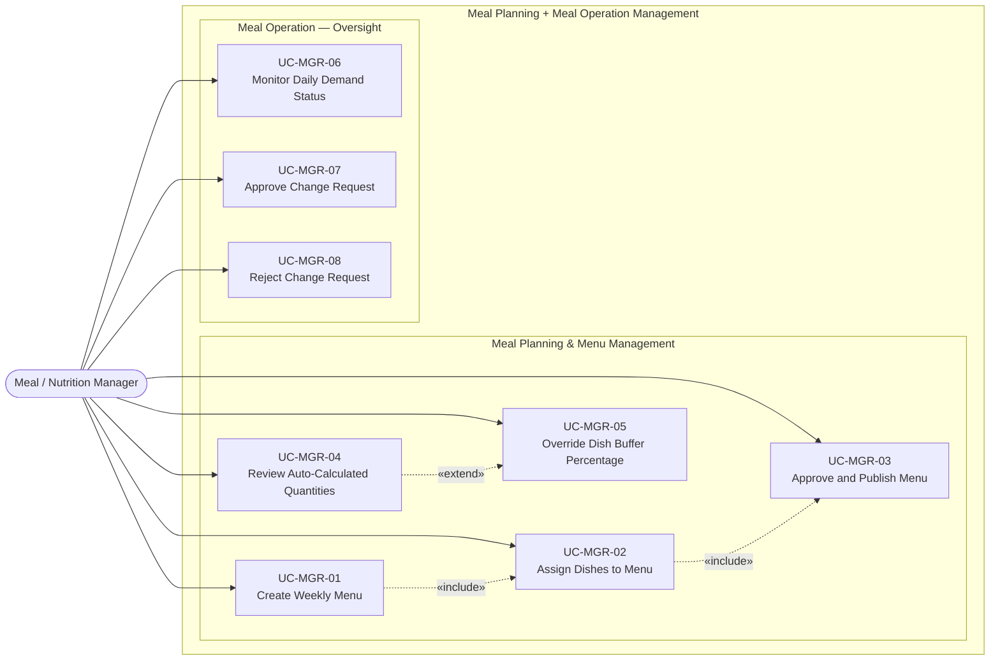

# UC-MGR — Meal / Nutrition Manager Use Cases

## Use Case Diagram

---

## Use Case Specifications

### UC-MGR-01 — Create Weekly Menu

| Field | Value |
|-------|-------|
| **Actor** | Meal / Nutrition Manager |
| **Feature** | F-MPN-01 Design Weekly Menu |
| **Precondition** | Manager is logged in. School week is defined in the system. |
| **Trigger** | Manager opens the Menu Planning screen for the upcoming week |

**Main Flow:**
1. Manager selects the target week
2. Manager creates a new `menus` record for each date + meal session combination needed
3. System saves menus in `draft` status
4. Manager proceeds to assign dishes (UC-MGR-02)

**Postcondition:** One or more draft menus exist for the target week.

---

### UC-MGR-02 — Assign Dishes to Menu

| Field | Value |
|-------|-------|
| **Actor** | Meal / Nutrition Manager |
| **Feature** | F-MPN-02 Assign Dishes & Standard Portions |
| **Precondition** | A draft menu exists (UC-MGR-01). Dish catalog is populated by ADM. |

**Main Flow:**
1. Manager opens a draft menu
2. System displays available dishes from the dish catalog, grouped by category (Main, Staple, Soup, Vegetable, Dessert)
3. Manager selects dishes and assigns standard portion sizes (e.g., 150g, 200ml)
4. System creates `menu_dishes` records
5. Manager can add multiple dishes and adjust portion sizes inline

**Postcondition:** Menu has at least one dish with a defined portion size.

---

### UC-MGR-03 — Approve and Publish Menu

| Field | Value |
|-------|-------|
| **Actor** | Meal / Nutrition Manager |
| **Feature** | F-MPN-03 Approve & Publish Menu |
| **Precondition** | Menu has dishes assigned (UC-MGR-02). |

**Main Flow:**
1. Manager reviews the complete menu
2. Manager transitions status: `draft` → `approved`
3. Manager confirms publishing: `approved` → `published`
4. System makes the published menu available for demand quantity calculation

**Alternative Flow — Publish on Same Day:**
- Manager may publish directly to `published` if no separate approval step is needed.

**Postcondition:** Menu is `published` and available for use in demand calculation.

---

### UC-MGR-04 — Review Auto-Calculated Quantities

| Field | Value |
|-------|-------|
| **Actor** | Meal / Nutrition Manager |
| **Feature** | F-MPN-04 Calculate Meal Demand Quantities |
| **Precondition** | Demand is locked (all classes confirmed). Published menu exists. |
| **Trigger** | System auto-calculates quantities after demand lock; Manager reviews |

**Main Flow:**
1. System auto-triggers calculation: `Total Raw = Planned Headcount × Unit Portion × (1 + Buffer%)`
2. System saves results to `expected_meal_quantities` with `calculation_method = 'auto'`
3. Manager opens the Quantities Review screen
4. System displays per-dish: planned headcount, unit portion, current buffer %, total raw quantity
5. Manager reviews for anomalies

**Postcondition:** Manager has verified that quantities are reasonable.

---

### UC-MGR-05 — Override Dish Buffer Percentage

| Field | Value |
|-------|-------|
| **Actor** | Meal / Nutrition Manager |
| **Feature** | F-MPN-04 Calculate Meal Demand Quantities |
| **Precondition** | Auto-calculation has run (UC-MGR-04). |
| **Trigger** | Manager identifies a dish where the default buffer is inappropriate |

**Main Flow:**
1. Manager selects a dish in the quantities table
2. Manager adjusts the buffer percentage using `[-]` / `[+]` stepper controls
3. System recalculates `total_quantity` in real time
4. System updates `calculation_method = 'manual'` for that row
5. System logs the override: `calculated_by = MGR user_id`

**Postcondition:** Dish quantity is updated with the manual buffer; `calculation_method` is `manual`.

---

### UC-MGR-06 — Monitor Daily Demand Status

| Field | Value |
|-------|-------|
| **Actor** | Meal / Nutrition Manager |
| **Feature** | F-MOP-01 Determine Meal Demand |
| **Trigger** | Manager opens the daily operations dashboard |

**Main Flow:**
1. Manager views the daily demand board for the current session
2. System shows per-class status: draft / confirmed / locked + headcount
3. System shows a cutoff countdown timer
4. At cutoff, system auto-locks all confirmed demands
5. Manager can force-lock a class that hasn't submitted before cutoff (emergency override)

**Postcondition:** Manager has situational awareness of daily demand status.

---

### UC-MGR-07 — Approve Change Request

| Field | Value |
|-------|-------|
| **Actor** | Meal / Nutrition Manager |
| **Feature** | F-MOP-02 Manage Post-Cutoff Change Requests |
| **Precondition** | A pending `meal_demand_change_requests` record exists. |
| **Trigger** | Manager receives notification of a pending change request |

**Main Flow:**
1. Manager opens the Change Request triage screen
2. System displays pending requests sorted by urgency (`is_emergency` first)
3. Manager reviews: requester, class, change type, quantity delta, reason
4. Manager clicks "Approve"
5. System transitions `approval_status` to `'approved'`
6. System updates the `daily_meal_demands` confirmed count
7. System logs the decision in `meal_demand_change_logs`
8. System notifies the requesting teacher

**Postcondition:** Demand count is updated. Change is logged.

---

### UC-MGR-08 — Reject Change Request

| Field | Value |
|-------|-------|
| **Actor** | Meal / Nutrition Manager |
| **Feature** | F-MOP-02 Manage Post-Cutoff Change Requests |
| **Precondition** | A pending `meal_demand_change_requests` record exists. |

**Main Flow:**
1. Manager reviews the request (same as UC-MGR-07 steps 1–3)
2. Manager clicks "Reject" and provides a rejection reason
3. System transitions `approval_status` to `'rejected'`
4. System logs the decision in `meal_demand_change_logs`
5. System notifies the requesting teacher with the rejection reason

**Postcondition:** Demand count is unchanged. Rejection is logged with reason.
