# UC-00 — System Overview

## System Use Case Overview

This diagram shows all actors and their primary use case groups at the system level.

```mermaid
graph LR
    ADM([School Administrator])
    MGR([Meal / Nutrition Manager])
    KIT([Kitchen Staff])
    TCH([Homeroom Teacher])
    STO([Storekeeper])

    subgraph SYSTEM["Primary School Semi-Boarding Meal Management System"]
        subgraph STU["Student Meal Management"]
            UC_ADM_01["Enroll Student in Meal Program"]
            UC_ADM_03["Register Student for Meal Session"]
            UC_TCH_01["Record Student Attendance"]
            UC_TCH_02["Submit Attendance Before Cutoff"]
        end

        subgraph MPN["Meal Planning & Menu Management"]
            UC_MGR_01["Create Weekly Menu"]
            UC_MGR_02["Assign Dishes to Menu"]
            UC_MGR_03["Approve and Publish Menu"]
            UC_MGR_04["Review Calculated Quantities"]
            UC_MGR_05["Override Buffer Percentage"]
        end

        subgraph MOP["Meal Operation"]
            UC_MGR_06["Monitor Daily Demand Status"]
            UC_MGR_07["Approve Change Request"]
            UC_TCH_03["Submit Post-Cutoff Change Request"]
            UC_KIT_01["View Preparation Plan"]
            UC_KIT_02["Record Prepared Quantity"]
            UC_KIT_03["Confirm Preparation Complete"]
            UC_KIT_04["View Distribution Plan"]
            UC_KIT_05["Record Distributed Quantity"]
            UC_KIT_06["Confirm Meal Handover"]
            UC_TCH_04["Acknowledge Meal Handover"]
        end

        subgraph SAF["Food Safety (Phase 1.5)"]
            UC_STO_01["Register Food Batch"]
            UC_STO_02["Record Receiving Inspection"]
        end

        subgraph CFG["System Configuration"]
            UC_ADM_04["Manage Meal Sessions"]
            UC_ADM_05["Manage User Accounts"]
            UC_ADM_06["Manage Dish Catalog"]
        end
    end

    ADM --> UC_ADM_01
    ADM --> UC_ADM_03
    ADM --> UC_ADM_04
    ADM --> UC_ADM_05
    ADM --> UC_ADM_06

    MGR --> UC_MGR_01
    MGR --> UC_MGR_02
    MGR --> UC_MGR_03
    MGR --> UC_MGR_04
    MGR --> UC_MGR_05
    MGR --> UC_MGR_06
    MGR --> UC_MGR_07

    TCH --> UC_TCH_01
    TCH --> UC_TCH_02
    TCH --> UC_TCH_03
    TCH --> UC_TCH_04

    KIT --> UC_KIT_01
    KIT --> UC_KIT_02
    KIT --> UC_KIT_03
    KIT --> UC_KIT_04
    KIT --> UC_KIT_05
    KIT --> UC_KIT_06

    STO --> UC_STO_01
    STO --> UC_STO_02
```

## Actor Interaction Summary

| Actor | Primary Domain | UC Count |
|-------|---------------|----------|
| School Administrator | Cross-cutting config | 6 |
| Meal / Nutrition Manager | Planning + Operation | 7 |
| Kitchen Staff | Operation (execution) | 6 |
| Homeroom Teacher | Student Mgmt + Operation | 4 |
| Storekeeper | Food Safety *(Phase 1.5)* | 2 |
