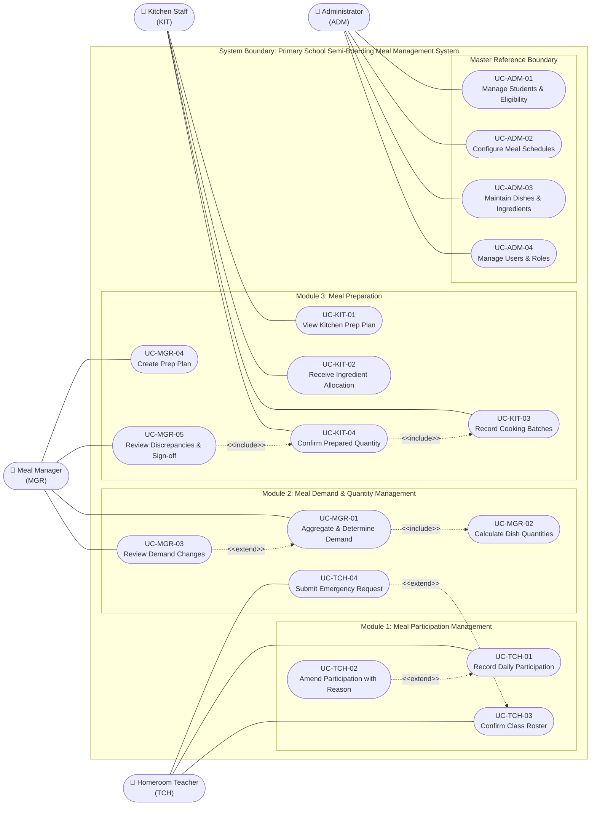
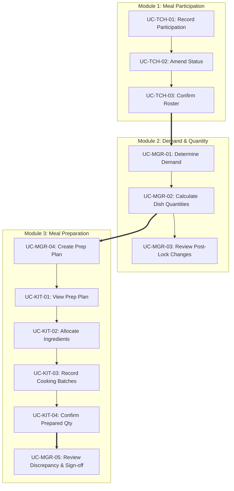

# Use Case Overview

## System Context

This document outlines the complete Use Case catalog and architecture for the Primary School Semi-Boarding Meal Management System across the **three active core operational modules**.

Every Use Case is derived from a Core Feature in [Phase 02](../02-core-features/core-feature-breakdown.md) and maps directly to operational task flows, user interfaces, and database tables in [Phase 06](../06-database/README.md).

---

## System-Level UML Use Case Diagram

The diagram below defines the **System Boundary**, primary actors, functional modules, and standard UML relationships (`<<include>>` for mandatory sub-tasks, `<<extend>>` for conditional or exceptional flows).

---

## Global Use Case Catalog

### Actor: Homeroom Teacher / Class Supervisor (TCH)

| UC ID | Use Case Name | Core Feature | Primary DB Entity | Specification Doc |
|---|---|---|---|---|
| **UC-TCH-01** | Record Daily Student Meal Participation | `F-PAR-01` | `meal_participations` | [usecase-teacher.md](usecase-teacher.md#uc-tch-01) |
| **UC-TCH-02** | Amend Participation Status with Reason | `F-PAR-02` | `meal_participation_changes` | [usecase-teacher.md](usecase-teacher.md#uc-tch-02) |
| **UC-TCH-03** | Confirm Daily Class Participation Roster | `F-PAR-03` | `meal_participations` | [usecase-teacher.md](usecase-teacher.md#uc-tch-03) |
| **UC-TCH-04** | Submit Post-Cutoff Emergency Request | `F-DMD-03` | `meal_demand_changes` | [usecase-teacher.md](usecase-teacher.md#uc-tch-04) |

---

### Actor: Meal / Nutrition Manager (MGR)

| UC ID | Use Case Name | Core Feature | Primary DB Entity | Specification Doc |
|---|---|---|---|---|
| **UC-MGR-01** | Aggregate & Determine Daily Meal Demand | `F-DMD-01` | `meal_demands` | [usecase-manager.md](usecase-manager.md#uc-mgr-01) |
| **UC-MGR-02** | Calculate & Adjust Expected Dish Quantities | `F-DMD-02` | `meal_demand_dish_quantities` | [usecase-manager.md](usecase-manager.md#uc-mgr-02) |
| **UC-MGR-03** | Review & Approve Post-Lock Demand Adjustments | `F-DMD-03` | `meal_demand_changes` | [usecase-manager.md](usecase-manager.md#uc-mgr-03) |
| **UC-MGR-04** | Create & Schedule Kitchen Meal Preparation Plan | `F-PRP-01` | `meal_preparation_plans` | [usecase-manager.md](usecase-manager.md#uc-mgr-04) |
| **UC-MGR-05** | Review Discrepancies & Sign Off Preparation Summary | `F-PRP-04` | `prepared_quantity_confirmations` | [usecase-manager.md](usecase-manager.md#uc-mgr-05) |

---

### Actor: Kitchen Staff / Head Chef (KIT)

| UC ID | Use Case Name | Core Feature | Primary DB Entity | Specification Doc |
|---|---|---|---|---|
| **UC-KIT-01** | View Active Kitchen Preparation Plan | `F-PRP-01` | `meal_preparation_plans` | [usecase-kitchen.md](usecase-kitchen.md#uc-kit-01) |
| **UC-KIT-02** | Receive & Adjust Ingredient Allocation | `F-PRP-02` | `ingredient_allocations` | [usecase-kitchen.md](usecase-kitchen.md#uc-kit-02) |
| **UC-KIT-03** | Record Cooking Batch Execution | `F-PRP-03` | `meal_preparations`, `meal_preparation_dish_records` | [usecase-kitchen.md](usecase-kitchen.md#uc-kit-03) |
| **UC-KIT-04** | Confirm Prepared Quantity & Log Discrepancies | `F-PRP-04` | `prepared_quantity_confirmations` | [usecase-kitchen.md](usecase-kitchen.md#uc-kit-04) |

---

### Actor: School Administrator (ADM)

| UC ID | Use Case Name | Core Feature | Primary DB Entity | Specification Doc |
|---|---|---|---|---|
| **UC-ADM-01** | Manage Student Records & Eligibility | Master Data | `students` | [usecase-admin.md](usecase-admin.md#uc-adm-01) |
| **UC-ADM-02** | Configure Meal Calendar & Daily Schedules | Master Data | `meal_schedules` | [usecase-admin.md](usecase-admin.md#uc-adm-02) |
| **UC-ADM-03** | Maintain Dish & Ingredient Master Catalog | Master Data | `dishes`, `ingredients` | [usecase-admin.md](usecase-admin.md#uc-adm-03) |
| **UC-ADM-04** | Manage System Users & Role Permissions | Master Data | `users` | [usecase-admin.md](usecase-admin.md#uc-adm-04) |

---

## Operational Lifecycle Trace

