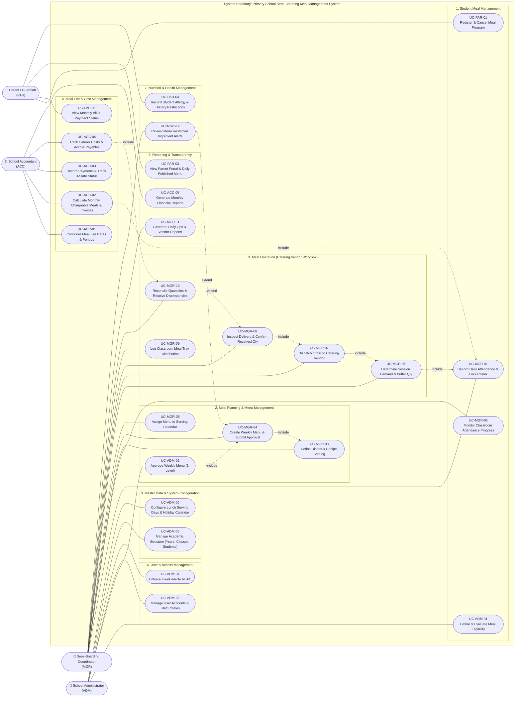
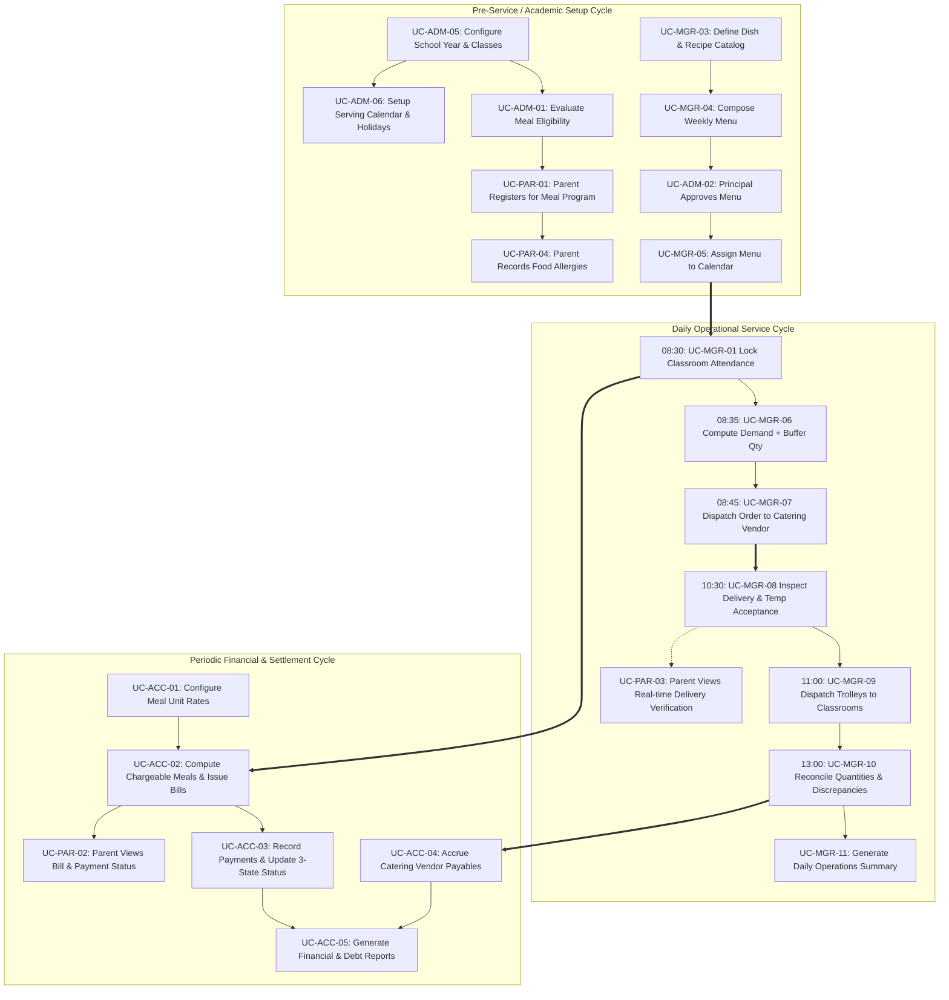

# Use Case Overview

## System Context

This document outlines the comprehensive Use Case catalog and system architecture for the Primary School Semi-Boarding Meal Management System across all **8 Business Domains** defined in [Phase 01 — MVP Baseline (MVP.md)](../01-top-down/MVP.md) and [Phase 02 — Core Features Breakdown](../02-core-features/core-feature-breakdown.md).

In strict alignment with institutional operational constraints, the system enforces a **Fixed 4-Role Model**:
1. **MGR — Semi-Boarding Coordinator / Meal Manager**
2. **ACC — School Accountant**
3. **PAR — Student Parent / Guardian**
4. **ADM — School Administrator / Principal**

Every Use Case derives directly from a Core Feature (`F-PAR`, `F-PLN`, `F-OPS`, `F-FEE`, `F-REP`, `F-USR`, `F-NUT`, `F-MST`) and maps directly to underlying database entities.

---

## System-Level UML Use Case Diagram

The diagram below defines the **System Boundary**, the 4 primary actors, functional domain groupings, and standard UML relationships (`include` for mandatory nested sub-tasks, `extend` for conditional or exceptional flows).

---

## Global Use Case Catalog

### 1. Semi-Boarding Coordinator / Meal Manager (MGR)

| UC ID | Use Case Name | Feature ID | Primary DB Entity | Specification Doc |
|---|---|---|---|---|
| **UC-MGR-01** | Record Daily Attendance, Absence Notes & Lock Roster | `F-PAR-03` | `meal_participations` | [usecase-manager.md](usecase-manager.md#uc-mgr-01) |
| **UC-MGR-02** | Monitor Classroom Attendance Progress & Chase Deadlines | `F-PAR-04` | `meal_participations` | [usecase-manager.md](usecase-manager.md#uc-mgr-02) |
| **UC-MGR-03** | Define Nutritional Dishes & Recipe Information | `F-PLN-01` | `dishes`, `ingredients` | [usecase-manager.md](usecase-manager.md#uc-mgr-03) |
| **UC-MGR-04** | Create Weekly Menu & Submit for Approval | `F-PLN-02` | `menus`, `menu_dishes` | [usecase-manager.md](usecase-manager.md#uc-mgr-04) |
| **UC-MGR-05** | Assign Approved Menu to Serving Calendar | `F-PLN-03` | `meal_schedules`, `menus` | [usecase-manager.md](usecase-manager.md#uc-mgr-05) |
| **UC-MGR-06** | Determine Session Demand & Calculate Expected Dish Quantities | `F-OPS-01` | `meal_demands`, `meal_demand_dish_quantities` | [usecase-manager.md](usecase-manager.md#uc-mgr-06) |
| **UC-MGR-07** | Dispatch Formal Purchase Order to Catering Vendor | `F-OPS-02` | `catering_orders`, `meal_demands` | [usecase-manager.md](usecase-manager.md#uc-mgr-07) |
| **UC-MGR-08** | Inspect Food Temperature/Quality & Confirm Receiving | `F-OPS-03` | `meal_deliveries`, `meal_inspections` | [usecase-manager.md](usecase-manager.md#uc-mgr-08) |
| **UC-MGR-09** | Log Classroom Meal Tray Distribution | `F-OPS-04` | `meal_distributions` | [usecase-manager.md](usecase-manager.md#uc-mgr-09) |
| **UC-MGR-10** | Reconcile Ordered vs Delivered Quantities & Discrepancies | `F-OPS-05` | `meal_reconciliations`, `meal_discrepancies` | [usecase-manager.md](usecase-manager.md#uc-mgr-10) |
| **UC-MGR-11** | Generate Daily Operations Report & Vendor Summary | `F-REP-01` | Materialized Views / Reports | [usecase-manager.md](usecase-manager.md#uc-mgr-11) |
| **UC-MGR-12** | Review Menu Restricted Ingredient Alerts | `F-NUT-02` | `dietary_alerts`, `menus` | [usecase-manager.md](usecase-manager.md#uc-mgr-12) |

---

### 2. School Accountant (ACC)

| UC ID | Use Case Name | Feature ID | Primary DB Entity | Specification Doc |
|---|---|---|---|---|
| **UC-ACC-01** | Configure Meal Fee Rates & Effective Periods | `F-FEE-01` | `meal_fee_configs` | [usecase-accountant.md](usecase-accountant.md#uc-acc-01) |
| **UC-ACC-02** | Calculate Chargeable Meals & Generate Invoices | `F-FEE-02` | `student_meal_bills`, `student_billing_items` | [usecase-accountant.md](usecase-accountant.md#uc-acc-02) |
| **UC-ACC-03** | Record Fee Payments & Update 3-State Status | `F-FEE-03` | `meal_payments`, `student_meal_bills` | [usecase-accountant.md](usecase-accountant.md#uc-acc-03) |
| **UC-ACC-04** | Record Catering Unit Costs & Accrue Vendor Payables | `F-FEE-04` | `catering_costs`, `vendor_payables` | [usecase-accountant.md](usecase-accountant.md#uc-acc-04) |
| **UC-ACC-05** | Generate Monthly Fee, Payment & Debt Reports | `F-REP-02` | Financial Views / Reports | [usecase-accountant.md](usecase-accountant.md#uc-acc-05) |

---

### 3. Student Parent / Guardian (PAR)

| UC ID | Use Case Name | Feature ID | Primary DB Entity | Specification Doc |
|---|---|---|---|---|
| **UC-PAR-01** | Register Student for Meal Program & Cancel | `F-PAR-02` | `meal_registrations`, `students` | [usecase-parent.md](usecase-parent.md#uc-par-01) |
| **UC-PAR-02** | View Monthly Meal Bill & Payment Tracking | `F-FEE-03` | `student_meal_bills`, `meal_payments` | [usecase-parent.md](usecase-parent.md#uc-par-02) |
| **UC-PAR-03** | View Parent Portal & Daily Published Menus | `F-REP-03` | `menus`, `meal_deliveries` | [usecase-parent.md](usecase-parent.md#uc-par-03) |
| **UC-PAR-04** | Record Student Allergy & Dietary Restrictions | `F-NUT-01` | `student_allergies`, `students` | [usecase-parent.md](usecase-parent.md#uc-par-04) |

---

### 4. School Administrator / Principal (ADM)

| UC ID | Use Case Name | Feature ID | Primary DB Entity | Specification Doc |
|---|---|---|---|---|
| **UC-ADM-01** | Define & Evaluate Student Meal Eligibility | `F-PAR-01` | `meal_eligibility`, `students` | [usecase-admin.md](usecase-admin.md#uc-adm-01) |
| **UC-ADM-02** | Approve Weekly Menu (1-Level Review) | `F-PLN-02` | `menus` | [usecase-admin.md](usecase-admin.md#uc-adm-02) |
| **UC-ADM-03** | Manage Staff Accounts & User Profiles | `F-USR-01` | `users` | [usecase-admin.md](usecase-admin.md#uc-adm-03) |
| **UC-ADM-04** | Enforce Fixed 4-Role RBAC Permissions | `F-USR-02` | `users`, `roles` | [usecase-admin.md](usecase-admin.md#uc-adm-04) |
| **UC-ADM-05** | Manage Academic Structure (Years, Classes, Students) | `F-MST-01` | `school_years`, `grades`, `classes`, `students` | [usecase-admin.md](usecase-admin.md#uc-adm-05) |
| **UC-ADM-06** | Configure Serving Days & Holiday Calendar | `F-MST-02` | `meal_calendars`, `holidays` | [usecase-admin.md](usecase-admin.md#uc-adm-06) |

---

## Operational Lifecycle Trace

