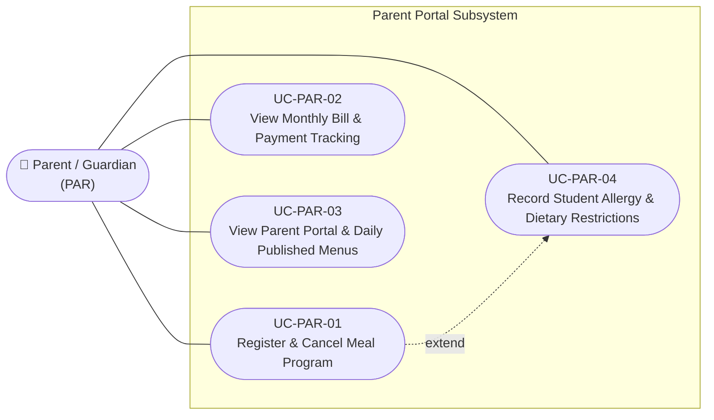

# Use Case Specifications — Student Parent / Guardian (PAR)

## Actor Overview

- **Actor Code:** `PAR`
- **Actor Name:** Student Parent / Guardian
- **Primary Operational Scope:** Domain 1 (Meal Registration), Domain 4 (Meal Fee & Payment Tracking), Domain 5 (Transparency Portal), and Domain 7 (Allergy Tracking). Parents actively manage child meal program participation, declare medical food allergies, inspect daily food delivery verification badges and menus, and review and settle monthly meal fee invoices.

---

## Use Case Diagram — Student Parent / Guardian

---

## UC-PAR-01 — Register Student for Meal Program & Cancel

- **Core Feature:** `F-PAR-02`
- **Primary DB Entities:** `meal_registrations`, `students`

### Preconditions
1. Parent is authenticated on the school portal and linked to their student profile.
2. School administration has opened registration for the upcoming semester.

### Main Success Scenario
1. Parent navigates to the **Meal Program Registration** section.
2. Selects the target semester meal package (e.g., Semester 1 Lunch + Afternoon Snack).
3. Enters optional dietary notes (e.g., "No scallions").
4. Clicks **Confirm Registration**.
5. System creates an active record in `meal_registrations` with status `active`.
6. Student's name automatically populates the classroom morning attendance roster.

### Alternative Flows
- **Cancelling Registration:** If the student transfers or opts out prior to term start, parent clicks **Cancel Meal Enrollment**. System transitions registration to status `cancelled` and removes the student from daily attendance rosters.

---

## UC-PAR-02 — View Monthly Bill & Payment Tracking

- **Core Feature:** `F-FEE-03`
- **Primary DB Entities:** `student_meal_bills`, `meal_payments`

### Preconditions
1. School Accountant has published monthly meal invoices ([UC-ACC-02](usecase-accountant.md#uc-acc-02)).

### Main Success Scenario
1. Parent accesses the **Tuition & Semi-Boarding Fees** tab.
2. System displays the current month's itemized bill:
   - Total scheduled meal days: 20 days.
   - Daily unit rate: 35,000 VND / day.
   - Excused absence credits: 2 days deducted (valid sickness leave reported before cutoff).
   - Net payable balance: 700,000 VND.
   - Payment status badge: `unpaid` or `paid`.
3. Parent views school bank account details along with a dynamic standardized QR code containing payment syntax `MEALFEE_[StudentID]_[Month]`.
4. Once payment is logged and reconciled by the Accountant, the status badge updates to `paid` and an electronic receipt is generated.

---

## UC-PAR-03 — View Parent Portal & Daily Published Menus

- **Core Feature:** `F-REP-03`
- **Primary DB Entities:** `menus`, `meal_deliveries`, `meal_inspections`

### Main Success Scenario
1. Parent opens the **Daily School Meal & Transparency Portal**.
2. System renders the active menu for the day:
   - Main Dish: Braised Pork with Quail Eggs.
   - Soup: Pork & Cabbage Soup.
   - Dessert: Fresh Banana.
   - Calorie count, macronutrient breakdowns, and recipe ingredient lists.
3. Parent inspects verified food safety compliance badges:
   - "Catering delivery accepted at 10:25 AM".
   - "Inspected core temperature: 72°C (Minimum standard: $\ge 65^\circ\text{C}$)".
   - Photo of certified sample food portion preserved at school.

---

## UC-PAR-04 — Record Student Allergy & Dietary Restrictions

- **Core Feature:** `F-NUT-01`
- **Primary DB Entities:** `student_allergies`, `students`

### Preconditions
1. Student has diagnosed food allergies or dietary medical restrictions.

### Main Success Scenario
1. Parent navigates to **Child Health & Allergy Profile**.
2. Selects allergen category (e.g., Peanuts, Shellfish, Cow's Milk, Eggs, Soy).
3. Selects clinical severity level: `Mild`, `Moderate`, `Severe` (Anaphylactic risk).
4. Enters description of symptoms and emergency protocol.
5. Clicks **Save Allergy Information**.
6. System stores records in `student_allergies` and triggers visual conflict indicators on coordinator planning boards ([UC-MGR-12](usecase-manager.md#uc-mgr-12)).

