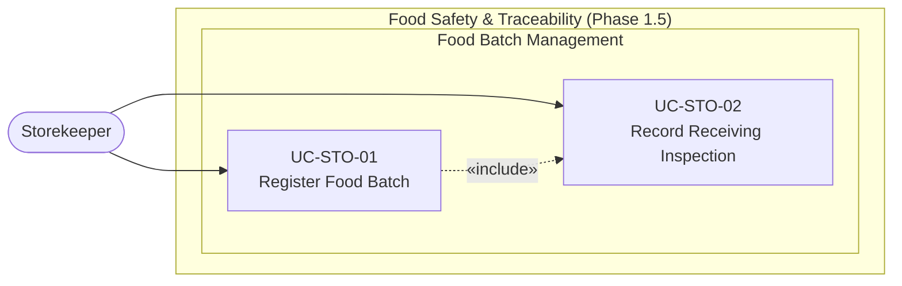

# UC-STO — Storekeeper Use Cases

> **Scope Note:** The Storekeeper role and these use cases are defined in Phase 1 for completeness but are **implemented in Phase 1.5**. The database schema includes placeholder tables (`food_batches`, `receiving_inspections`) that are not yet populated by the prototype.

## Use Case Diagram

---

## Use Case Specifications

### UC-STO-01 — Register Food Batch

| Field | Value |
|-------|-------|
| **Actor** | Storekeeper |
| **Feature** | F-SAF-01 Register Food Batch *(Phase 1.5)* |
| **Precondition** | A food delivery has arrived from a supplier. Supplier is registered in the system. |
| **Trigger** | Storekeeper receives a delivery and opens the Batch Registration form |

**Main Flow:**
1. Storekeeper opens the Food Batch form
2. Storekeeper enters batch details: supplier, ingredient type, quantity received, unit, delivery date, batch code, expiry date
3. System creates a `food_batches` record with `inspection_status = 'pending'`
4. System generates an internal batch ID for traceability
5. Storekeeper proceeds to receiving inspection (UC-STO-02)

**Postcondition:** Food batch is registered and pending inspection.

---

### UC-STO-02 — Record Receiving Inspection

| Field | Value |
|-------|-------|
| **Actor** | Storekeeper |
| **Feature** | F-SAF-01 Register Food Batch, F-SAF-02 Trace Food Source |
| **Precondition** | Food batch is registered (UC-STO-01). |
| **Trigger** | Storekeeper physically inspects the delivery |

**Main Flow:**
1. Storekeeper opens the batch inspection form
2. Storekeeper records: appearance (Pass/Fail), smell (Pass/Fail), packaging condition (Pass/Fail), temperature (if cold chain)
3. Storekeeper sets overall inspection result: **Pass** or **Fail**
4. If Pass: System transitions batch to `approved`, batch becomes available for kitchen use
5. If Fail: Storekeeper records rejection reason. System flags batch as `rejected`. System notifies the Meal/Nutrition Manager.

**Postcondition:** Batch inspection is recorded. Batch is either approved for use or rejected with a reason.
