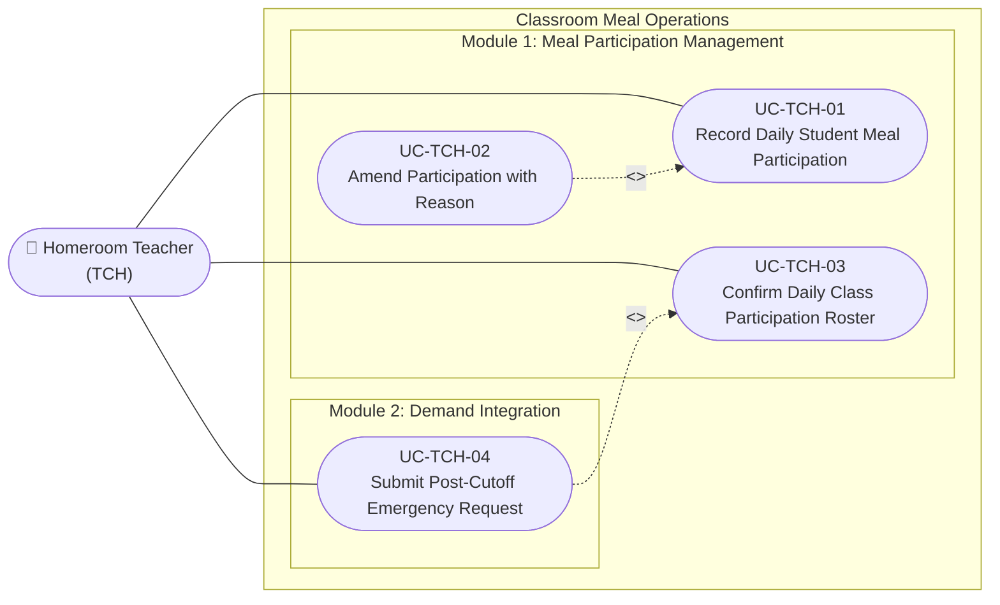

# Use Case Specifications — Homeroom Teacher / Class Supervisor (TCH)

## Actor Overview

- **Actor Name:** Homeroom Teacher / Class Supervisor (`TCH`)
- **Primary Domain:** Module 1: Meal Participation Management (with Emergency Bridge to Module 2)
- **Key Objectives:** Accurately record which students take meals today, report absences or modifications with valid reasons, submit confirmed counts before the school's operational cutoff time, and request emergency adjustments post-lock.

---

## Use Case Diagram — Homeroom Teacher

---

## UC-TCH-01 — Record Daily Student Meal Participation

- **Core Feature:** `F-PAR-01`
- **Primary DB Entity:** `meal_participations`
- **Secondary Entities:** `students`, `meal_schedules`, `meal_registrations`

### Preconditions
1. The teacher is authenticated and assigned to a specific classroom (e.g., Class 1A).
2. A `meal_schedules` record exists for the current date and target meal session (e.g., Lunch).
3. The current system time is prior to the daily cutoff deadline.

### Main Success Scenario (Happy Path)
1. Teacher navigates to the **Class Roster Meal Participation** screen ([SCR-TCH-01](../04-information-architecture/screen-inventory.md)).
2. System displays the list of enrolled students for the teacher's class, pre-populating with their registration status (default: `pending` or `recorded` as attended).
3. Teacher reviews the physical presence of students in the classroom.
4. For all attending students, teacher confirms their participation (`participation_status = 'recorded'`).
5. Teacher taps **Save Participation Draft**.
6. System persists or updates records in `meal_participations` with `recorded_by = current_user.id`.

### Alternative & Exception Flows
- **3a. Student is unlisted / transfer student:** Teacher contacts Admin (ADM) to register the student in master data (`students`) or logs an extra guest tag.

---

## UC-TCH-02 — Amend Participation Status with Reason

- **Core Feature:** `F-PAR-02`
- **Primary DB Entity:** `meal_participation_changes`
- **Secondary Entities:** `meal_participations`

### Preconditions
1. A participation record already exists in `meal_participations` for the student.
2. The teacher receives an update (e.g. parent calls to report sudden illness, or student arrives late).

### Main Success Scenario (Happy Path)
1. Teacher opens the student's entry in the participation roster.
2. Teacher selects the new status (e.g. `cancelled` due to absence, or `recorded` from `cancelled`).
3. Teacher chooses the change type: `status_update`, `correction`, or `reschedule`.
4. Teacher enters a mandatory `change_reason` (e.g., "Parent phoned at 08:15: Fever").
5. System validates the change, updates `meal_participations.participation_status`, and appends an audit entry into `meal_participation_changes`:
   - `meal_participation_id`
   - `change_type`
   - `previous_status`
   - `new_status`
   - `change_reason`
   - `changed_by = current_user.id`
   - `changed_at = now()`
6. System displays success confirmation with audit record ID.

---

## UC-TCH-03 — Confirm Daily Class Participation Roster

- **Core Feature:** `F-PAR-03`
- **Primary DB Entity:** `meal_participations` (status: `confirmed`)
- **Secondary Entities:** `meal_demands`

### Preconditions
1. Participation statuses have been recorded for 100% of students in the classroom.
2. Current time is before the cutoff deadline.

### Main Success Scenario (Happy Path)
1. Teacher reviews the summary panel: Total Enrolled, Attending Count, Absent Count.
2. Teacher clicks **Confirm & Submit Class Roster**.
3. System prompts for confirmation: *"Lock roster for Lunch today? Total meals: 32"*.
4. Teacher confirms.
5. System updates all records for this class in `meal_participations`:
   - `participation_status = 'confirmed'`
   - `confirmed_by = current_user.id`
   - `confirmed_at = now()`
6. System signals readiness to the Demand Aggregation engine ([UC-MGR-01](usecase-manager.md#uc-mgr-01)).

---

## UC-TCH-04 — Submit Post-Cutoff Emergency Request

- **Core Feature:** `F-DMD-03`
- **Primary DB Entity:** `meal_demand_changes`
- **Secondary Entities:** `meal_demands`

### Preconditions
1. Class roster has already been locked/confirmed, or the daily cutoff deadline has elapsed.
2. An unexpected event occurs (e.g., student falls ill and goes home at 10:00 AM, or late arrival from hospital visit).

### Main Success Scenario
1. Teacher attempts to edit attendance; system displays notice: *"Roster locked. Submit an Emergency Change Request"*.
2. Teacher opens the **Post-Cutoff Emergency Request Form** ([SCR-TCH-04](../04-information-architecture/screen-inventory.md)).
3. Teacher inputs:
   - Delta quantity (+1 or -1 portion)
   - Student identity and affected meal schedule
   - Change type (`quantity_increase`, `quantity_decrease`, `dish_adjustment`, `cancellation`)
   - Mandatory urgent reason (e.g., "Parent picked up student due to high fever at 10:15 AM")
4. Teacher taps **Submit Urgent Request**.
5. System creates a record in `meal_demand_changes` with status `pending`, `requested_by = current_user.id`, and notifies the Meal Manager ([UC-MGR-03](usecase-manager.md#uc-mgr-03)).
