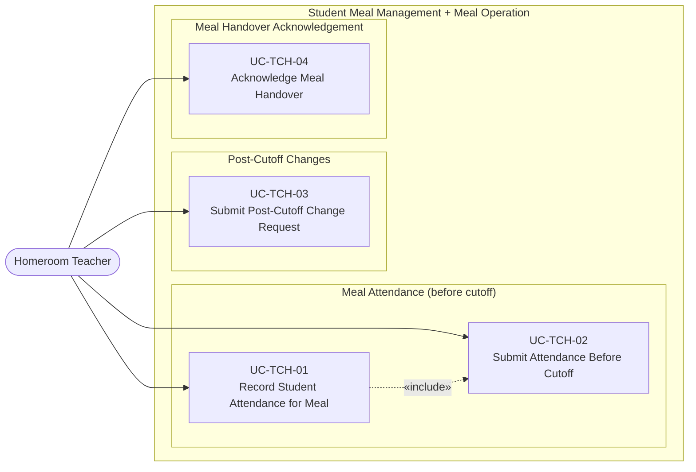

# UC-TCH — Homeroom Teacher Use Cases

## Use Case Diagram

---

## Use Case Specifications

### UC-TCH-01 — Record Student Attendance for Meal

| Field | Value |
|-------|-------|
| **Actor** | Homeroom Teacher |
| **Feature** | F-STU-03 Record Daily Meal Participation |
| **Precondition** | The current time is before the meal session cutoff. The teacher is logged in with their class assigned. |
| **Trigger** | Teacher opens the daily attendance form for the current meal session |

**Main Flow:**
1. Teacher selects today's date and meal session
2. System loads the class roster filtered to enrolled semi-boarding students
3. System displays each student with their default status (Attend) and any dietary/allergen badges
4. Teacher reviews the list and marks any students as:
   - **Absent** — must provide a reason (Sick, Family, Other)
   - **Extra Guest** — adds a guest portion for a supervising adult
5. System reactively updates: class headcount summary, absence count, total confirmed attendance
6. Teacher reviews the summary totals

**Postcondition:** Student attendance statuses are saved to `daily_meal_demand_details`. The class `daily_meal_demands` record reflects current counts.

---

### UC-TCH-02 — Submit Attendance Before Cutoff

| Field | Value |
|-------|-------|
| **Actor** | Homeroom Teacher |
| **Feature** | F-STU-03, F-MOP-01 |
| **Precondition** | UC-TCH-01 completed. Current time is before cutoff. |
| **Trigger** | Teacher taps "Submit Attendance" / "Lock Demand" |

**Main Flow:**
1. System shows a confirmation summary: Confirmed Attend, Absent, Extra Guests
2. Teacher confirms submission
3. System transitions the class `daily_meal_demands` status to `confirmed`
4. System shows a success state with cutoff countdown
5. System aggregates all class submissions for the session; once all classes are submitted, the session demand is fully confirmed

**Alternative Flow — After Cutoff:**
- Teacher attempts to submit after the cutoff → System shows "Cutoff passed. Your changes will require a Change Request." → UC-TCH-03

**Postcondition:** Class attendance is locked. Session-level demand aggregation is updated.

---

### UC-TCH-03 — Submit Post-Cutoff Change Request

| Field | Value |
|-------|-------|
| **Actor** | Homeroom Teacher |
| **Feature** | F-MOP-02 Manage Post-Cutoff Change Requests |
| **Precondition** | The cutoff time has passed. The teacher needs to report a change. |
| **Trigger** | Teacher taps "+ New Change Request" after cutoff |

**Main Flow:**
1. System opens the Change Request form
2. Teacher fills in:
   - Target: Student or Staff Guest
   - Class (pre-filled with teacher's class)
   - Student name (if student target)
   - Change type: Late Addition / Early Departure / Dietary Change
   - Quantity delta (e.g., +1 or -1)
   - Justification reason
3. System detects the request is post-cutoff → flags `is_emergency = true` automatically if > 30 min past cutoff
4. Teacher submits
5. System creates a `meal_demand_change_requests` record with `approval_status = 'pending'`
6. System notifies the Meal/Nutrition Manager

**Postcondition:** Change request is submitted and awaiting manager approval.

---

### UC-TCH-04 — Acknowledge Meal Handover

| Field | Value |
|-------|-------|
| **Actor** | Homeroom Teacher |
| **Feature** | F-MOP-05 Confirm Meal Handover & Reconcile |
| **Precondition** | Kitchen staff has confirmed handover for the teacher's class (UC-KIT-06) |
| **Trigger** | Teacher receives handover notification |

**Main Flow:**
1. Teacher receives push/in-app notification: "Meal for Class [X] delivered"
2. Teacher opens the handover confirmation screen
3. System shows: expected portions, delivered quantity, any notes from kitchen staff
4. Teacher acknowledges receipt
5. System records the acknowledgement with timestamp
6. System completes the reconciliation record for the class

**Alternative Flow — Quantity Mismatch:**
- 3a. Delivered quantity does not match expected → Teacher flags the discrepancy with a note
- 3b. Discrepancy is recorded and escalated to the Meal/Nutrition Manager

**Postcondition:** Class meal handover is fully recorded. Reconciliation is updated.
