# Sitemap & System Navigation

## 1. Overview

The **Primary School Semi-Boarding Meal Management System** implements a **role-based navigation architecture**. To ensure operational speed, zero cognitive clutter, and physical device suitability, the system routes users into 4 autonomous portals mapped directly to the core operational modules:

1. **Teacher Portal (`/teacher`)**: Module 1 — Meal Participation Management
2. **Manager Portal (`/manager`)**: Module 2 (Demand & Quantity) and Module 3 (Preparation Oversight)
3. **Kitchen Kiosk Portal (`/kitchen`)**: Module 3 — Meal Preparation Execution
4. **Admin Portal (`/admin`)**: Master Data & Identity Management

---

## 2. Visual Navigation Architecture

```mermaid
graph TD
    ROOT["🔑 Entry & Portal Router (/)"]

    %% Portals
    ROOT --> TCH["📝 Teacher Portal (/teacher)"]
    ROOT --> MGR["📋 Manager Portal (/manager)"]
    ROOT --> KIT["🍳 Kitchen Portal (/kitchen)"]
    ROOT --> ADM["🔧 Admin Portal (/admin)"]

    %% Teacher Views
    TCH --> TCH_ROSTER["SCR-TCH-01: Class Attendance Roster<br/><code>/teacher/roster</code>"]
    TCH_ROSTER -.-> TCH_AMEND["SCR-TCH-02: Amendment Modal<br/><code>/teacher/roster/amend</code>"]
    TCH_ROSTER --> TCH_CONFIRM["SCR-TCH-03: Lock Confirmation View<br/><code>/teacher/roster/confirm</code>"]
    TCH --> TCH_EMERGENCY["SCR-TCH-04: Post-Lock Emergency Form<br/><code>/teacher/emergency-request</code>"]

    %% Manager Views
    MGR --> MGR_DEMAND["SCR-MGR-01: Demand Determination Board<br/><code>/manager/demand</code>"]
    MGR_DEMAND --> MGR_QUANTITIES["SCR-MGR-02: Expected Raw Quantities<br/><code>/manager/quantities</code>"]
    MGR --> MGR_CHANGES["SCR-MGR-03: Emergency Request Queue<br/><code>/manager/changes</code>"]
    MGR --> MGR_PREP_PLAN["SCR-MGR-04: Kitchen Shift Plan Authoring<br/><code>/manager/prep-plans</code>"]
    MGR --> MGR_RECON["SCR-MGR-05: Preparation Yield Reconciliation<br/><code>/manager/reconciliation</code>"]

    %% Kitchen Views
    KIT --> KIT_BOARD["SCR-KIT-01: Active Shift Kiosk Board<br/><code>/kitchen/shift</code>"]
    KIT --> KIT_ALLOC["SCR-KIT-02: Storage Ingredient Checklist<br/><code>/kitchen/ingredients</code>"]
    KIT --> KIT_COOK["SCR-KIT-03: Cooking Batch Station Timers<br/><code>/kitchen/cooking</code>"]
    KIT --> KIT_VERIFY["SCR-KIT-04: Yield Discrepancy Gate<br/><code>/kitchen/verification</code>"]

    %% Admin Views
    ADM --> ADM_STUDENTS["SCR-ADM-01: Student & Class Directory<br/><code>/admin/students</code>"]
    ADM --> ADM_SCHEDULES["SCR-ADM-02: Meal Calendars & Cutoffs<br/><code>/admin/schedules</code>"]
    ADM --> ADM_CATALOG["SCR-ADM-03: Dish & Recipe Catalog<br/><code>/admin/catalog</code>"]
    ADM --> ADM_USERS["SCR-ADM-04: User Roles & Access<br/><code>/admin/users</code>"]

    classDef primary fill:#E05318,stroke:#9A3412,stroke-width:2px,color:#FFFFFF;
    classDef portal fill:#1E293B,stroke:#0F172A,stroke-width:2px,color:#FFFFFF;
    classDef modal fill:#FFFBEB,stroke:#D97706,stroke-width:1px,stroke-dasharray: 5 5,color:#78350F;

    class ROOT,TCH,MGR,KIT,ADM portal;
    class TCH_ROSTER,MGR_DEMAND,KIT_BOARD primary;
    class TCH_AMEND modal;
```

---

## 3. Role Portals & Detailed Route Map

### 3.1. Teacher Portal (`/teacher`)
- **Primary Persona:** Homeroom Teacher (`TCH`), Grade Supervisor (`TCH_SUP`)
- **Target Device:** Mobile smartphone (390px default), portrait orientation
- **Operating Window:** 07:30 AM – 08:30 AM (Strict Cutoff)

| Route | Screen ID | Purpose & Capabilities | Parent Route |
|---|---|---|---|
| `/teacher` | — | Auto-redirects to active morning session roster (`/teacher/roster`). | `/` |
| `/teacher/roster` | `SCR-TCH-01` | Classroom student list with instant Eating/Absent toggle pills, allergy alert flags, and live countdown timer to 08:30 AM cutoff. | `/teacher` |
| `/teacher/roster/amend` | `SCR-TCH-02` | Contextual bottom sheet for modifying a student's status post-initial entry, requiring a mandatory preset or custom reason. | `/teacher/roster` |
| `/teacher/roster/confirm` | `SCR-TCH-03` | Roster summary confirmation screen; locks all student records to `confirmed` and shifts view into read-only mode. | `/teacher/roster` |
| `/teacher/emergency-request` | `SCR-TCH-04` | Post-lock slide-up form to submit delta meal adjustments ($\pm N$) directly to the Nutrition Manager with justification notes. | `/teacher` |

---

### 3.2. Manager Portal (`/manager`)
- **Primary Persona:** Meal & Nutrition Manager (`MGR`), School Operations Director (`DIR`)
- **Target Device:** Desktop Workstation / Tablet (> 768px), landscape orientation
- **Operating Window:** 08:00 AM – 11:30 AM (Continuous Operations)

| Route | Screen ID | Purpose & Capabilities | Parent Route |
|---|---|---|---|
| `/manager` | — | Auto-redirects to daily demand board (`/manager/demand`). | `/` |
| `/manager/demand` | `SCR-MGR-01` | School-wide attendance rollup tracker across all classrooms; demand calculation method selector (`participation_based`, `manual_forecast`, `historical_average`), buffer stepper ($0\%\text{--}10\%$), and demand locking. | `/manager` |
| `/manager/quantities` | `SCR-MGR-02` | Breakdown of expected gross raw ingredient and dish cooking quantities computed from approved headcount and portion recipes. Supports manual chef overrides. | `/manager/demand` |
| `/manager/changes` | `SCR-MGR-03` | Real-time queue of emergency post-lock adjustment requests submitted by teachers. Manager can review, approve, or reject with reason notes. | `/manager` |
| `/manager/prep-plans` | `SCR-MGR-04` | Kitchen shift planning dashboard; binds approved demand to target kitchen stations and publishes target completion deadlines (10:45 AM). | `/manager` |
| `/manager/reconciliation` | `SCR-MGR-05` | Real-time yield sign-off comparing planned dish quantities against cooked batch outputs. Flags variances exceeding tolerance ($\pm 3\%$) for mandatory explanation. | `/manager` |

---

### 3.3. Kitchen Kiosk Portal (`/kitchen`)
- **Primary Persona:** Head Chef (`KIT_CHEF`), Station Cook (`KIT_COOK`), Pantry Handler (`KIT_PANTRY`)
- **Target Device:** Industrial 15–21" Wall-Mounted Touch Kiosk (> 1024px), landscape orientation
- **Operating Window:** 08:30 AM – 11:00 AM (Cooking Window)

| Route | Screen ID | Purpose & Capabilities | Parent Route |
|---|---|---|---|
| `/kitchen` | — | Auto-redirects to active shift board (`/kitchen/shift`). | `/` |
| `/kitchen/shift` | `SCR-KIT-01` | High-contrast industrial kiosk board showing today's menu, target portions, station assignments, and shift countdown to 10:45 AM service. | `/kitchen` |
| `/kitchen/ingredients` | `SCR-KIT-02` | Pantry receiving checklist to verify raw bulk ingredients delivered from storage against recipe allocations. Supports logging shortfall/trimming loss. | `/kitchen` |
| `/kitchen/cooking` | `SCR-KIT-03` | Station cooking timers and batch logger. Chefs start batches, track active kettles/steamers, and log weighed batch outputs via on-screen numpad. | `/kitchen` |
| `/kitchen/verification` | `SCR-KIT-04` | Final preparation verification gate before classroom tray distribution. Compares total prepared yield against target, enforcing discrepancy logs if variance exceeds $\pm 3\%$. | `/kitchen` |

---

### 3.4. Admin Portal (`/admin`)
- **Primary Persona:** School System Administrator (`ADM`)
- **Target Device:** Desktop Workstation (> 1024px)
- **Operating Window:** Ad-hoc / Academic Term Setup

| Route | Screen ID | Purpose & Capabilities | Parent Route |
|---|---|---|---|
| `/admin` | — | Auto-redirects to student directory (`/admin/students`). | `/` |
| `/admin/students` | `SCR-ADM-01` | CRUD student directory, classroom assignments, dietary allergies notes, and semi-boarding program eligibility status. | `/admin` |
| `/admin/schedules` | `SCR-ADM-02` | School academic calendar setup, daily session configurations (Breakfast, Lunch, Snack), and cutoff deadline parameters (default 08:30 AM). | `/admin` |
| `/admin/catalog` | `SCR-ADM-03` | Master dish registry, standard portion weights (grams/piece), ingredient recipes, and standard thermal yield conversion factors. | `/admin` |
| `/admin/users` | `SCR-ADM-04` | User account provisioning, password management, and role-based access assignment (`TCH`, `MGR`, `KIT`, `ADM`). | `/admin` |

---

## 4. Route Access Control & Role Matrix

| Route Path | Teacher (`TCH`) | Manager (`MGR`) | Kitchen (`KIT`) | Admin (`ADM`) |
|---|:---:|:---:|:---:|:---:|
| `/teacher/*` | **Read / Write** | Read Only | No Access | Full Admin |
| `/manager/*` | View Headcount | **Read / Write** | Read Only | Full Admin |
| `/kitchen/*` | No Access | Read Only | **Read / Write** | Full Admin |
| `/admin/*` | No Access | No Access | No Access | **Full Admin** |
