```mermaid
graph TD
    LOGIN["Login / Role Select"]

    LOGIN --> ADM_PORTAL["🔧 Admin Portal"]
    LOGIN --> MGR_PORTAL["📋 Manager Portal"]
    LOGIN --> KIT_PORTAL["🍳 Kitchen Portal"]
    LOGIN --> TCH_PORTAL["📝 Teacher Portal"]

    ADM_PORTAL --> ADM_STUDENTS["Student Management"]
    ADM_PORTAL --> ADM_SESSIONS["Meal Session Configuration"]
    ADM_PORTAL --> ADM_USERS["User & Role Management"]
    ADM_PORTAL --> ADM_DISHES["Dish Catalog"]

    ADM_STUDENTS --> ADM_STU_LIST["Student List"]
    ADM_STUDENTS --> ADM_STU_ENROLL["Enroll Student"]
    ADM_STUDENTS --> ADM_STU_REGISTER["Register Meal Session"]

    MGR_PORTAL --> MGR_MENU["Menu Planning"]
    MGR_PORTAL --> MGR_DEMAND["Daily Demand Overview"]
    MGR_PORTAL --> MGR_QUANTITIES["Quantity Calculation"]
    MGR_PORTAL --> MGR_CHANGES["Change Request Triage"]

    MGR_MENU --> MGR_MENU_LIST["Weekly Menu List"]
    MGR_MENU --> MGR_MENU_CREATE["Create / Edit Menu"]
    MGR_MENU --> MGR_MENU_DISHES["Assign Dishes & Portions"]

    MGR_DEMAND --> MGR_DEMAND_BOARD["Class Demand Status Board"]
    MGR_QUANTITIES --> MGR_QTY_REVIEW["Review Calculated Quantities"]
    MGR_CHANGES --> MGR_CHG_LIST["Change Request List"]
    MGR_CHANGES --> MGR_CHG_DETAIL["Change Request Detail / Approve / Reject"]

    KIT_PORTAL --> KIT_PREP["Meal Preparation"]
    KIT_PORTAL --> KIT_DIST["Meal Distribution"]
    KIT_PORTAL --> KIT_HAND["Meal Handover"]

    KIT_PREP --> KIT_PREP_PLAN["Preparation Plan View"]
    KIT_PREP --> KIT_PREP_RECORD["Record Prepared Quantity"]
    KIT_PREP --> KIT_PREP_CONFIRM["Confirm Preparation Complete"]

    KIT_DIST --> KIT_DIST_PLAN["Distribution Plan View"]
    KIT_DIST --> KIT_DIST_RECORD["Record Distributed Quantity"]

    KIT_HAND --> KIT_HAND_CONFIRM["Confirm Handover"]

    TCH_PORTAL --> TCH_ATT["Attendance Roll Call"]
    TCH_PORTAL --> TCH_CHANGES["Submit Change Request"]
    TCH_PORTAL --> TCH_HAND["Acknowledge Handover"]

    TCH_ATT --> TCH_ATT_CLASS["Class Roster (by meal session)"]
    TCH_ATT --> TCH_ATT_SUBMIT["Submit Attendance / Lock"]
```

# Sitemap

## System Navigation Structure

The system uses **role-based navigation**. After login, each role sees only their relevant module. The sitemap is organized by role portal, then by domain.

---

---

## Role Portal Summary

| Portal | Primary Sections | Entry Point Screen |
|--------|-----------------|-------------------|
| Admin | Student Mgmt, Sessions, Users, Dishes | Student List |
| Manager | Menu Planning, Demand Board, Quantities, Changes | Demand Overview Board |
| Kitchen | Preparation, Distribution, Handover | Preparation Plan View |
| Teacher | Attendance, Change Requests, Handover | Class Roster (today) |
