```mermaid
graph TD
    LOGIN["🔑 Login & Role Selection"]

    LOGIN --> TCH_PORTAL["📝 Teacher Portal (Module 1)"]
    LOGIN --> MGR_PORTAL["📋 Manager Portal (Module 2 & 3)"]
    LOGIN --> KIT_PORTAL["🍳 Kitchen Portal (Module 3)"]
    LOGIN --> ADM_PORTAL["🔧 Admin Portal (Master Data)"]

    %% TCH Portal
    TCH_PORTAL --> TCH_ROSTER["Class Participation Roster"]
    TCH_PORTAL --> TCH_AMEND["Participation Changes & Reason"]
    TCH_PORTAL --> TCH_SUBMIT["Confirm Class Roster"]
    TCH_PORTAL --> TCH_EMERGENCY["Post-Lock Emergency Request"]

    %% MGR Portal
    MGR_PORTAL --> MGR_DEMAND["Demand Determination (Methods & Buffer)"]
    MGR_PORTAL --> MGR_QUANTITIES["Dish Expected Quantities"]
    MGR_PORTAL --> MGR_CHANGES["Demand Changes Review Queue"]
    MGR_PORTAL --> MGR_PREP_PLAN["Kitchen Shift Planning"]
    MGR_PORTAL --> MGR_RECON["Preparation Sign-off & Discrepancies"]

    %% KIT Portal
    KIT_PORTAL --> KIT_BOARD["Active Prep Shift Board"]
    KIT_PORTAL --> KIT_ALLOC["Ingredient Allocation Checklist"]
    KIT_PORTAL --> KIT_COOK["Cooking Batch Execution"]
    KIT_PORTAL --> KIT_VERIFY["Prepared Quantity Verification"]

    %% ADM Portal
    ADM_PORTAL --> ADM_STU["Student & Class Directory"]
    ADM_PORTAL --> ADM_SCHED["Meal Calendar & Schedules"]
    ADM_PORTAL --> ADM_CATALOG["Dishes & Ingredients Catalog"]
    ADM_PORTAL --> ADM_USERS["User Accounts & Roles"]
```

# Sitemap & System Navigation

## System Navigation Structure

The system uses **role-based navigation** tailored around the three active core operational modules:
1. **Meal Participation Management**
2. **Meal Demand & Quantity Management**
3. **Meal Preparation**

---

---

## Navigation Paths by Portal

### 1. Teacher Portal (TCH) — Focus: Module 1 (Meal Participation)
- `/teacher/roster`: Main view listing all students in teacher's assigned classroom with toggle participation states.
- `/teacher/roster/:studentId/amend`: Dialog/sheet to update status (`status_update`, `correction`, `reschedule`) and log `change_reason`.
- `/teacher/roster/confirm`: Review summary and lock attendance before cutoff.
- `/teacher/request-change`: Post-lock emergency delta request form submitted to Manager.

### 2. Manager Portal (MGR) — Focus: Module 2 & Module 3 Oversight
- `/manager/demand`: Class attendance submission tracker; selector for calculation method (`participation_based`, `manual_forecast`, `historical_average`), buffer % configuration, and final headcount confirmation.
- `/manager/demand/dish-quantities`: Calculation table showing expected raw cooking quantities per dish based on portion recipes.
- `/manager/demand/changes`: Queue of pending post-lock change requests with Approve/Reject actions and audit logs.
- `/manager/prep-plans`: Shift authoring interface to publish daily cooking targets to the kitchen.
- `/manager/prep-summary`: Real-time yield report comparing planned vs actual prepared quantities with discrepancy sign-off.

### 3. Kitchen Portal (KIT) — Focus: Module 3 (Meal Preparation)
- `/kitchen/shift`: High-visibility kitchen kiosk dashboard displaying active preparation plans and dish deadlines.
- `/kitchen/ingredients`: Checklist for checking in and adjusting raw pantry ingredients allocated from storage.
- `/kitchen/cooking`: Batch logging screen where chefs start/complete batches and record actual prepared yields.
- `/kitchen/verification`: Final verification screen for checking cooked weights/portions against targets and recording discrepancy reasons.

### 4. Admin Portal (ADM) — Focus: Reference Master Data
- `/admin/students`: Manage student profiles, classes, and meal program eligibility.
- `/admin/schedules`: Setup daily meal sessions (breakfast, lunch, snack, dinner) and calendar dates.
- `/admin/catalog`: Master registry of dishes and standard ingredient units.
- `/admin/users`: User provisioning and role assignment (`teacher`, `manager`, `kitchen`, `admin`).
