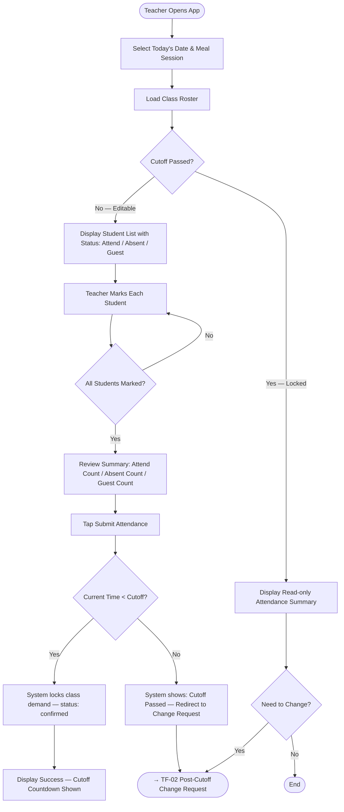
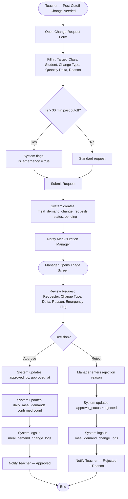
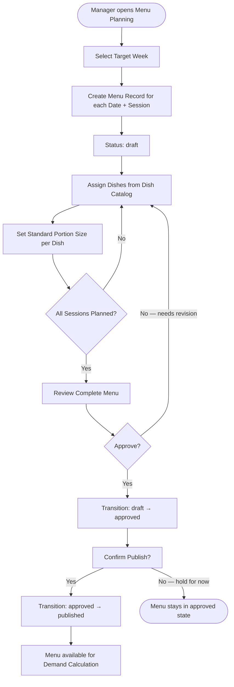
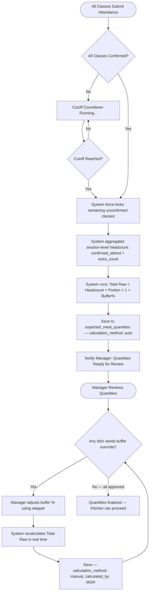
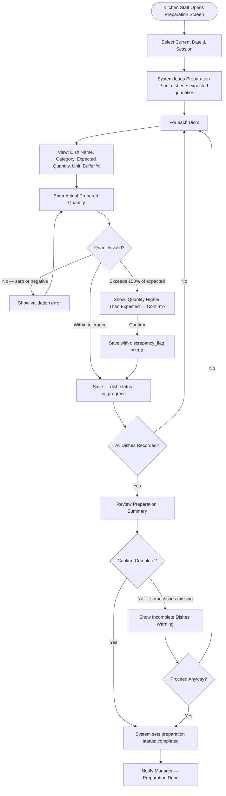
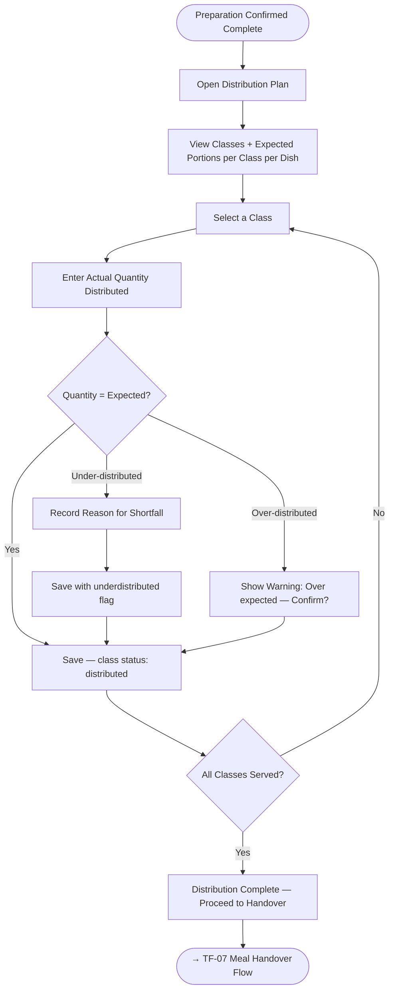
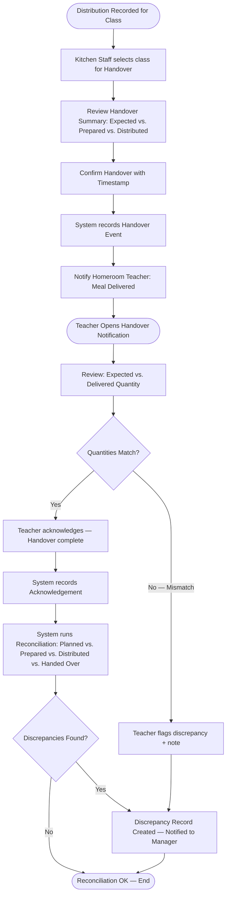
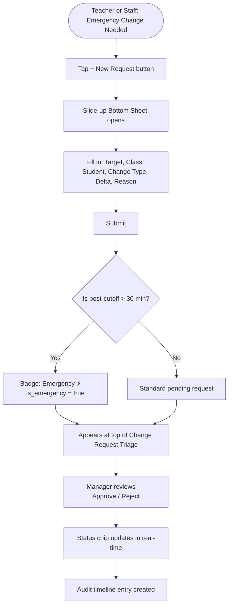

# Task Flows

All task flows are written in Mermaid flowchart syntax. Each flow is traceable to at least one Use Case Specification from [Phase 03](../03-roles-usecases/).

---

## TF-01 — Student Meal Attendance Flow

**Source:** UC-TCH-01, UC-TCH-02
**Actor:** Homeroom Teacher

---

## TF-02 — Post-Cutoff Change Request Flow

**Source:** UC-TCH-03, UC-MGR-07, UC-MGR-08
**Actors:** Homeroom Teacher (initiates), Meal/Nutrition Manager (approves/rejects)

---

## TF-03 — Meal Planning & Menu Publishing Flow

**Source:** UC-MGR-01, UC-MGR-02, UC-MGR-03
**Actor:** Meal / Nutrition Manager

---

## TF-04 — Meal Demand Quantity Calculation Flow

**Source:** UC-MGR-04, UC-MGR-05
**Actor:** System (auto) + Meal / Nutrition Manager (review/override)

---

## TF-05 — Meal Preparation Flow

**Source:** UC-KIT-01, UC-KIT-02, UC-KIT-03
**Actor:** Kitchen Staff

---

## TF-06 — Meal Distribution Flow

**Source:** UC-KIT-04, UC-KIT-05
**Actor:** Kitchen Staff

---

## TF-07 — Meal Handover & Reconciliation Flow

**Source:** UC-KIT-06, UC-TCH-04
**Actors:** Kitchen Staff (initiates), Homeroom Teacher (acknowledges)

---

## TF-08 — Post-Cutoff Change Request (Emergency Shortcut)

> *Simplified view for the prototype's Screen 3 — Manage Demand Changes.*
> *Same flow as TF-02 but annotated for the prototype's UI interactions.*

