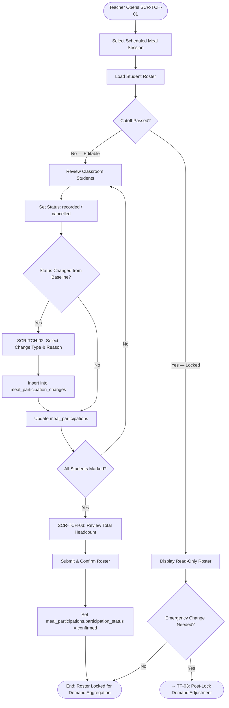
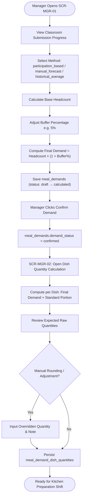
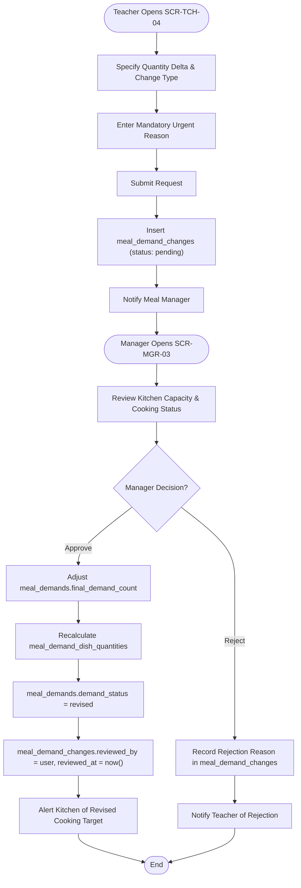
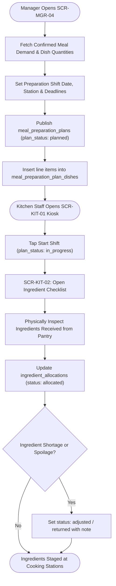
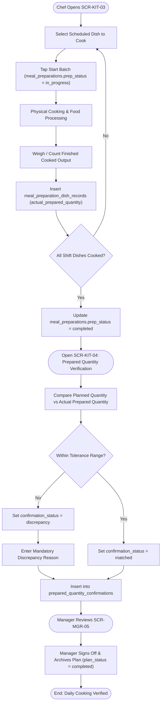

# Task Flows

All task flows are modeled using Mermaid flowchart syntax. Each flow traces directly from Use Case Specifications ([Phase 03](../03-roles-usecases/)) through user interactions down to database state transitions in [Phase 06](../06-database/README.md).

---

## TF-01 — Student Meal Participation & Amendment Flow

- **Use Cases:** `UC-TCH-01`, `UC-TCH-02`, `UC-TCH-03`
- **Actor:** Homeroom Teacher (`TCH`)
- **Database Entities:** `meal_participations`, `meal_participation_changes`

---

## TF-02 — Meal Demand Determination & Dish Quantity Calculation Flow

- **Use Cases:** `UC-MGR-01`, `UC-MGR-02`
- **Actor:** Meal / Nutrition Manager (`MGR`)
- **Database Entities:** `meal_demands`, `meal_demand_dish_quantities`

---

## TF-03 — Post-Lock Demand Adjustment Flow

- **Use Cases:** `UC-TCH-04`, `UC-MGR-03`
- **Actors:** Homeroom Teacher (`TCH`), Meal / Nutrition Manager (`MGR`)
- **Database Entities:** `meal_demand_changes`, `meal_demands`, `meal_demand_dish_quantities`

---

## TF-04 — Kitchen Preparation Planning & Ingredient Allocation Flow

- **Use Cases:** `UC-MGR-04`, `UC-KIT-01`, `UC-KIT-02`
- **Actors:** Meal Manager (`MGR`), Kitchen Staff (`KIT`)
- **Database Entities:** `meal_preparation_plans`, `meal_preparation_plan_dishes`, `ingredient_allocations`

---

## TF-05 — Cooking Batch Execution & Quantity Confirmation Flow

- **Use Cases:** `UC-KIT-03`, `UC-KIT-04`, `UC-MGR-05`
- **Actors:** Kitchen Staff / Chef (`KIT`), Meal Manager (`MGR`)
- **Database Entities:** `meal_preparations`, `meal_preparation_dish_records`, `prepared_quantity_confirmations`

