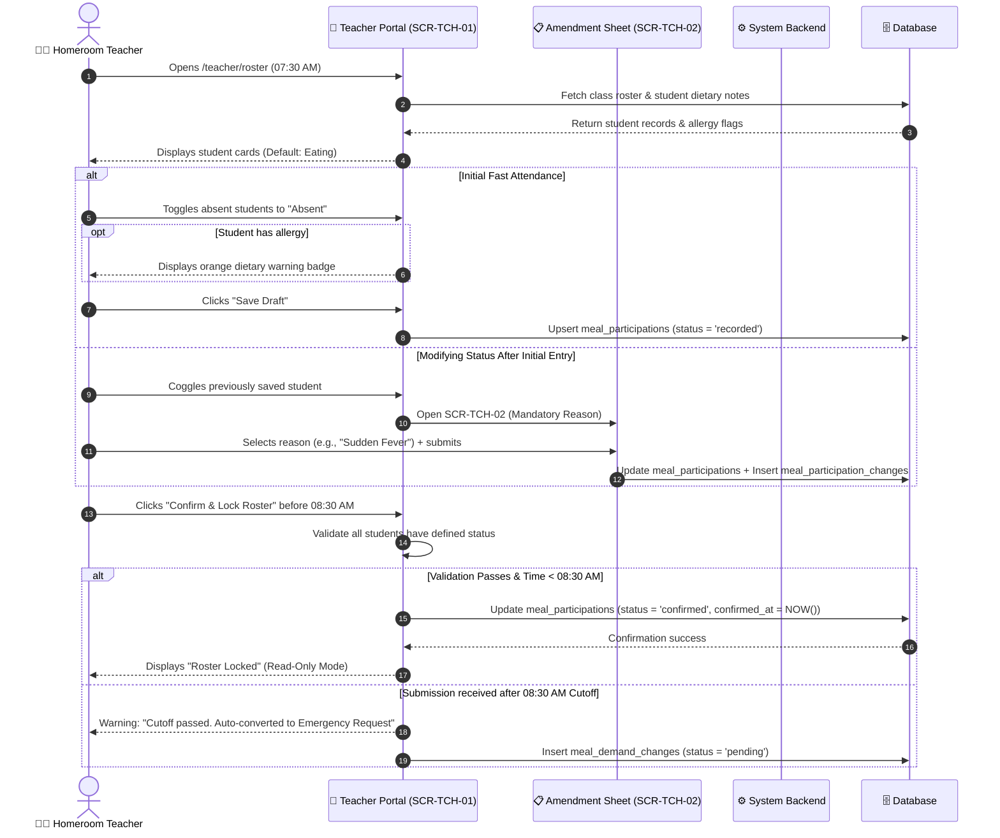
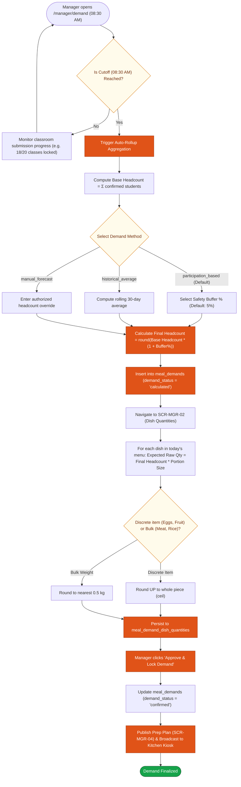
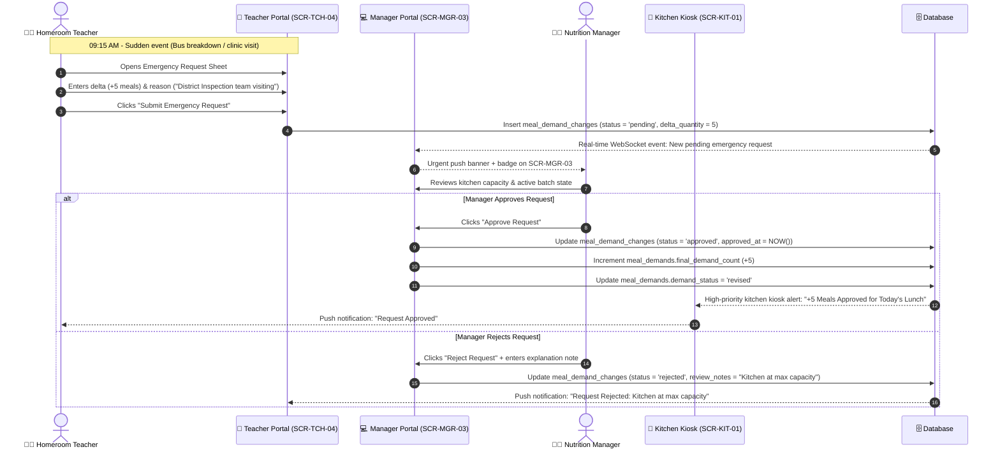
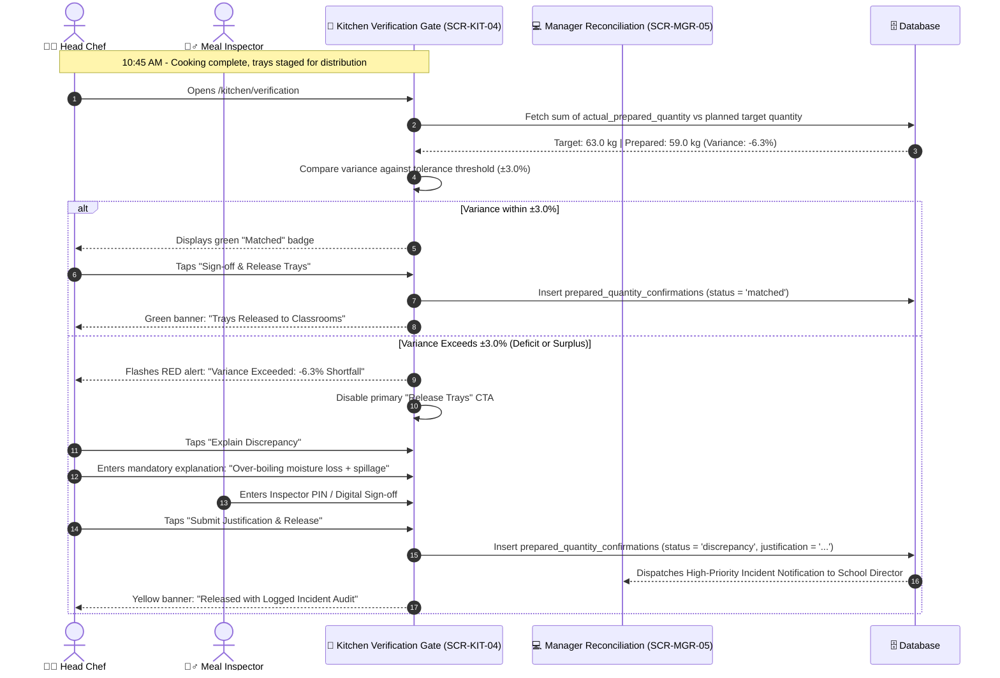

# Operational Task Flows & Decision Trees

## 1. Overview

This document formalizes the **5 Core Operational Task Flows** that span the daily lifecycle of semi-boarding meal operations. Each task flow illustrates the user steps, system decision gates, error handling, state transitions, and database mutations mapped directly to the **10 INVEST Core Features** in [invest-requirements.md](../02-core-features/invest-requirements.md).

```
[07:30 - 08:30 AM]   TF-01: Classroom Attendance & Roster Freeze (Module 1)
                               ↓
[08:30 - 08:45 AM]   TF-02: Demand Aggregation & Buffer Calculation (Module 2)
                               ↓
[08:45 - 10:30 AM]   TF-03: Post-Lock Emergency Change Triage (Module 2) [Asynchronous]
                               ↓
[08:45 - 10:30 AM]   TF-04: Kitchen Stock Intake & Batch Execution (Module 3)
                               ↓
[10:30 - 10:45 AM]   TF-05: Cooking Yield Reconciliation & Discrepancy Gate (Module 3)
```

---

## 2. Task Flow TF-01: Daily Classroom Attendance & Cutoff Lock

- **Covered Stories:** `US-PAR-01`, `US-PAR-02`, `US-PAR-03`
- **Primary Actor:** Homeroom Teacher (`TCH`)
- **Primary Screens:** `SCR-TCH-01`, `SCR-TCH-02`, `SCR-TCH-03`, `SCR-TCH-04`



---

## 3. Task Flow TF-02: Demand Aggregation & Recipe Buffer Calculation

- **Covered Stories:** `US-DMD-01`, `US-DMD-02`
- **Primary Actor:** Meal & Nutrition Manager (`MGR`)
- **Primary Screens:** `SCR-MGR-01`, `SCR-MGR-02`, `SCR-MGR-04`



---

## 4. Task Flow TF-03: Post-Lock Emergency Change Triage

- **Covered Stories:** `US-DMD-03`
- **Primary Actors:** Homeroom Teacher (`TCH`), Meal & Nutrition Manager (`MGR`), Head Chef (`KIT_CHEF`)
- **Primary Screens:** `SCR-TCH-04`, `SCR-MGR-03`, `SCR-KIT-01`



---

## 5. Task Flow TF-04: Kitchen Stock Intake & Batch Execution

- **Covered Stories:** `US-PRP-01`, `US-PRP-02`, `US-PRP-03`
- **Primary Actors:** Pantry Handler (`KIT_PANTRY`), Station Cook (`KIT_COOK`)
- **Primary Screens:** `SCR-KIT-01`, `SCR-KIT-02`, `SCR-KIT-03`

```mermaid
flowchart TD
    START(["Kitchen Crew loads Kiosk /kitchen/shift (08:45 AM)"]) --> RECEIVE["Pantry Handler opens SCR-KIT-02 (Ingredient Checklist)"]

    RECEIVE --> WEIGH_INTAKE["Weigh incoming raw ingredients from central cold storage"]
    WEIGH_INTAKE --> CHECK_MATCH{"Physical weight == Target allocated weight?"}

    CHECK_MATCH -- Yes --> STATUS_OK["Mark allocation_status = 'allocated'"]
    CHECK_MATCH -- No (Shortfall/Trimming) --> LOG_SHORTFALL["Enter actual weight & select discrepancy reason (e.g. Trimming loss)"]
    LOG_SHORTFALL --> STATUS_ADJ["Mark allocation_status = 'adjusted' & notify Manager"]

    STATUS_OK --> START_COOKING["Cooks navigate to SCR-KIT-03 (Cooking Timers)"]
    STATUS_ADJ --> START_COOKING

    START_COOKING --> SELECT_STATION["Select station (e.g. Steamer #1 - Jasmine Rice)"]
    SELECT_STATION --> START_BATCH["Cook taps 'Start Batch #1'"]
    START_BATCH --> DB_START["Insert meal_preparations (prep_status = 'in_progress', start_time = NOW())"]

    DB_START --> TIMER_RUN["On-screen countdown timer runs; visual pulsing indicator"]
    TIMER_RUN --> COOK_COMPLETE["Cooking finishes. Cook taps 'Complete Batch'"]
    COOK_COMPLETE --> WEIGH_BATCH["Cook weighs finished dish tray on connected scale"]
    WEIGH_BATCH --> NUMPAD["Enter scale reading (e.g. 70.0 kg) via oversized touch numpad"]

    NUMPAD --> SAVE_BATCH["Update meal_preparations (prep_status = 'completed', end_time = NOW())"]
    SAVE_BATCH --> SAVE_DISH_REC["Insert meal_preparation_dish_records (actual_prepared_quantity = 70.0)"]

    SAVE_DISH_REC --> MORE_BATCHES{"Additional batches required for this dish?"}
    MORE_BATCHES -- Yes --> START_BATCH
    MORE_BATCHES -- No --> STATION_DONE["Mark Station Ready (Green Badge)"]
    STATION_DONE --> END(["Ready for Final Yield Verification Gate"])

    classDef action fill:#E05318,stroke:#9A3412,color:#FFFFFF;
    classDef gate fill:#FFFBEB,stroke:#D97706,color:#78350F;
    classDef finish fill:#16A34A,stroke:#14532D,color:#FFFFFF;
    class RECEIVE,WEIGH_INTAKE,START_BATCH,NUMPAD,SAVE_BATCH,SAVE_DISH_REC action;
    class CHECK_MATCH,MORE_BATCHES gate;
    class END finish;
```



---

## 6. Task Flow TF-05: Cooking Yield Reconciliation & Discrepancy Gate

- **Covered Stories:** `US-PRP-04`
- **Primary Actors:** Head Chef (`KIT_CHEF`), School Meal Inspector (`INS`)
- **Primary Screens:** `SCR-KIT-04`, `SCR-MGR-05`


